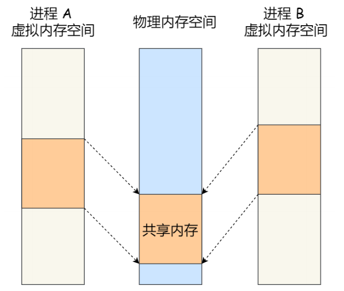

## 1. 管道

* 管道分为
  * 匿名管道
  * 命名管道
* 管道的通信是半双工的

### 1.1 匿名管道

```shell
ps -ef|grep mysql
```

* | 就是一个匿名管道，将前一个命令ps -ef的输出，作为后一个命令grep mysql 的输入
* 匿名管道只存在于内存中，通信是单向的，数据只能在一个方向上流动
* 匿名管道只能用于存在父子关系的进程间的通信
* 匿名管道是OS内核中一块缓冲区
* 匿名管道的系统调用是`int pipe(int fd[2])`
  * 两个文件描述符，一个是管道的读取端，一个是管道写入端

### 1.2 命名管道

```shell
mkfifo pipe_name
```

* 通过mkfifo创建**命名管道**，也称为FIFO，命名管道以文件方式存在，毫无关系的进程可以通过这个文件进行通信

* 命名管道的系统调用是`int mkfifo()`

* 进程从命名管道读取数据时，如果其中没有数据，就会阻塞；进程往命名管道中写入数据时，如果没有其他进程读取数据，也会阻塞

## 2. 消息队列

* 消息队列是保存在内核中的消息链表
* 消协队列生命周期与内核一致，如果没有释放消息队列或者没有关闭OS，那么消息队列会一直存在
* 消息队列通信的不足
  * 不适合大数据的传输——Linux内核中有两个宏定义MSGMAX和MSGMNB——定义了一条消息的最大长度和一个队列的最大长度
  * 消息队列通信过程中，存在内核态和用户态之间的数据拷贝开销——因为进程写入数据到内核中的消息队列时，会发生从用户态拷贝数据到内核态的过程，另一端读取时，也会发生从内核态拷贝数据到用户态的过程

## 3. 共享内存

* 两个进程各拿出一块地址空间，映射到相同的物理内存
  
  一个进程写入的东西，另一个进程可以立刻读取



## 4. 信号量

## 5. 信号

* 信号是**唯一的异步通信机制**，可以在任何时候发送信号给某一进程，进程对信号进行处理
  
  * 执行默认操作
  * 捕捉信号——为信号定义一个信号处理函数
  * 忽略信号

* Linux提供kill指令，可以给进程发送信号

* 运行在shell终端的进程，也可以通过某些按键给这些进程发送信号
  
  * Ctrl+C发送SIGINT信号，表示终止该进程
  * Ctrl+Z发送SIGTSTP信号，表示停止该进程，但还未结束

## 6. Socket

* Socket一般用于不同主机进程之间的通信，Socket也可以用于同主机上进程间的通信
* Socket通信方式分为
  * 实现TCP字节流通信
  * 实现UDP数据报通信
  * 实现本地进程间通信

### 6.1 TCP协议的socket模型


### 6.2 UDP协议的socket模型


### 6.3 本地进程间通信的socket模型

* 本地字节流socket和本地数据报socket在bing的时候，不需要指定IP和端口，而是绑定一个本地文件