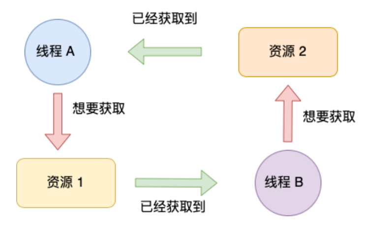

## 1. 死锁概念

当两个线程为了保护两个不同的共享资源而使用了两个互斥锁，那么当这两个互斥锁使用不当时，可能会造成两个线程都在等待对方释放锁，在没有外界干预的情况下，这两个线程会一直相互等待，就没有办法继续运行

## 2. 死锁条件

死锁只有同时满足以下四个条件才会发生

* 互斥条件——多个线程不能同时使用同一个资源

* 不可剥夺条件——线程持有资源后，在自己使用完之前不能被其他线程获取

* 持有并等待条件——当线程A已经持有了资源1，又想申请资源2，但是资源2已经被线程B持有，那么线程A就会处于等待状态，但是线程A又不会释放已经持有的资源1

* 环路等待条件——两个线程获取资源的顺序构成了环形链
  
  

## 3. 避免死锁

* 破坏产生死锁的条件（四个破坏掉一个就行）
  
  * 破坏不可剥夺条件——利用线程持有的资源的信息，和将要持有的资源信息生成图，如果图中有环，那么表明存在死锁，让其中一个线程放弃掉持有的资源
  
  * 预防环路等待条件——让不同的线程按照相同的顺序去获取资源