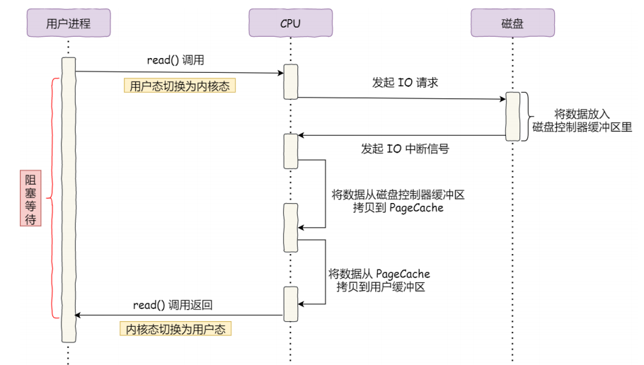
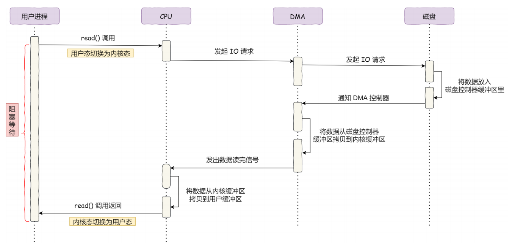
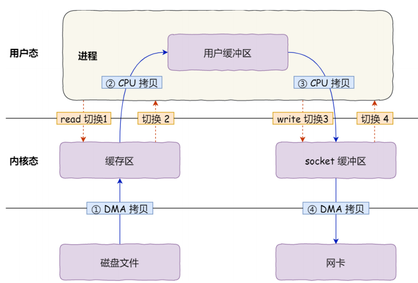
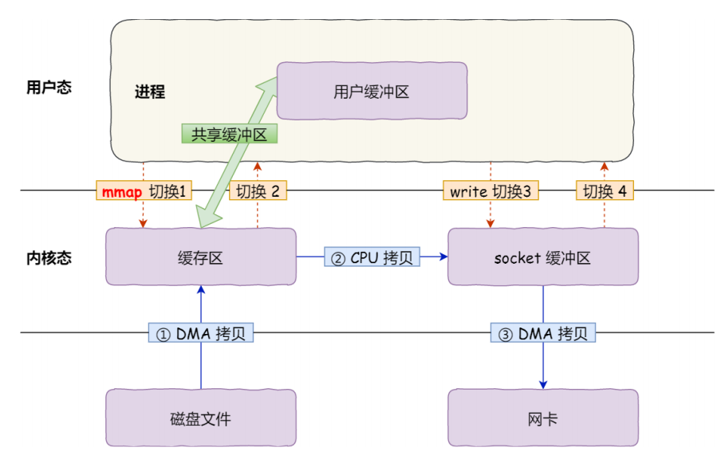
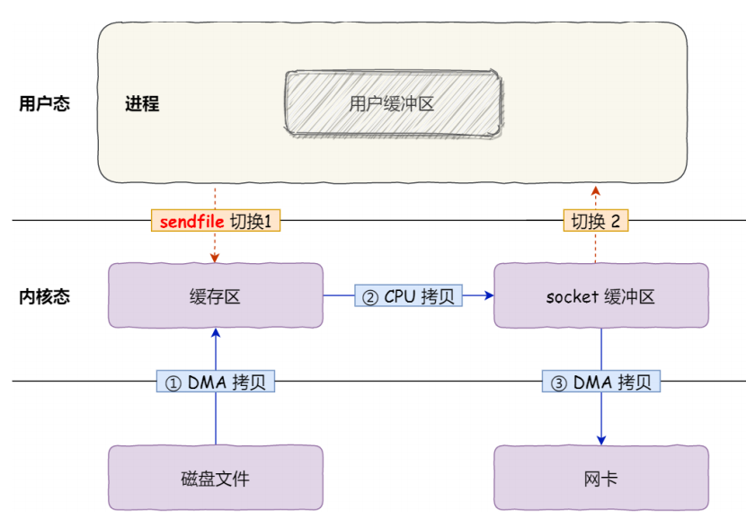
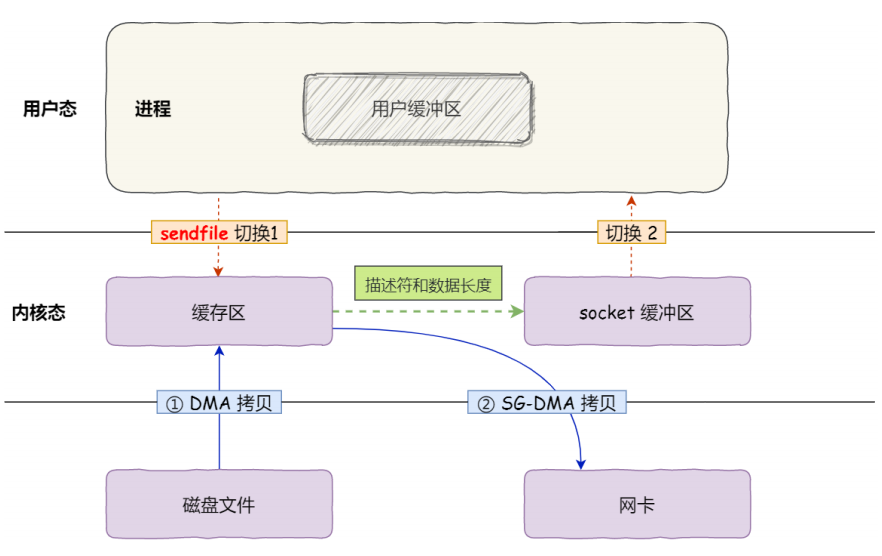

# 1. DMA

## 1.1 没有DMA的IO流程

1. 用户进程调用read()系统调用，陷入内核态，用户进程阻塞等待
2. CPU发送IO请求给磁盘控制器，然后返回去干别的事
3. 磁盘控制器收到命令后，开始准备数据，将数据从磁盘中读出，放入磁盘控制器的内部缓冲区中，然后产生一个IO中断
4. CPU收到IO中断后，停下手头的工作，将磁盘控制器的内部缓冲区中的数据拷贝到内核缓冲区
5. CPU将数据从内核缓冲区拷贝到用户缓冲区，read()系统调用返回，用户进程获得数据，继续执行



* **整个过程，数据的搬运都由CPU完成**


## 1.2 有DMA的IO流程

* DMA——Direct Memory Access
* DMA——在进行IO设备与内存数据传输时，数据搬运的工作交给DMA控制器去做

1. 用户进程调用read()系统调用，陷入内核态，用户进程阻塞等待
2. CPU将IO请求发送给DMA，然后CPU执行其他的任务
3. DMA将IO请求发送给磁盘控制器
4. 磁盘控制器收到命令后，开始准备数据，将数据从磁盘中读出，放入磁盘控制器的内部缓冲区中，然后产生一个IO中断，发送给DMA
5. DMA收到IO中断，将磁盘控制器缓冲区中的数据拷贝到内核缓冲区(PageCache)中
6. DMA发送信号给CPU
7. CPU收到信号后，将数据从内核缓冲区拷贝到用户缓冲区




# 2. 零拷贝

## 2.1 传统的文件传输

```c
read(file,temp_buf,len);
write(socket,temp_buf,len);
```



* **四次用户态与内核态的上下文切换，四次拷贝（2次DMA拷贝，2次CPU拷贝）**

1. 用户程序调用read函数，向操作系统发起IO调用，上下文从用户态转换为内核态**（切换1）**
2. DMA控制器把数据从磁盘中拷贝到内核缓冲区**（DMA拷贝）**
3. CPU把内核缓冲区的数据，拷贝到用户缓冲区**（CPU拷贝）**，上下文从内核态转换为用户态**（切换2）**，read函数返回
4. 用户程序调用write函数，发起IO调用，上下文从用户态转换为内核态**（切换3）**
5. CPU将用户缓冲区中的数据写入socket缓冲区**（CPU拷贝）**
6. DMA控制器把数据从socket缓冲区拷贝到网卡设备上**（DMA拷贝）**，上下文从内核态切换为用户态**（切换4）**，write函数返回

## 2.2 零拷贝实现

* 零拷贝——CPU不参与数据的搬运


### 2.2.1 mmap+write

```c
buf=mmap(file,len); //mmap将数据从磁盘读入用户缓冲区
write(socket,buf,len); //write将数据从用户缓冲区写入网卡设备
```

* mmap会将**内核缓冲区**与**用户缓冲区**映射到为**同一块物理内存**上，从而达到内核缓冲区与用户缓冲区共享数据
* **四次用户态与内核态上下文切换，3次拷贝**
* 不是真正的零拷贝，还是有CPU参与数据的搬运




### 2.2.2 sendfile

* Linux内核2.1版本中，提供了一个专门发送文件的系统调用sendfile()
* **两次上下文切换，3次拷贝**
* 不是真正的零拷贝，还是有CPU参与数据的搬运



### 2.2.3 SG-DMA+sendfile

* mmap+write和sendfile都不是真正的零拷贝
* 真正的零拷贝是在网卡支持**scatter-gather（SG-DMA）**的情况下，通过sendfile实现的
* Linux内核从2.4版本开始，在网卡支持SG-DMA的情况下，sendfile调用的过程出现变化

* **两次上下文切换，2次拷贝**
* 全程CPU没有参与数据搬运，都是DMA来进行数据搬运



1. 用户进程发起sendfile系统调用，**上下文（切换1）从用户态转向内核态**
2. DMA控制器，把数据从硬盘中拷贝到内核缓冲区**(DMA拷贝)**
3. CPU把内核**缓冲区的文件描述符信息** （包括内核缓冲区的内存地址和偏移量）和数据长度发送到socket缓冲区
4. 网卡的SG-DMA控制器根据**Socket缓冲区中的内核缓冲区的文件描述符信息**，直接把数据从内核缓冲区拷贝到网卡
5. **上下文（切换2）从内核态切换回用户态** ，sendfile调用返回


## 2.3 Java NIO对零拷贝的使用

### 2.3.1 Java NIO对mmap的支持

Java NIO有一个 **MapperByteBuffer类**，底层调用的是Linux的**mmap**

```JAVA
public class MmapTest {

    public static void main(String[] args) {
        try {
            FileChannel readChannel = FileChannel.open(Paths.get("./jay.txt"), StandardOpenOption.READ);
            MappedByteBuffer data = readChannel.map(FileChannel.MapMode.READ_ONLY, 0, 1024 * 1024 * 40);//使用mmap
            FileChannel writeChannel = FileChannel.open(Paths.get("./siting.txt"), StandardOpenOption.WRITE, StandardOpenOption.CREATE);
            //数据传输
            writeChannel.write(data);
            readChannel.close();
            writeChannel.close();
        }catch (Exception e){
            System.out.println(e.getMessage());
        }
    }
}
```

### 2.3.2 Java NIO对sendfile的支持

**FileChannel类**的 **transferTo()/transferFrom()**，底层调用的是Linux的**sendfile()**

```java
public class SendFileTest {
    public static void main(String[] args) {
        try {
            FileChannel readChannel = FileChannel.open(Paths.get("./jay.txt"), StandardOpenOption.READ);
            long len = readChannel.size();
            long position = readChannel.position();
            
            FileChannel writeChannel = FileChannel.open(Paths.get("./siting.txt"), StandardOpenOption.WRITE, StandardOpenOption.CREATE);
            //数据传输
            readChannel.transferTo(position, len, writeChannel);
            readChannel.close();
            writeChannel.close();
        } catch (Exception e) {
            System.out.println(e.getMessage());
        }
    }
}
```

