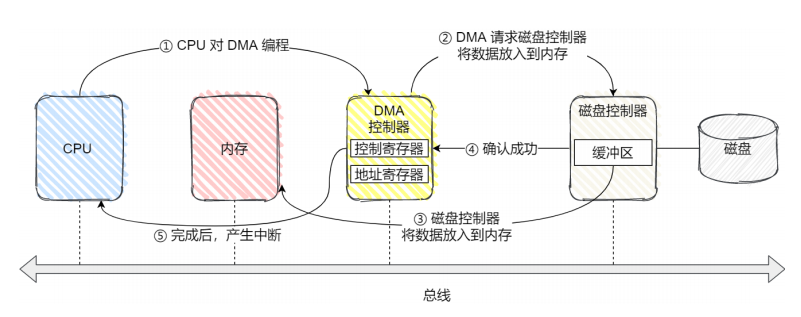

## 1. 设备控制器

每个硬件设备中都有一个设备控制器

* 设备控制器里面有芯片，可以执行自己的逻辑
* 设备控制器有自己的寄存器，可以用来与CPU通信
  * CPU通过写入这些寄存器，OS可以对设备发出命令
  * CPU通过读取这些寄存器，可以了解设备的状态
* 寄存器分为三类
  * 状态寄存器：用于告诉CPU设备的状态
  * 命令寄存器：CPU向该寄存器写入数据，来向设备传达命令
  * 数据寄存器：CPU向设备写入需要传输的数据

## 2. 设备分类

* 块设备——把数据存储在固定大小的块中，每个块有自己的地址（硬盘，USB）
  * 块设备通常传输的数据量很大，于是在块设备的设备控制器中可能有一个可读写的数据缓冲区
    * CPU写入数据到缓冲区，当缓冲区数据屯够了才发送给设备
    * CPU从缓冲区读数据，缓冲区数据屯够了才会拷贝到内存
  * CPU与设备的寄存器和数据缓冲区交互
    * 端口IO——每个寄存器分配一个IO端口，通过特殊的汇编指令操作这些寄存器
    * 内存映射IO——将所有的寄存器映射到内存空间，像读写内存一样读写寄存区/数据缓冲区
* 字符设备——以字符为单位发送or接收一个字符流（鼠标）

## 3. DMA工作流程

1. CPU对DMA控制器下发指令，然后干自己的事去了
2. DMA控制器向磁盘控制器发出指令，让它从磁盘读取数据到磁盘控制器的缓冲区
3. 磁盘控制器将缓冲区中的数据传输到内存
4. 磁盘控制器向DMA发送成功信号
5. DMA收到信号后，触发中断通过CPU，CPU可以直接用内存中的数据

## 4. 设备驱动程序

* 为了屏蔽设备控制器的差异，引入了设备驱动程序
* 不同的设备控制器虽然功能不同，但是通过设备驱动程序给OS提供统一的接口，这样不同的设备就可以以相同的方式接入OS
* 设备完成了工作，会发送中断给CPU，OS需要处理这个中断
* 设备驱动程序中定义了处理中断的逻辑（中断处理程序）

## 6. 设备完成工作后如何通知CPU

* 设备完成工作后，通过中断来通知OS，CPU需要来处理中断
* 在**设备驱动程序**中定义好了中断的处理逻辑（中断处理程序），

1. 外部设备处理完工作后，通过中断控制器向CPU发送中断
2. 保护被中断进程的CPU上下文
3. 调用相应的中断处理程序（在设备驱动程序中）
4. 进行中断处理
5. 恢复被中断进程的上下文

## 7. 通用块层

* Linux提供一个统一的通用块层，来管理不同的块设备
* 通过块层，包括块设备的IO队列和IO调度器

* 通用块层有两个功能

  1. 向上为文件系统和应用程序，提供访问块设备的标准接口

     向下将不同的磁盘设备抽象为统一的块设备，并在内核层面，提供一个框架来管理这些设备的驱动程序

  2. 通用块层给文件系统和应用程序发来的IO请求排队，再通过IO调度器（IO调度），选择一个IO发给设备