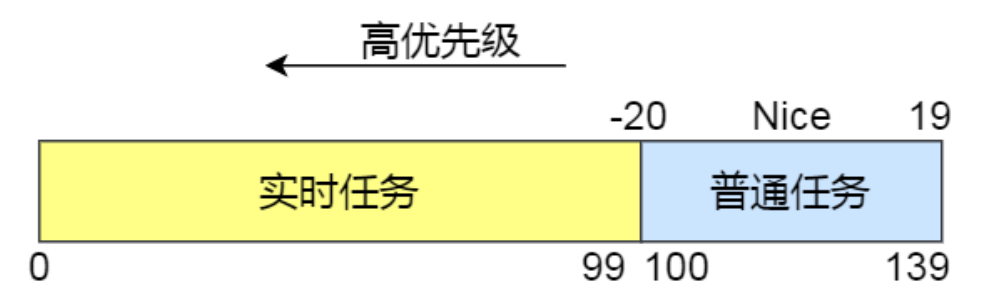
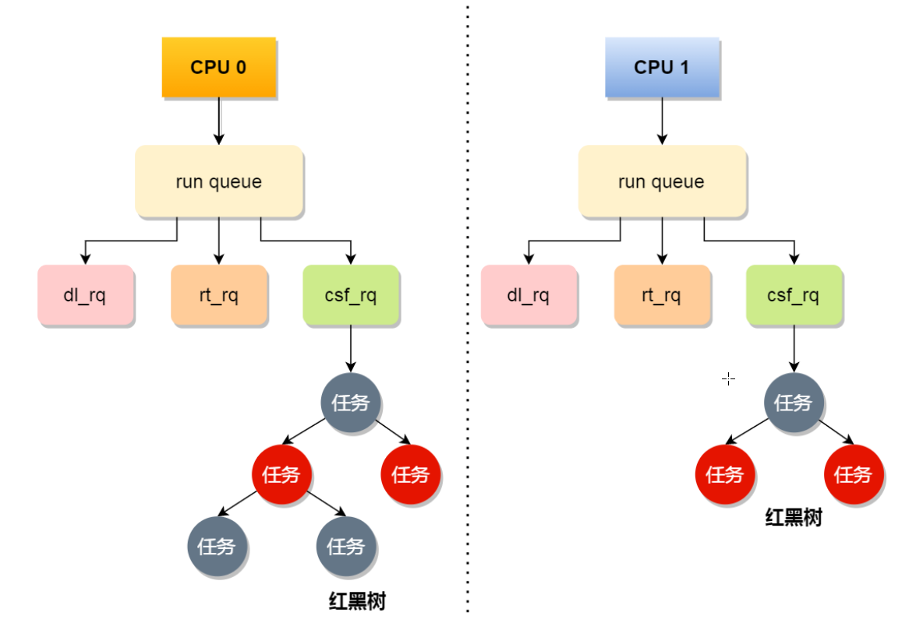
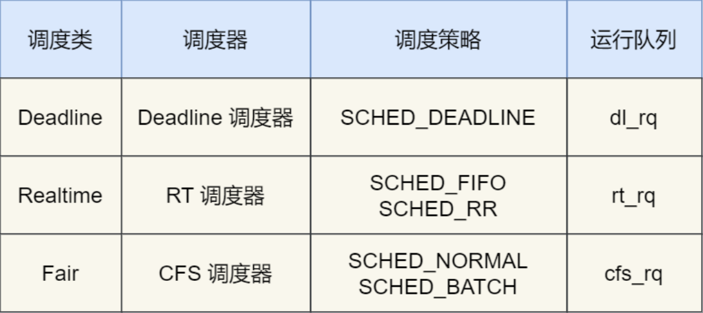

## 1. Linux实现线程

Linux内核中，进程和线程都是用**tark_struct结构体**表示

* 线程的tark_struct结构体中，部门资源共享了进程已经创建的资源（内存地址空间，代码段，文件描述符等）


Linux内核中的调度器，调度的对象是**tark_struct**

Linux根据任务的优先级以及响应要求，将任务分为两种（数值越小，优先级越高）

* **实时任务**：对系统的响应时间要求很高（优先级在0-99）
* **普通任务**：响应时间没有很高的要求（优先级100-139）




## 2. CPU运行队列

每个CPU都有自己的运行队列，里面包含三个运行队列

* Deadline运行队列（dl_rq）——存放实时任务
* 实时任务运行队列（rt_rq）——存放实时任务
* CFS运行队列（csf_rq）——存放普通任务，红黑树结构，按照vruntime大小来排序，最左侧的叶子节点是下次被调度的任务



* **优先级：Deadline>Realtime>Fair，也就是说Linux选择下一个任务时，会优先从dl_rq中选择任务，然后从rt_rq中选择任务，最后从csf_rq中选择任务（实时任务总是比普通任务优先被执行）**


## 3. 调度类

Linux为了保障高优先级的任务尽可能早的被执行，划分了这几个调度类



* **优先级：Deadline>Realtime>Fair，也就是说Linux选择下一个任务时，会优先从dl_rq中选择任务，然后从rt_rq中选择任务，最后从csf_rq中选择任务（实时任务总是比普通任务优先被执行）**

* **实时任务调度类**

  * **Deadline**
    * **SCHED_DEADLINE**：按照deadline进行调度，deadline快到的任务优先调度
  * **Realtime**
    * **SCHED_FIFO**：相同优先级的任务，按照先来先服务的原则，并且优先级更高的任务可以抢占优先级低的任务
    * **SCHED_RR**：相同优先级的任务，轮流执行，保证公平，但是优先级更高的任务可以抢占优先级低的任务

* **普通任务调度类**

  * **Fair**

    * **SCHED_NORMAL**：普通任务使用的调度策略
    * **SCHED_BATCH**：后台任务的调度策略，不和终端进行交互，因此在不影响其他需要交互任务的时候，可以适当降低其优先级

    **CFS调度器实现了完全公平调度算法（Completely Fair Scheduling）**

    这个算法的理念是让分配给每个任务的CPU时间一样长——每个任务计算一个虚拟运行时间vruntime，如果一个任务运行时间越久，其vruntime越大

    CFS算法调度时，优先选择vruntime少的任务，保证每个任务的公平性

    ```
    vruntime=vruntime+实际运行时间* NICE_0_LOAD/权重
    ```

    

    

