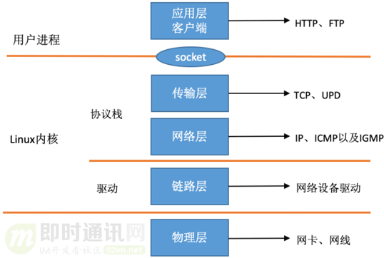

# 1. Socket介绍

* Socket存在于OS内核中，有2个缓冲区
  
  * Socket接收缓冲区（接受队列）
  
  * Socket发送缓冲区

* Socket有一个核心内核对象sock，sock包含以下数据
  
  * 接受队列（Socket接受缓冲区）
  
  * 等待队列
  
  * 函数指针sk_data_ready——**数据就绪处理函数**

* 对Socket写时，用户线程将数据从用户缓冲区拷贝到Socket发送缓冲区，然后内核中有单独的线程会负责执行剩下的步骤

* 对Socket读时，用户线程将数据从Socket接收缓冲区拷贝到用户缓冲区

# 2. RingBuffer

* 现在一般每个网卡都有多个队列（收包队列，发包队列），每个队列都是一个RingBuffer表示

# 3. 网络收包总览

* 物理层对应的是网卡是网线，应用层是各种应用，Linux实现的是数据链路层，网络层，传输层

* 在Linux内核中，数据链路层主要是依赖网卡驱动实现，内核协议栈实现网络层和传输层

* Linux内核为应用层提供网络抽象服务(socket)

## 3.1 接收数据

* 下面接受数据的过程采用了**NAPI机制**——中断+轮询

* Linux通过中断来处理网络数据的到达，但是由于中断处理函数耗时过长，会过度占据CPU，所以Linux将中断处理函数分成了两个部分——硬中断和软中断（Linux2.4后）
  
  * 硬中断：进行最简单的工作，快速处理后释放CPU
  
  * 软中断：剩余的工作，由**内核线程ksoftirqd**来处理，软中断运行期间会暂时关闭中断，避免不断到达的数据包不断地触发中断

**接收数据的流程如下**

1. 数据到达网卡

2. 网卡上的数据通过DMA拷贝到内存中的Ring Buffer

3. 网卡发送硬中断给CPU，通过CPU有数据到达

4. CPU响应硬中断，调用网络设备驱动注册的**硬中断处理函数**，网络设备驱动注册的**硬中断处理函数**做以下的事情
   
   * 记录硬件中断频率（寄存器）
   
   * 进行NAPI调度
     
     * 发送软中断请求给内核软中断线程
   
   * 释放CPU

5. 内核线程ksoftirqd检测到有软中断请求到达，开始处理软中断，调用网卡驱动程序注册的poll函数开始收包，将数据从Ring Buffer中取出，通过网络协议栈进行处理，最后写入Socket的接收缓冲区，然后调用Socket的数据就绪处理函数（在同步阻塞IO和IO多路复用下逻辑是不一样的）

## 3.2 发送数据

1. 通过系统调用，进程由用户态切换为内核态，将数据由用户缓冲区拷贝到Socket发送缓冲区，然后用户进程就切换回用户态，返回，后续的操作由内核去执行

2. 内核线程将Socket发送缓冲区中的数据取出，交由网络协议栈进行处理，最终写入到RingBuffer中

3. 通知网卡，网卡通过DMA将数据从RingBuffer拷贝到网卡中，发送出去

4. 网卡发送硬中断给CPU，CPU会触发一个软中断来清除RingBuffer中的数据
