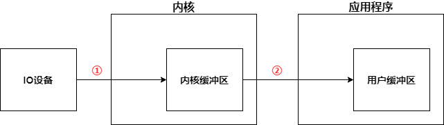
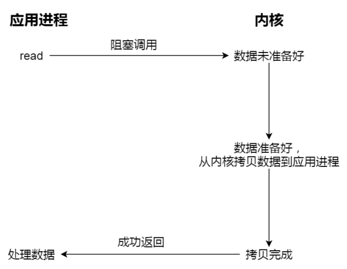
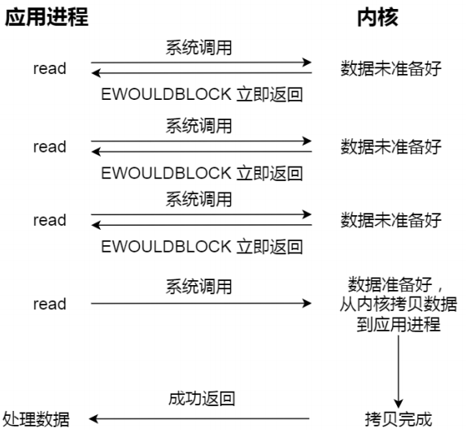

# 1. IO过程

应用进程发出IO请求后，分为2个过程

1. **内核准备数据**，将数据从数据源读入**内核缓冲区**（数据源可能是IO设备，也可能是网卡）
2. **内核将数据从内核缓冲区拷贝到用户缓冲区**

# 2. IO类型

* **划分**
  
  * **缓冲与非缓冲**
    * **缓冲IO**：利用**标准库提供的缓存功能**来访问文件，程序访问标准库，标准库再通过系统调用访问文件
    * **非缓冲IO**：直接通过系统调用访问文件
  * **直接与非直接**
    * **直接IO**：不使用Page Cache，直接通过文件系统访问磁盘
    * **非直接IO**：使用Page Cache，读操作时，先在Page Cache中查看是否有要的数据，如果没有，数据从磁盘读入内核缓冲区，再由内核缓冲区拷贝到用户缓冲区；写操作时，数据从用户缓冲区拷贝到内核缓冲区，再由内核决定什么时候写入磁盘
      * **触发内核缓冲区写入磁盘**
        * 调用write时，数据是从用户缓冲区写入内核缓冲区，如果内核缓冲区中数据太多，就会将内核缓冲区写入磁盘
        * 用户调用fsync
        * 内存不足时
        * 内核缓冲区中数据的缓存时间超过了指定时间
  * **阻塞与非阻塞**
    * **阻塞IO**：内核在准备数据时，应用程序阻塞等待
    * **非阻塞IO**：内核在准备数据时，应用程序继续干自己的事
  * **同步与异步**
    * **同步IO**：当内核准备好数据后，内核通知应用进程去拷贝数据
    * **异步IO**：一切交由内核去做，当内核将数据拷贝到用户缓冲区后，通知应用进程

* **五大类IO**
  
  * 同步IO
    * **同步阻塞IO**
    * **同步非阻塞IO**
    * **IO多路复用**
    * **信号驱动IO**
  * **异步IO**

## 2.1 同步阻塞IO

应用进程阻塞等待内核准备好数据，当内核准备好数据后，将数据由内核缓冲区拷贝到用户缓冲区

## 2.2 同步非阻塞IO

应用进程通知内核去准备数据，然后应用进程继续干自己的事，在内核准备数据期间，应用进程会不断询问内核是否准备好数据，如果内核准备好数据，那么应用进程将数据从内核缓冲区拷贝到用户缓冲区

## 2.3 IO多路复用

具体看IO多路复用

## 2.4 信号驱动IO

## 2.5 异步IO

* 应用进程通知内核，内核准备数据，然后将数据从内核缓冲区拷贝到用户缓冲区，然后发送信号通知应用进程