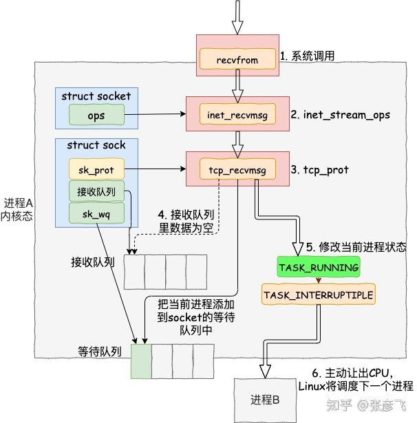
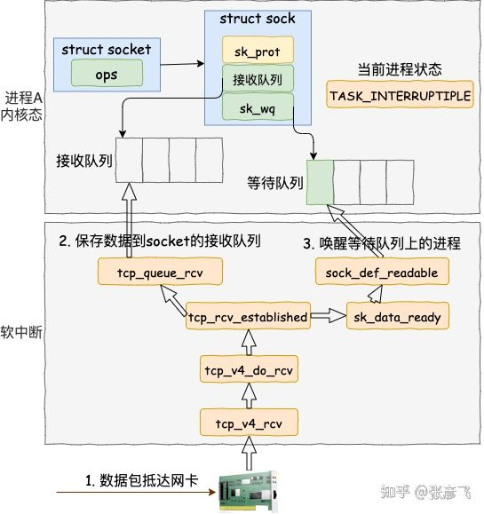
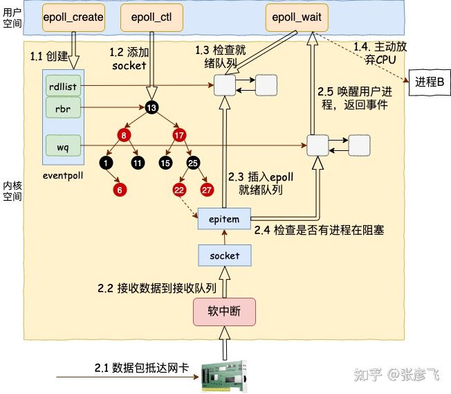

* 一个线程可以**监听多个Socket**，一旦某个Socket上有事件达到，那么会通知应用程序处理

* select/poll/epoll是内核提供的IO多路复用系统调用

## 1. 为什么要有IO多路复用

传统的同步阻塞IO，效率过低，下图表示传统的`recv()`执行流程





1. 调用系统调用之后，进程由用户态进入内核态，然后在Socket的接受缓冲区中查看是否有数据，如果没有，将进程自己添加到该Socket的等待队列中，然后将进程状态更改为阻塞，让出CPU

2. 当数据到达网卡时，网卡向OS发出中断请求，OS通过软中断来处理，软中断会将数据从网卡读出，交由网络协议栈进行处理，最后写入Socket的接受缓冲区，然后唤醒在该Socket上等待的进程


## 2. select实现

### 2.1 select API

```c
typedef struct{
    unsigned long fds_bits[__FDSET_LONGS];//select中使用固定长度的bitmap来表示Socket文件描述符集合
} fd_set;

int select(int max_fd,fd_set* readset,fd_set* writeset,fd_set* exceptset,struct timeval* timeout);//返回就绪的文件描述符的数目
```

### 2.2 select使用

```c
fd_set fs;//应用进程维护一个集合来保存所有已连接的Socket的文件描述符

while(1){
    //调用select()时，将整个Socket文件描述符集合拷贝到内核中，让内核去监听，应用进程阻塞等待select返回
    //内核会对集合中的每一个Socket进行监听，当内核监听到某个Socket上有网络事件产生，将Socket标记为可读/可写，然后内核将内核中的文件描述符集合拷贝回用户态
    //select返回就绪的Socket数目
    nfds=select(&fs);

    //应用进程从select返回，遍历Socket描述符集合，找到可读/可写的Socket，进行处理
}
```

### 2.3 select问题

* **select中**使用固定长度的BitsMap来表示Socket文件描述符集合（大小默认为1024，也就是说最多只能监听1024个Socket）
* **问题——两次拷贝，两次遍历，性能不是很高**


## 3. poll

### 3.1 poll API

```c
struct pollfd{
    int fd;//需要内核监听的Socket的文件描述符
    short events;//需要内核监听的事件
    short revents;//实际发生的事件
}

int poll(struct pollfd * fds, nfds_t nfds,int timeout);//返回就绪的文件描述符的数目
```

### 3.2 poll使用

* **同select**，不过这里使用**数组**来表示已连接的Socket的文件描述符集合，所以没有文件描述符数目限制（但是还是会受OS限制，OS限制了一个进程最多可以打开的文件描述符数目）

## 4. epoll

epoll核心结构是一个eventpoll对象，该对象中有2个子结构

* **红黑树**——跟踪被监听的Socket

* **就绪链表**——存储ready的Socket

```c++
struct eventpoll{
    struct rb_root rbr;//红黑树根节点
    struct list_head rdlist;//就绪链表
}
```

* epoll还提供三个API
  
  * `epoll_create()`
  
  * `epoll_ctl()`
  
  * `epoll_wait()`

### 4.1 epoll_create

* 在内核中创建一个eventpoll结构

### 4.2 epoll_ctl

1. 在Socket的等待队列中添加一个带有回调函数的等待事件

2. 创建一个红黑树节点，将该红黑树节点插入epoll中的红黑树

### 4.3 请求达到

1. 当数据到达网卡时，网卡通过中断通知OS，OS触发软中断进行处理

2. 软中断将数据读出，通过网络协议栈进行处理，写入到Socket接收缓冲区

3. 对于epoll，还需要找到Socket对应的节点，将其添加到就绪链表中

4. epoll检查是否有进程阻塞在epoll上，如果有，将其唤醒



### 4.4 epoll_wait

* 进程检查就绪队列中是否有ready的Socket，如果有就取出返回，如果没有就会阻塞等待


### 4.5 epoll工作模式

epoll有两种工作模式——LT和ET

* 边缘触发模式LT——如果一个Socket中还有数据可读，那么epoll_wait每次都会返回这个Socket的文件描述符，提醒用户去处理
* 水平触发模式ET——如果一个Socket可读，那么只会提醒一次，在下次有新的数据流入Socket前都不会再有提示

## 5. 三者比对

|            | select   | poll   | epoll                            |
|:----------:|:--------:|:------:|:--------------------------------:|
| 数据结构       | bitmap   | 数组     | 红黑树+链表                           |
| 最大Socket数目 | 1024     | 受限于OS  | 受限于OS                            |
| Socket拷贝   | 每次select | 每次poll | 只有首次调用epoll_ctl才拷贝，epoll_wait不拷贝 |
| 事件发生后的处理效率 | 遍历O(N)   | 遍历O(N) | 回调O(1)                           |
