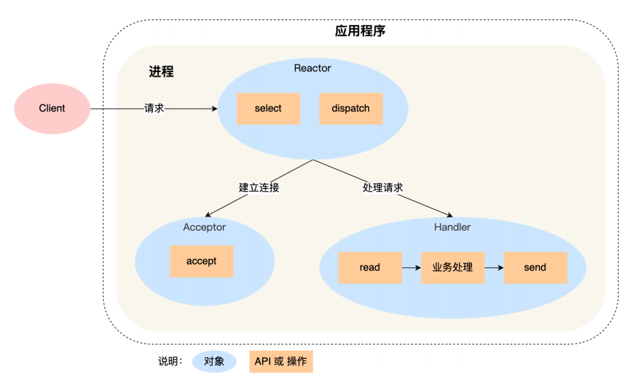
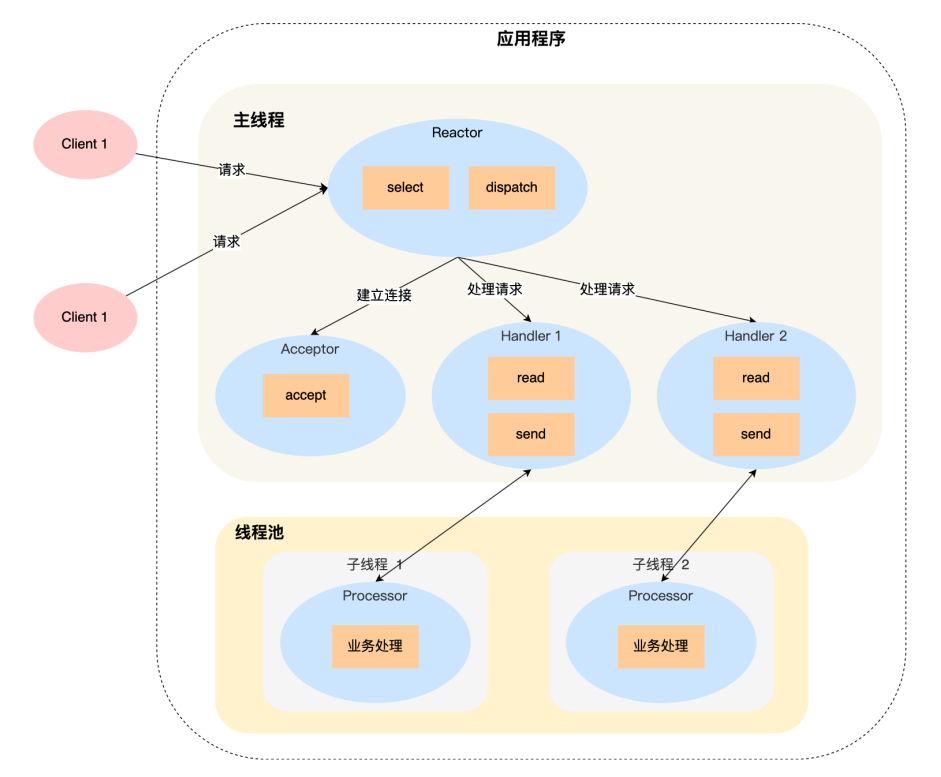
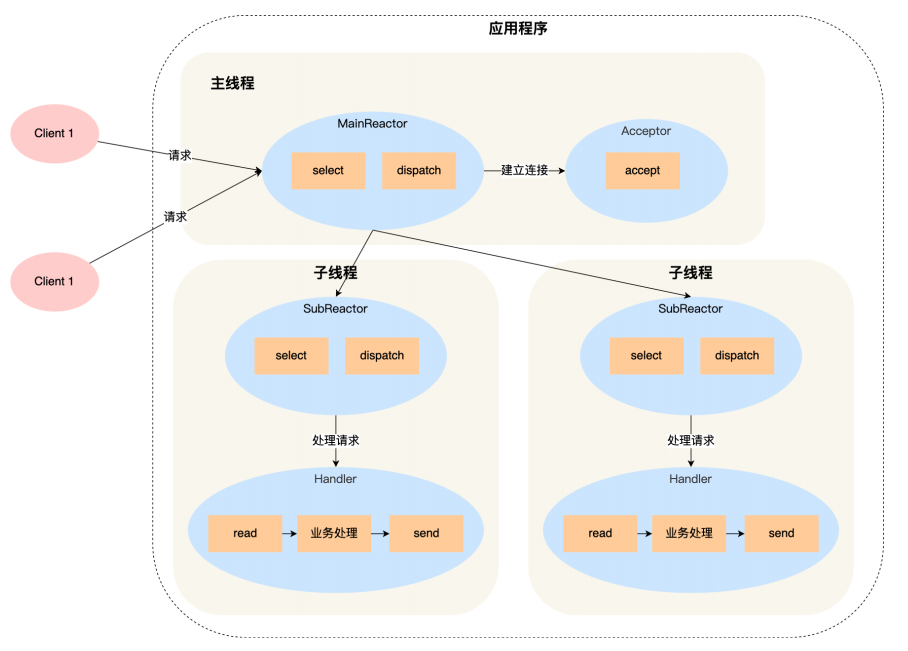

# Reactor模式

* Reactor是同步非阻塞网络模式
* Reactor模式是对IO多路复用的封装
* Reactor也叫Dispatcher模式——IO多路复用监听Socket，Socket上有事件发生，就会根据事件的类型将事件分配给某个线程/进程处理
* Reactor模式有2个核心部分
  * Reactor对象——负责监听事件的发送，分发事件
  * Handler和Acceptor——负责处理事件

## 1. 单Reactor单进程/线程

* Reactor对象通过IO多路复用(select)监听事件，收到事件后，通过dispatch进行分发，建立连接事件分发给Acceptor，其他事件分发给Handler

* **缺点**
  
  * 单进程无法充分利用多核CPU性能
  * Handler在处理事件时，整个进程无法处理其他事件

* **适用场景**：不适合计算密集型的场景，只适合于业务处理非常快速的场景

* Redis采用这个

## 2. 单Reactor多进程/多线程

* Handler对象不再负责业务处理，只负责数据的接收和发送，Handler对象获得数据后，将数据转发给子线程中的Processor对象进行业务处理
* 子线程中的Processor对象进行业务处理，处理完后，将结果发送给Handler对象

## 3. 多Reactor多进程/多线程

* 主线程中的MainReactor通过IO多路复用监听**建立连接事件**，收到建立连接事件后，通过Accpetor对象的accept建立连接，然后将新的连接分配给子线程的SubReactor对象

* 子线程中的SubReactor对象将分配到的连接加入到select中继续监听，如果有新的事件发生，调用Handler对象进行处理

* Netty采用这个方案
