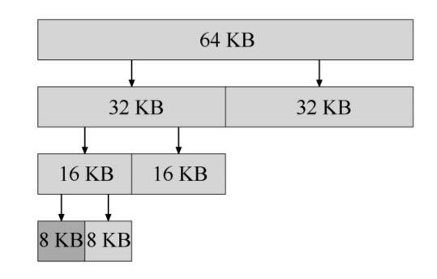

# 1. 内存分配策略

程序申请内存时，OS选择空闲内存块的策略

* **最优匹配**
  
  遍历整个空闲列表，找到和请求的内存大小一样or更大的空闲块，返回这组候选者中最小的一块

* **最差匹配**
  
  找到最大的内存块，返回给用户

* **首次匹配**
  
  找到第一个足够大的块，就返回给用户

* **下次匹配**
  
  多维护一个指针，指向上一次查找结束的位置
  
  想法是将堆空闲空间的查找操作扩散到整个空闲列表中取，避免了遍历查找

# 2. 内存管理方式

* 空闲表法

* 空闲链表法

* 位图

* 伙伴系统

## 2.1 伙伴系统

* 空闲空闲被看成是2的N次方的大空间，当有一个内存分配请求时，空闲空间被递归地一分为二，直到刚好可以满足请求的大小
* 每个2的N次方的内存块都有一个伙伴
* 内存块释放时，将内存块归还给空闲列表，同时会检查伙伴是否空闲，如果空闲，就合二为一，这个递归合并过程继续上溯，直到合并整个内存区域或者某一块的伙伴不是空闲

# 3. 虚拟内存优化

## 3.1 预取

OS在将一个页从磁盘加载到内存时，可能会猜测下一个页面即将被使用，从而提前载入

## 3.2 聚集写入

OS收集多个需要写入磁盘的页，将它们一起写入磁盘

## 3.3 按需置零

* 程序申请一个页时，OS在物理内存中找到页，并将页置0，然后映射到地址空间中，但是如果这个页没有被进程使用，该页的分配就是一种浪费

* 使用按需置零，当程序申请一个页时，OS在页表放入一个页表项，当进程需要读写这个页时，OS才会在物理内存中寻找物理页，并将页置0，映射到地址空间中

## 3.4 copy-on-write

如果程序想要让OS将页A中的数据复制到页B中，并不需要实际复制它，只需要在页表中，将这个两个页映射为同一个物理页帧即可，并标记为只读（实现了快速复制，而不需要移动任何数据）

如果程序尝试向页B中写入数据，OS会给程序分配一个新页，将原页的数据拷贝到这个新页，程序对这个副本页进行写入操作