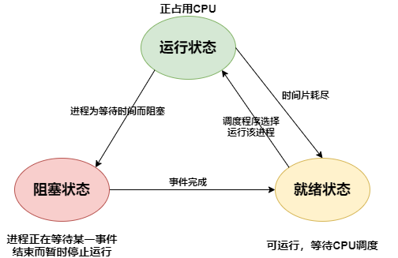
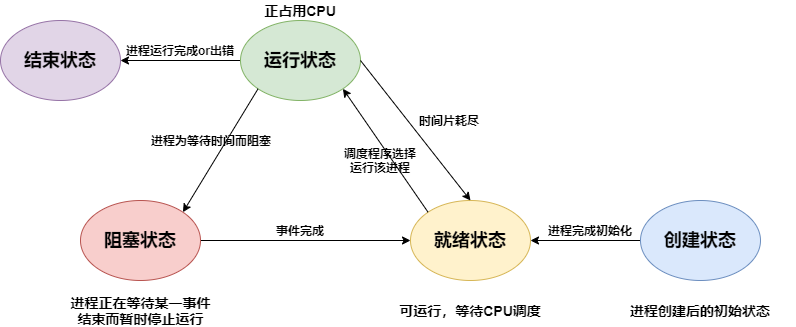
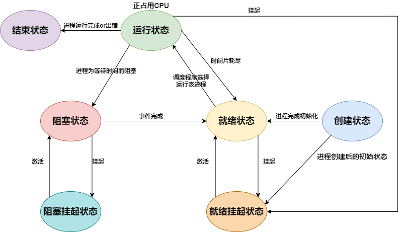
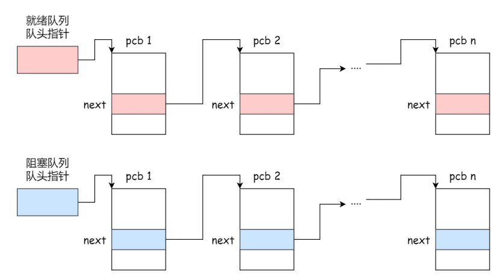
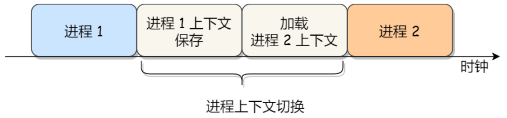
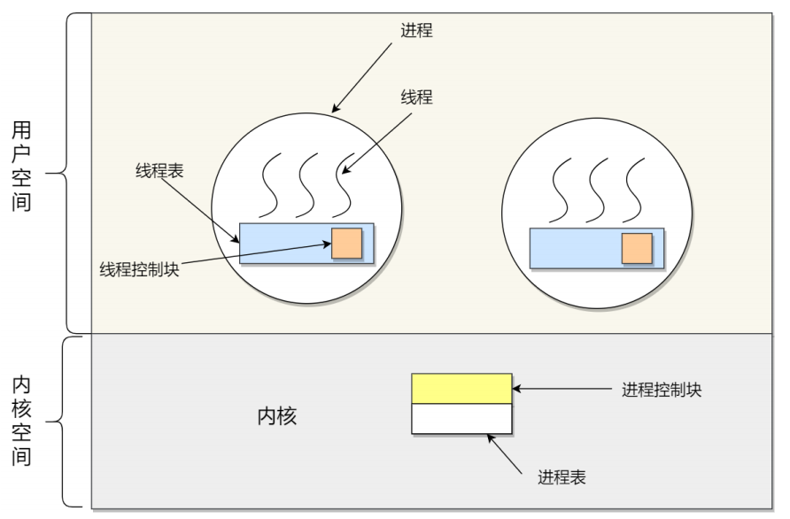
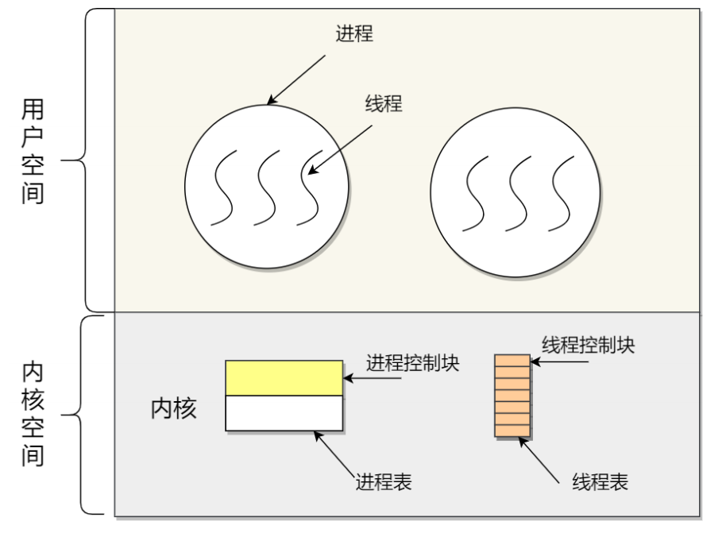
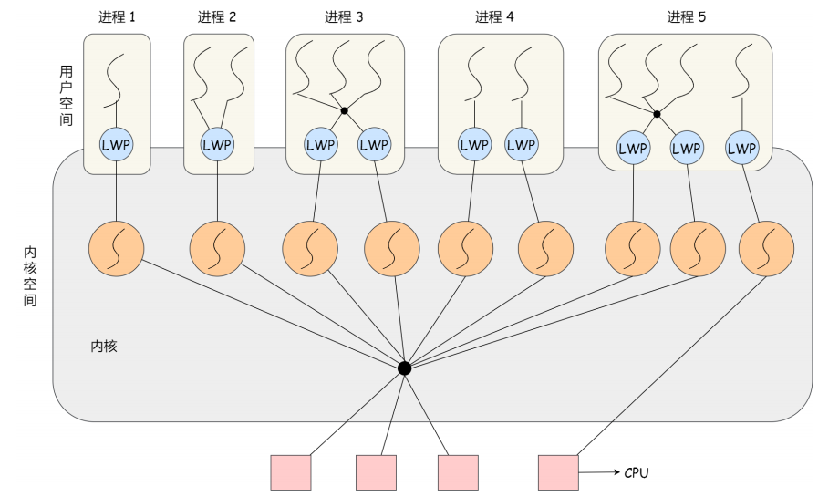

# 1. 进程

## 1.1 进程的概念和组成

* 我们编写的代码知识一个存储在磁盘上的静态文件，通过编译后生成一个二进制可执行文件，当我们运行这个可执行文件时，它会被装载到内存中，接着CPU会执行程序中的每一条指令，程序开始运行
* **进程**——OS为正在运行的程序提供的抽象，是OS进行资源调度和分配的基本单位，实现了OS的并发

* **OS**通过**时分复用技术**来虚拟化CPU——一个CPU在不同进程之间来回切换，某个进程时间片耗尽后，CPU将其挂起，然后执行另一个进程

## 1.2 进程状态

### 1.2.1 三状态模型

### 1.2.2 五状态模型

* 如果有大量处于阻塞状态的进程，这些进程占用着物理内存，这不是我们希望看到的——所以OS通常会将阻塞状态的进程占用的物理内存交换到磁盘上，等再次需要运行的时候，再从磁盘换入内存

### 1.2.3 七状态模型

* 引入挂起状态，进程有三种情况会处于挂起状态
  * 进程的物理内存被交换到了磁盘上
  * 通过sleep将进程挂起
  * 用户希望挂起一个程序的执行，比如Linux中用 **Ctrl+Z**挂起进程

## 1.3 进程的控制结构PCB

* 在OS中，使用进程控制块（PCB）来描述继承

* PCB是进程的唯一标识

### 1.3.1 PCB包含的信息

* **进程描述信息**
  * 进程标识符：进程的唯一标识符
  * 用户标识符：进程归属的用户
* **进程控制和管理信息**
  * 进程状态
  * 进程优先级
* **资源分配清单**
  * 有关进程地址哦空间的信息
  * 进程打开的所有文件的文件描述符列表（其实是一个数组，下标是文件描述符，可以通过文件描述符找到对应的文件）
  * 进程使用的IO设备信息
* **CPU相关信息**
  * 进程运行时的各个寄存器的值（通用寄存器，指令寄存器，程序计数器）（进程切换时，会将进程运行时各个寄存器的值保存到PCB中）

### 1.3.2 PCB组织方式

#### 1.3.2.1 链表

PCB是通过链表的方式进行组织——将具有相同状态的进程放在一起，组成一个队列

#### 1.3.2.2 索引

将同一状态的进程的PCB放在同一个索引表中，索引表项指向相应的PCB，不同的状态对应不同的索引表

# 2. 上下文切换

## 2.1 CPU上下文切换

* CPU寄存器和程序计数器是CPU运行任何任务前都必须依赖的环境，这些环境叫**CPU上下文**

* **CPU上下文切换**——将前一个任务的CPU上下文保存起来，然后加载新任务的上下文到寄存器和程序计数器中，最后再跳转到程序计数器所指的新位置，运行新任务

* **CPU上下文切换**可以分成
  * 进程上下文切换
  * 线程上下文切换
  * 中断上下文切换

## 2.2 进程上下文切换

* 各个进程之间是共享CPU资源的，在不同的时候，进程之间需要进行切换，让不同的进程在CPU上执行，CPU上执行的进程从一个进程变为另一个进程，这就是进程的上下文切换

* 进程的上下文切换包含了地址空间，栈，全局变量等用户空间资源，也包括内核堆栈，寄存器等内核空间的资源

  通常，会把交换的信息保存在PCB中，当要运行另一个进程时，从这个进程的PCB中取出上下文，恢复到CPU中

  

### 发生进程上下文切换的场景

* CPU在运行进程时，给进程分配了时间片，当某个进程分配到的时间片耗尽时，从就绪队列选择另一个进程运行
* 进程通过sleep主动将自己挂起，CPU会去调度其他进程
* 发送硬件中断时，CPU上的进程会被中断挂起，CPU会去执行中断处理程序

## 2.3 线程的上下文切换

* 线程切换时，地址空间保持不动，主需要切换线程的私有数据即可（例如寄存器，栈）

# 3. 线程

## 3.1 线程概念

* 线程是进程当中的一条执行流程
* 同一个进程中的多个线程共享代码段，数据段，打开的文件列表等资源，但是每个线程都有自己独属的寄存器和栈——确保线程的控制流是相对独立的

## 3.2 进程与线程的区别

* **进程是资源分配的基本单位，线程是调度的基本单位（指的是内核线程）**
* 进程拥有一个完整的独属于自己的资源平台，线程只独享必备可少的资源
* **线程的时间效率，空间效率都优于进程**
  * 线程的创建比进程更快，因为进程在创建过程中，还需要创建分配资源，但是线程在创建的过程中，共享进程的资源
  * 线程的终止比进程更快，因为线程释放的资源更少
  * 同一个进程内线程的切换比进程切换更快，因为线程共享进程的地址空间，这意味着同一个进程中的线程都使用同一个页表，在线程切换时不需要切换页表；但是对于进程之间的切换，需要切换页表
  * 线程间的通信比进程间通信效率更高，因为线程共享进程的内存与文件资源

## 3.3 线程的实现

线程有三种实现方式

* **用户线程**：在用户空间实现的线程，不是由内核管理，由用户态的线程库来完成线程的管理
* **内核线程**：在内核中实现的线程，由内核管理
* **轻量级进程（Light-weight)**：用户线程与内核线程组合实现

### 3.3.1 用户线程

* 用户态的线程库来实现用户线程，OS完全不知道用户线程的存在

* 线程控制块(TCB)也是在用户态的线程库中实现的，OS看不到TCB

* 用户线程的管理和调度，是由用户态的线程库函数来完成，OS不直接参与
* 每个进程在用户空间维护一个TCB列表

* **优点**
  * 线程切换不需要使用内核空间，速度快
  * 线程调度由进程自己根据需要进行改变
* **缺点**
  * OS不知道用户线程的存在，**OS调度时是对进程进行调度**，只会**给进程分配一个CPU**，只能有一个用户线程运行，如果一个线程始终占据着CPU，那么其他线程无法运行，无法利用多核CPU
  * 如果用户线程发起系统调用被阻塞，进程中的其他用户线程也无法获得CPU资源，整个进程被阻塞

### 3.3.2 内核线程

* 内核线程由OS管理，OS内核中为每个内核线程都维护了一个TCB
* OS内核维护一个TCB列表，内核线程的管理和调度都由OS负责

* **优点**
  * OS调度是对**内核线程**进行调度，一个进程可以分配到多个CPU资源，同时有多个内核线程并行运行
  * 如何一个内核线程发起系统调用被阻塞了，其他线程可以获得CPU资源，不会受到影响
* **缺点**
  * 由内核来维护PCB和TCB，并且线程的管理和调度都是通过系统调用的方式进行，开销比较大

### 3.3.3 轻量级进程(Linux)

* 一个进程可以有多个LWP

* 每个LWP映射一个内核线程
* LWP与用户线程的映射关系有三种
  * 1：1
  * 1：N
  * M：N

