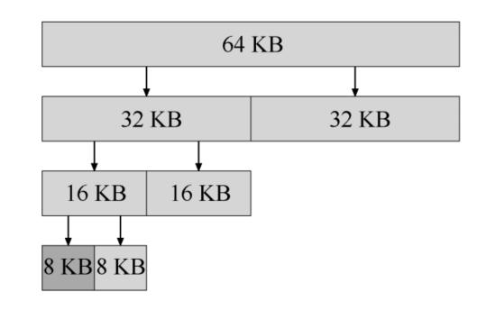

# 2. 内存管理

## 2.2 空闲空间管理

### 2.2.1 思路

1. 空闲列表记录了哪些空间还没有被分配

   

2. **分割**

   申请一块内存时，进行分割操作——从空闲链表找到一块可分配内存，将其分割（一块给用户使用，一块留在内存中）

   

3. **合并**

   用户归还内存时，空闲列表中会插入一个新的节点

   

   并查看归还的内存块是否与原有的空闲块相邻，如果是——将其**合并**为一个大的空闲块

   

### 2.2.2 实现

1. **头块(header)**

   

   * 将物理内存划分为已分配内存和空闲内存——可以将物理内存划分为一块一块
   * 每块内存都有头块（header）——用于保存额外信息
   * 已分配内存块的header
     * size：分配给用户的内存大小（不包含头块）
     * magic：幻数，用于正常性检查
   * 空闲内存块的header
     * size：空闲内存块的内存大小（不包含头块）
     * next：指向下一个空闲内存块的指针

2. **初始化状态**

   假设内存块4096B，那么其初始的状态如下

   

3. **分配内存后**

   

   ----------------------------------------------------------------------------------------------------------------

   

4. **归还内存后**

   

   * 如果空闲内存块**相邻**——需要进行**合并**

### 2.2.3 内存分配策略

程序申请内存时，OS选择空闲内存块的策略

* **最优匹配**

  遍历整个空闲列表，找到和请求的内存大小一样or更大的空闲块，返回这组候选者中最小的一块

* **最差匹配**

  找到最大的内存块，返回给用户

* **首次匹配**

  找到第一个足够大的块，就返回给用户

* **下次匹配**

  多维护一个指针，指向上一次查找结束的位置

  想法是将堆空闲空间的查找操作扩散到整个空闲列表中取，避免了遍历查找

### 2.2.4 其余管理方式

#### 2.2.4.1 分离空闲列表

如果某个应用程序进程申请一种（或几种）大小的内存空间，那么就使用一个独立的列表来管理这样的内存空间

* **好处**——避免了碎片

#### 2.2.4.2 伙伴系统

* 空闲空闲被看成是2的N次方的大空间，当有一个内存分配请求时，空闲空间被递归地一分为二，直到刚好可以满足请求的大小
* 每个2的N次方的内存块都有一个伙伴
* 内存块释放时，将内存块归还给空闲列表，同时会检查伙伴是否空闲，如果空闲，就合二为一，这个递归合并过程继续上溯，直到合并整个内存区域或者某一块的伙伴不是空闲

