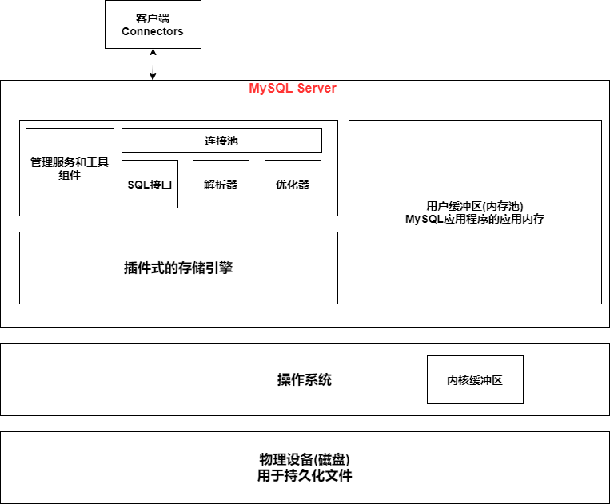

## 1. MySQL体系结构

MySQL使用的是插件式的存储引擎，存储引擎是基于表的

## 2. 存储引擎

* **InnoDB**
  * 支持事务
  * 实现了行锁(读数据默认不加锁)
  * 支持外键
  * 实现了4种事务隔离等级，默认为REPEATABLE  
  * 采用**多版本并发控制(MVCC)** 来获得高并发性  
  * 使用**next-key-lock**来减少幻读的产生  
  * 提供 插入缓冲，二次写，自适应哈希索引，预读等功能  
  * **使用聚簇索引**——表数据的存储按照主键的顺序存放——一定有主键   
    如果提供主键，那么主键作为聚簇索引来存储表数据   
    如果没有提供主键，那么自动生成6字节的ROWID来作为主键   
* **MySIAM**
  * 不支持事务
  * 不支持外键
  * 只有表锁  
  * 存储引擎的缓存池只缓存 索引文件，不缓存数据文件   
  * 采用**非聚簇索引**，可以没有主键，索引文件与数据文件分离  ——所以MySIAM存储引擎表有MYD和MYI两种文件，MYD为数据文件，MYI为索引文件  