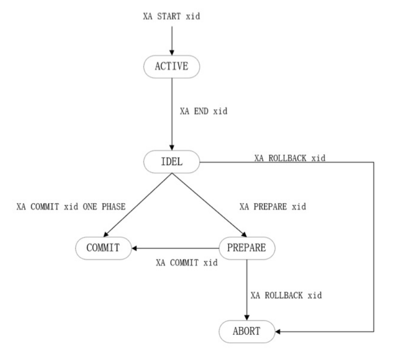

# 1. XA规范(2PC算法)

* XA规范里面提出了2个角色
  
  * **事务协调器**——一个全局事务由多个小事务组成，事务协调器负责和各个小事务进行沟通，指导他们提交or回滚（大哥）
  
  * **事务管理器**——用于管理小事务（小弟）

* 要提交一个全局事务，必须保证属于该全局事务的所有小事务都应该全部提交，只要有任何一个小事务无法提交，那么整个全局事务就要回滚

* 分为两个阶段——Prepare阶段与Commit阶段

## 1.1 阶段一：Prepare

当大哥准备提交全局事务时，会逐个通知各个小弟，如果小弟觉得自己没有问题，就会把事务执行过程中生成的redo log，undo log刷新到磁盘上，然后向大哥返回Yes响应，如果小弟出现了问题，向大哥返回No响应

## 1.2 阶段二：Commit

大哥会收集所有小弟的响应，有以下2种情况

* 如果小弟都返回了Yes响应
  1. 大哥向所有小弟发从Commit请求
  2. 小弟收到Commit请求后，真正提交事务，然后向大哥返回Yes响应
  3. 大哥在收到所有小弟的Yes响应后，完成事务，大哥在某个地方记录下全局事务已提交
* 如果有任何一个小弟返回No响应or有小弟超时未返回请求
  1. 大哥向所有小弟发送Rollback请求
  2. 所有小弟收到RollBack请求后，会通过undo日志回滚，然后向大哥返回Yes响应
  3. 大哥收到所有小弟的Yes响应后，完成事务回滚

# 2. MySQL的XA事务（两阶段提交）

## 2.1 外部XA事务

* 外部XA事务中——MySQL Server作为事务管理器，Client作为事务协调器

* XA START xid：开启一个XA事务，XA事务处于ACTIVE状态
* XA END xid：开启XA事务后，Client可以不断输入SQL，当所有SQL输入完后，执行XA END xid告诉MySQL Server——事务的所有SQL都输入完了，XA事务变为IDEL状态
* XA PREPARE xid：Client通过该语句询问MySQL Server，是否准备好提交这个XA事务，MySQL Server收到这个指令后，会将redo log落盘，XA事务变为PREPARE状态
* XA COMMIT xid：如果XA事务为PREPARE状态，Client通过该语句让MySQL Server提交XA事务，XA事务变为COMMIT状态
* XACOMMIT xid ONE PHASE：如果XA事务为IDEL状态，Client可以通过该语句让MySQL Server直接提交XA事务，XA事务变为COMMIT状态
* XA ROLLBACK xid：如果XA事务为PREPARE状态/IDEL状态，Client可以通过该剧于让XA事务回滚，XA事务变为 ABORT状态

MySQL的外部XA被用于跨行转账这种经典的分布式事务应用场景，还广泛运用在数据库中间件（数据存储在不同数据库中，业务人员将SQL发送给数据库中间件，中间件分析SQL访问的数据位于哪个数据库中，如果业务人员将一个事务发送给中间件，这个事务里面的SQL可能需要在不同的数据库上执行，那么中间件就可以在不同的数据库上开启外部XA事务，当业务人员提交事务时，中间件向各个数据库发送 **XA PREPARE**指令，如果各个数据库正常响应的话，中间件接着向各个数据库发送 **XA COMMIT** 来提交XA事务）

## 2.2 内部XA事务

对于一台MySQL Server来说，一个事务可能涉及到不同的表，这些表可能使用了不同的存储引擎，如果开启了bin log，这个事务还会涉及到Server层的bin log

MySQl的内部XA事务

* 保证所有支持事务的存储引擎要么全部提交，要么全部回滚
* 保证了**Server层的bin log**和**存储引擎层做的修改**是一致的——如果存储引擎层提交了事务，Sever层的bin log必须落盘，如果存储引擎层回滚了事务，Server层的bin log就不能落盘
* MySQL会为内部XA事务生成一个xid

### 2.2.1 InnoDB事务的提交和bin log日志写入（两阶段提交）

#### 2.2.1.1 数据结构支持

事务在运行过程中，会不断生成undo log，这些undo log会写入若干个undo log页，这些页会组织成undo log页链表（多个），undo log页链表中的第一个undo log页中记录了一些控制信息，核心的有这几个

* **TRX_UNDO_STATE**：表示Undo页面链表的状态（有Active，Cached，Free，Purege，Prepared，默认为Active）
* **TRX_UNDO_XID_EXISTS**：是否包含XID
* **TRX_UNDO_TRX_ID**：如果TRX_UNDO_XID_EXISTS为true，那么该字段存储的是XA事务的XID

#### 2.2.1.2 两阶段提交过程

1. **Prepare阶段**
   
   在事务对应的undo log页链表中的第一个undo log页中记录下事务的一些信息（**修改TRX_UNDO_STATE字段为Prepare**），将redo log刷盘

2. **Commit阶段**
   
   将事务产生的bin log落盘，然后完成**存储引擎层面的事务提交**（主要做下面的事情）
   
   * 更新undo log页链表中第一个undo log页的 **TRX_UNDO_STATE字段**，修改规则如下
     1. 如果事务产生的undo log较少——让其他事务复用undo log页链表，将 TRX_UNDO_STATE修改为 Cached
     2. 如果undo log页链表存储的是insert undo log——那么事务提交后，这些insert undo log无用了，将TRX_UNDO_STATE修改为 Free，释放其占用的页
     3. 如果undo log页链表中存储有delete undo log/update undo log——将TRX_UNDO_STATE修改为 Purge，等待purge线程回收

### 2.2.2 两阶段提交下的崩溃恢复

1. 按照已经刷盘的redo log来恢复页面数据

2. 通过系统表空间第5号页面定位到128个回滚段的位置，然后对于每一个回滚段
   
   * 遍历回滚段的Rollback Segment Header页面的 **TRX_RSEG_UNDO_SLOTS**中，对于不为 FIL_NULL的undo slot，找到其对应的undo链表
   
   * 检查undo链表的first undo page中 Undo Segment Header中的 TRX_UNDO_STATE属性
     
     * Active——数据库崩溃时，事务还未提交，需要回滚
       
       * Prepare——数据库崩溃时，redo log落盘了，但是bin log可能落盘了，也可能还未落盘
         * 从undo链表的first undo page中的 Undo Log Header中的读出XA事务的XID，在最后一个bin log文件中查看是否有相同的xid的bin log
           * 如果有——bin log已经落盘了，不需要做任何操作
           * 如果没有——bin log还未落盘，通过undo log链表去回滚
     
     * 如果是其他状态——数据库崩溃时，完成了两阶段提交，不需要做任何操作

# 3. group commit

在两阶段提交中，一个事务将自己的redo log落盘，bin log落盘，效率太低了

Group Commit——将多个事务产生的bin log和redo log收集起来统一

## 3.1 不开启bin log

将多个事务的redo log一起刷盘

## 3.2 开启bin log——Bin Log Group Commit

开启bin log后，MySQL使用两阶段提交

此时group commit——将多个事务的bin log一起刷盘

Bin Log Group Commit将**两阶段提交中的Commit阶段**细分为三个阶段——**flush，sync，commit**

每个阶段都有一个队列，一个队列中可以有多个事务，每个队列中的第一个事务为leader，其他事务为follower

三个阶段并发

1. **flush阶段**
   
   队列中的leader将队列中所有事务的bin log从binlog cache写入文件系统缓存

2. **Sync阶段**
   
   队列中的leader，通过fsync()，将文件系统缓存中的数据同步到磁盘上（一次fsync()完成多个事务的bin log落盘）

3. **commit阶段**
   
   遍历队列中的事务，逐一完成其存储引擎层事务的提交（更改对应的undo log页链表中的TRX_UNDO_STATE字段）
