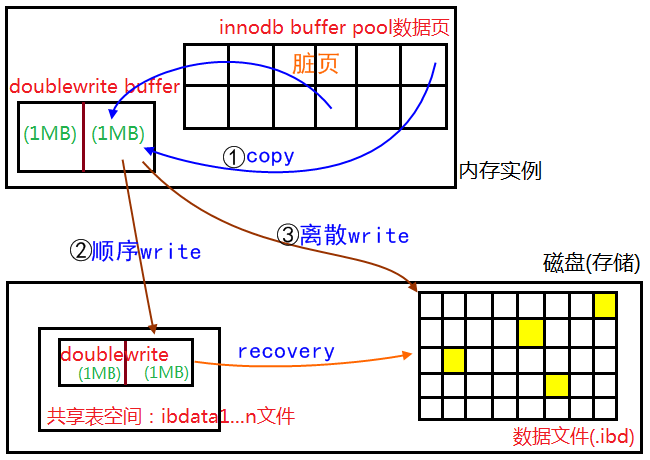

一条写SQL，其redo日志会先落盘，然后对数据页进行修改，成为脏页，脏页存放在Buffer Pool中

当脏页需要刷盘时，会出现问题

* **脏页的刷盘**需要double write机制防止部分写失效
* redo日志的刷盘不需要double write——redo日志的基本单位是redo log block（512B），是磁盘IO单次操作的最小单位，不会出现部分写失效

## 1. 脏页刷盘风险——部分写失效

* InnoDB单次操作的最小单位是InnoDB页（16KB）
* OS的文件系统单词操作的最小单位是页（4KB/1KB）
* 磁盘IO单次操作的最小单位是扇区（512B）

所以我们在将Buffer Pool中的脏页刷新到磁盘上时，可能会出现**部分写失效**的问题，导致InnoDB页不完整，是一个损坏的页——这种情况是无法通过redo日志去恢复的，所以需要**double write**

## 2. double write

有了double write机制后，脏页的刷盘变为以下流程

1. 将脏页拷贝到double write buffer中
2. 将double write buffer中的数据写入共享表空间中的double write file（顺序IO，效率高）
3. 将double write buffer中的脏页数据写入数据文件中（随机IO）
4. 如果在第三步执行过程中，出现了部分写失效，那么可以通过共享表空间double write file来恢复数据文件，然后再通过redo重做
