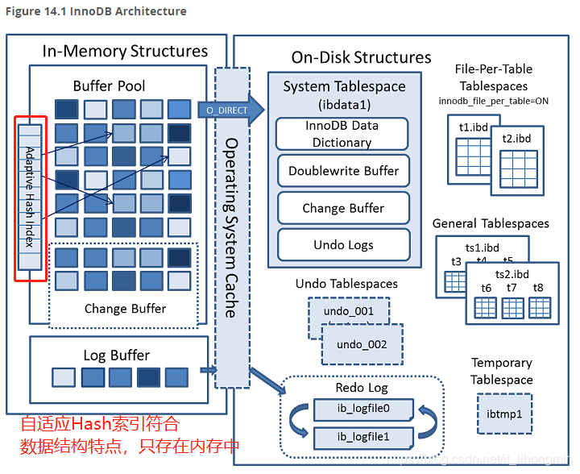

InnoDB会监控对表中各索引页的查询，如果观察到建立哈希索引可以带来速度提升,则建立哈希索引,称之为自适应哈希索引

自适应哈希索引的底层数据结构是Hash表——只存在内存中

 InnoDB的自适应Hash索引是默认开启的，可以通过配置参数设置：innodb_adaptive_hash_index = off进行关闭

* 哈希索引只能适用于等值查询
* 自适应哈希索引存储key-value——key为查询使用到的列值，value为目标记录所在的页号