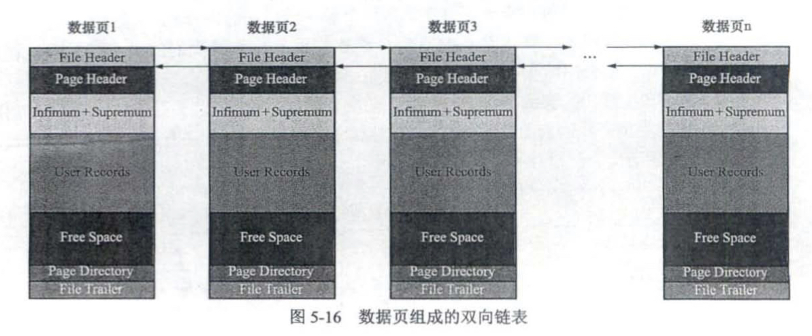
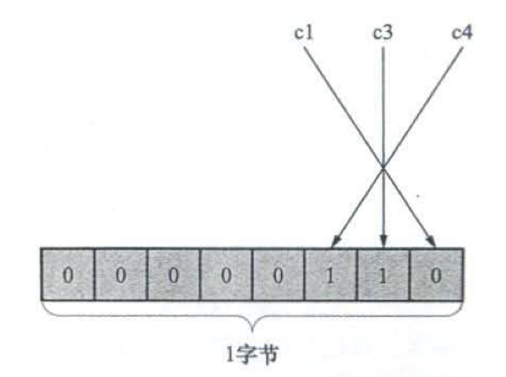
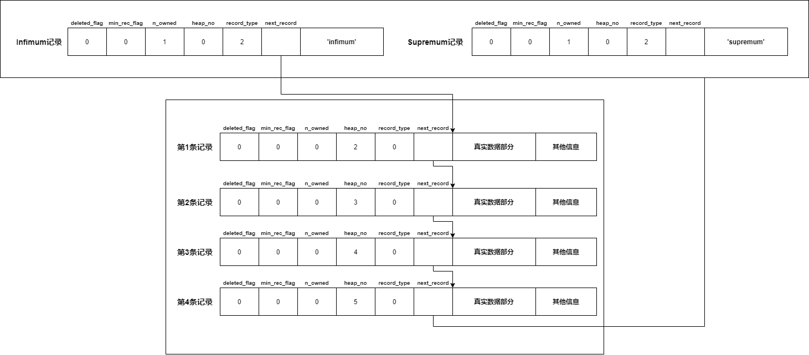
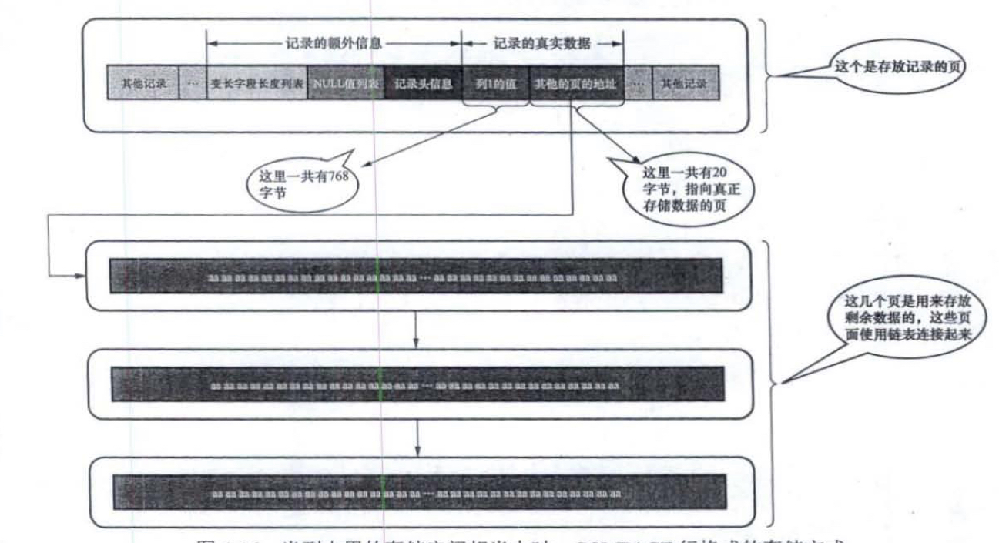
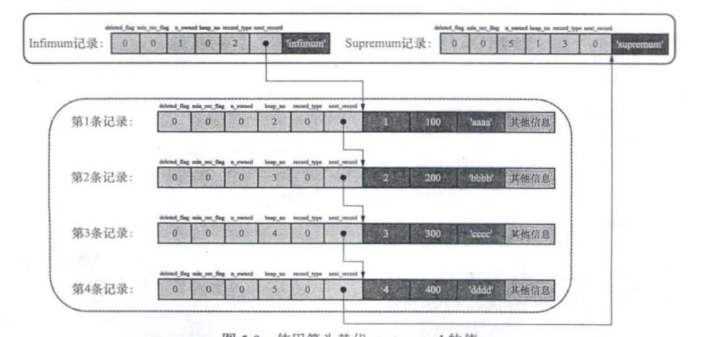
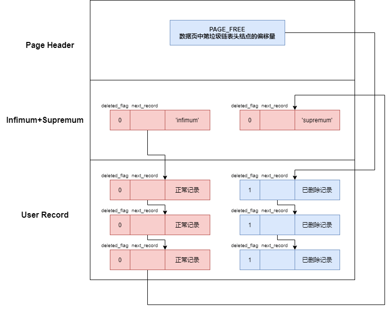
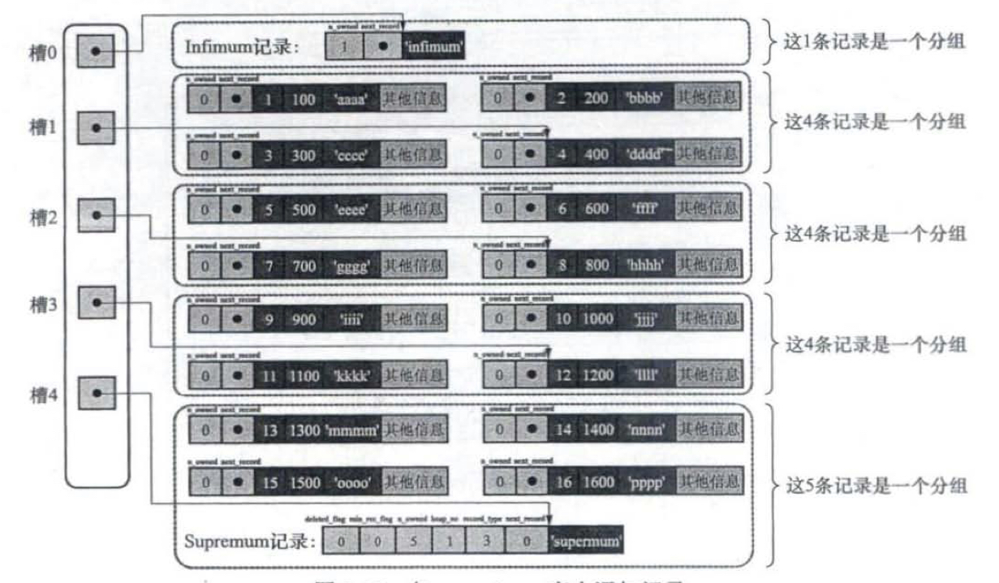
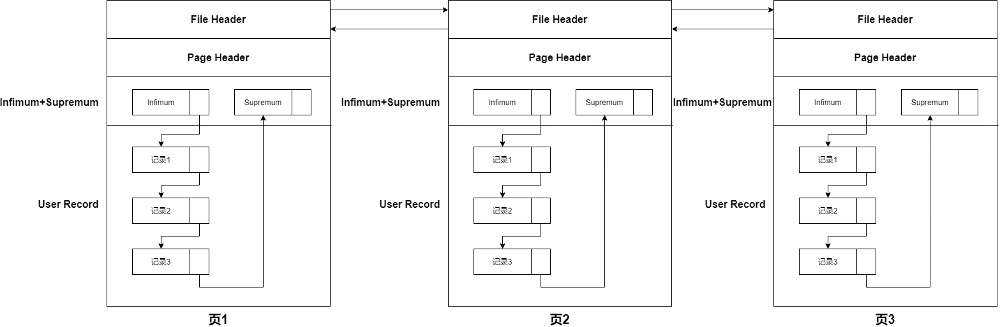
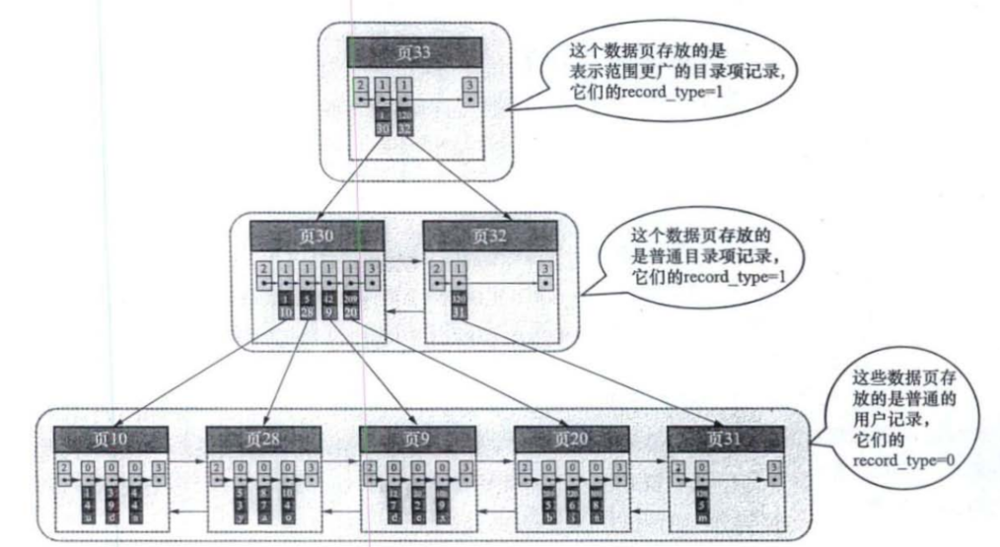
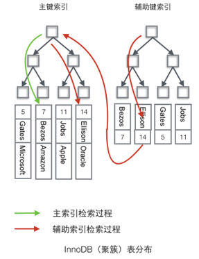

如果进行高效地查询一条记录

1. 定位到记录所在的数据页——通过**B+树索引**
2. 在页中快速找到记录——通过**数据页的结构**和**记录的结构**
   * 在数据页的Page Directory中进行二分查找，找到对应的Slot
   * 遍历Slot对应的记录组，找到记录（记录之间根据主键大小形成一条单向链表）

# 1. InnoDB的页

页是InnoDB管理存储空间的基本单位，一个页的大小一般为16KB

InnoDB里面有许多不同的页，但这些页有一些相同的结构——File Header和 File Trailer

## 1.1 File Header

* **FIL_PAGE_SPACE_OR_CHESM**：页的校验和

* **FIL_PAGE_OFFSET**：页号（通过页号可以定位到唯一的页）

* 两个非常重要的字段——**让页与页之间可以形成双向链表**
  
  * **FILE_PAGE_PRE**：前一个页的页号
  * **FILE_PAGE_NEXT**：下一个页的页号
  
  

* **FILE_PAGE_LSN**：页最后一次被修改时对应的LSN值

* **FILE_PAGE_TYPE**：页的类型

## 1.2 File Trailer

**File Trialer主要是用于校验页的完整性**

* **检验和**——与File Header中的校验和配合使用，在页面发生修改时，在将修改后的页刷新到磁盘中之前需要将这两个校验和都计算出来，如果在刷新过程中出现错了，那么File Header中的校验和与FIle Trailer中的校验和就会不一致，如果正常刷新，者两个校验和是一致的（用于校验页面的完整性）
* **页面最后一次被修改时对应的LSN值**——也是用于校验页面的完整性

# 2. 记录的结构

记录有4种类型——COMPACT，REDUNDANT，DYNAMIC，COMPRESSED

我们只关注**COMPACT**的结构，REDUNDANT是旧版本，DYNAMIC和COMPRESSED跟COMPACE差不多

## 2.1 变长字段长度列表

存储各个变长字段的真实长度（每个变长字段用1or2个字节来存储其真实长度）

* 如果某个变长字段允许存储的最大字节数目>255 and 真实占用的字节数> 127——使用2个字节来存储其长度；否则使用1个字节来存储其长度
* 在可变长编码下，char(M)类型的长度也是不固定的，所以也会在变长字段长度列表种存储其长度

## 2.2 NULL值列表

NULL值列表占据 整数个字节，如果有5个允许存储NULL的列，那么NULL值列表占据1个字节（8位），用低5位来表示对应的列是否位NULL

* 二进制位为1——该列值为NULL
* 二进制位为0——该列值不为NULL

## 2.3 记录头

* **deleted_flag**：标记记录是否被删除

* **min_rec_flag**：B+树每层非叶子节点中的最小的目录项记录会添加该标记

* **n_owned**：在一个页中，记录被划分为多个组，每个组的最后一条记录是大哥，其余是小弟，大哥的n_owned表示该组的记录数，小弟的n_owned为0

* **heap_no**：代表记录在页中的相对位置（同一个页中，heap_no越大，代表该记录越晚插入，Infimum的heap_no为0，Supremum的heap_no为1）

* **record_type**：记录的类型（0—普通记录，1—B+树非叶子节点的目录项记录，2—Infimum记录，3—Supremum记录）

* **next_record**：记录之间通过**next_record**形成一条按照主键排序的**单向链表**，表示从当前位置往前/后多少个字节就是下一条记录的真实数据部分（如果是整数—往前，如果是负数—往后）
  
  
  
  * 记录被标记为删除后，会从这条单向链表中被移除，放入删除记录链表，可以通过**Page Header的PAGE_FREE字段**，定位删除记录链表的第一条记录

## 2.4 真实数据部分

* 主键值（如果没有指定主键，并且没有唯一索引，那么MySQL会自动创建一个row_id列作为主键）

* **trx_id**：MySQL自动创建的隐藏列，最后一次修改该记录的事务的食物ID

* **roll_pointer**：MySQL自动创建的隐藏列，回滚指针，指向undo log

* 其余所有的列

## 2.5 不同记录格式对溢出列的处理

对应溢出列，COMPACE会在真实数据部分存储——部分溢出列的值+指向溢出页的指针

DYNAMIC不会存储溢出列的值——直接存储指向溢出页的指针

COMPRESSED在DYNAMIC的基础上还会对采用压缩算法对页面进行压缩

# 3. InnoDB的数据页(索引页)

## 3.1 Page Header

Page Header用于存储数据页相关的状态信息

* **PAGE_N_DIR_SLOTS**：页目录中Slot的数量
* **PAGE_HEAP_TOP**：Free Space的起始地址
* **PAGE_N_HEAP**：第1位表示存储的记录是否位紧凑型记录，其余位表示本页中的记录数目（不包括2个默认记录和标记为已删除的记录）
* **PAGE_FREE**：数据页中，标记为删除的记录会构成一个单向链表，表示该链表的头记录在页面中的偏移量（理解成是一个指向单向链表的指针）
* **PAGE_GARBAGE**：已删除记录占用的字节数
* **PAGE_MAX_TRX_ID**：修改该页的最大的事务ID，仅在二级索引数据页中才有
* **PAGE_LEVEL**：该页在B+树中处于哪个层级
* **PAGE_BTR_SEG_LEAF**：索引的叶子节点段的Segment Header（只有B+树的根节点才有该属性）
* **PAGE_BTR_SEG_TOP**：索引的非叶子节点段的Segment Header（只有B+树的根节点才有该属性）
* 还有一些信息，我就不写了

## 3.2 Infimum+Supremum

每个页中都会默认的两条记录——Infimum和Supremum

* Infimum——代表页中的最小记录
* Supremum——代表页中的最大记录

## 3.3 UserRecord和FreeSpace

每当需要插入一条记录时，会从FreeSpace中申请空间，如果空间不足，就要去申请新的页

UserRecord中存储的记录，会通过next_record形成2个链表

* **正常记录链表**—— 按照主键排序的单向链表
* **垃圾链表**——被标记为删除的记录都会存在于该链表中（Page Header的Page_FREE字段存储着垃圾链表的首节点的偏移量）

## 3.4 Page Directory

* 一个数据页中的记录（包括Infimum和Supremum）被划分为多个组

* 每个组的最后一条记录是该组的带头大哥——其 n_owned表示该组有多少条记录

* 每个组对应一个页目录项，页目录项是一个Slot，存储着该组带头大哥的地址偏移量

* 通过Page Directory中的页目录项可以非常快速的找到每个组的最后一条记录

* 在一个数据页中要查找指定主键值的记录，分为2步
  1. 对页目录项进行**二分查找**，定位到一个具体的Slot
  2. 在Slot对应的记录组中进行遍历

# 4. 数据页与记录的关系

* 数据页之间通过 **FILE HEADER**的 **FILE_PAGE_PRE字段**和 **FILE_PAGE_NEXT字段**，形成一个双向链表
* 同一个页内的记录，通过**记录头的next_record**，形成一个按照主键排序的单向链表
* 数据页对其中的记录进行了分组，每组都对应一个页目录项（Slot），可以通过页目录进行二分查找，快速定位到记录所在的组

# 5. 索引

索引的目的是——快速找到需要的数据页

* B+树的每一层都会形成一个双向链表

* 叶子节点是**数据页**，存储**普通用户记录**

* 非叶子节点也是**数据页**，存储**目录项记录**
  
  * **每个目录项纪录对应下一层的一个页面**
  * **目录项记录**跟**用户记录**存储结构一致，只是存储的数据略有差异
    * 记录的record_type属性——目录项记录为1，普通用户记录为0
    * 目录项记录至少有**3个固定的列**+隐藏列
      * 索引列的值（目录项记录对应的下一层的页中的最小的索引列值）
      * 对应的主键值
      * page_no（目录项记录对象的下一层的页的页号）

* **索引是有序的——体现在4个方面**
  
  1. **叶子节点之间是有序的**——**各个叶子节点之间会根据叶子节点内的用户记录的索引值大小顺序形成一个双向链表**——**下一个叶子节点中所有用户记录的索引值**都必须>**上一个叶子节点中所有用户记录的索引值**
  2. **叶子节点内是有序的——一个叶子节点内的用户记录，会按照索引值大小形成一个单向链表**
  3. **同层非叶子节点之间是有序的——各个非叶子节点之间会根据非叶子节点内的目录项记录的索引值大小顺序形成一个双向链表**
  4. **非叶子节点内是有序的——一个非叶子节点内的目录项记录，会按照索引值大小形成一个单向链表**

* 假设叶子节点可以存放100条用户记录，非叶子节点可以存放1000条目录项记录
  
  * B+树1层——存放100条用户记录
  * B+树2层——存放100*1000条用户记录
  * B+树3层——存放100*1000 *1000条用户记录
  * B+树4层——存放100*1000 *1000 *1000条用户记录
  * B+树都不会超过4层，所以我们要在B+树中查找一条记录，最多只需要进行4个页面的查询

* 对于一张使用InnoDB的表，一定有**一个聚簇索引**和**若干个二级索引**

## 5.1 聚簇索引

* 每张表都有一个聚簇索引
* 聚簇索引的**叶子节点**中存储的**完整的用户记录（存储了所有的列+隐藏列）**——索引组织表
* 聚簇索引的排序规则——将记录和页按照**主键值**进行排序

## 5.2 二级索引

* InnoDB中每张表只有一个聚簇索引，其余的都是非聚簇索引，二级索引也是非聚簇索引）

* 二级索引的创建需要**指定索引列**

* 二级索引的叶子节点中存储的不是完整的用户记录，而是 **指定的索引列+主键值**

* 二级索引的排序规则——将记录和页按照**指定的索引列的值**进行排序

### 回表

在二级索引中查询到的二级索引记录只包含了二级索引值和主键值，并不包含完整的用户记录，所以需要通过查到的主键值，再次查询一次聚簇索引，这个操作叫做回表

## 5.3 联合索引

* **本质也是一个二级索引**

* 创建索引时，指定多个索引列（假设指定了a，b两个列）

* 排序规则——将记录和页按照a进行排序，在a相同的情况下，再采用b进行排序

### 联合索引的查询—最左前缀匹配原则

## 5.4 覆盖索引

* 覆盖索引是一种优化手段

* InnoDB引擎如果使用辅助索引，那么根据先在辅助索引树中获取的聚集索引值，然后再到聚集索引检索真正的数据，该过程称为回表查询。回表查询需要更多的磁盘IO，对性能影响很大。

* 如果**辅助索引的叶子节点**中已经包含了我们要查询的所有数据，那么还有什么必要再回表查询呢？
  
  如果一个索引包含所有需要查询的字段，我们就称之为“覆盖索引”

## 5.6 MyISAM的索引

* 所有的索引都是 **非聚集索引**
* **数据**与**索引**是分开存储
* 所有索引的叶子节点存储的是 **索引字段值+对应记录的地址**
* 使用MyISAM索引查询的过程
  1. 在索引中查询到目标记录的地址
  2. 根据地址取出完整的用户记录
