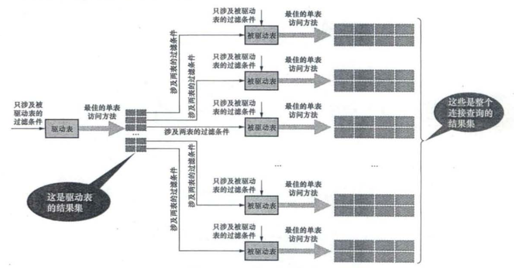
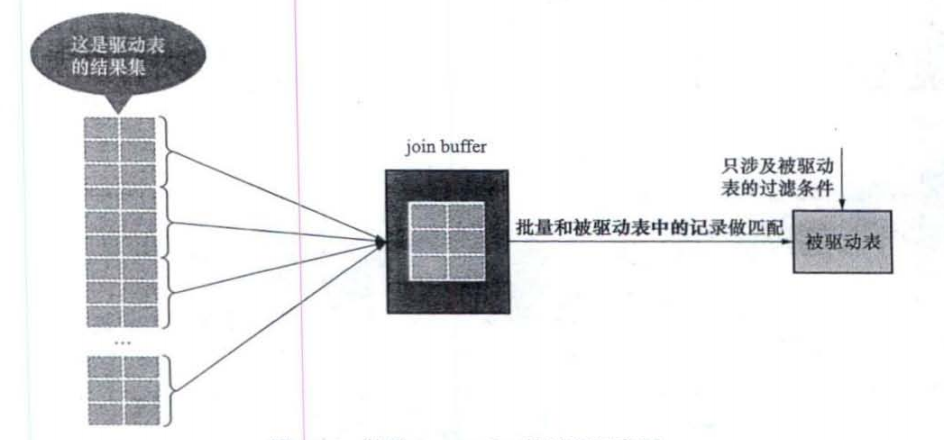

## 1. 内连接和外连接

* 内连接——若驱动表中的记录在被驱动表中没有匹配的记录，那么该记录不会加入结果集

* 外连接——若驱动表中的记录在被驱动表中没有匹配的记录，那么该记录的填充NULL后加入结果集

  * 左外连接——左侧的表为驱动表
  * 右外连接——右侧的表为驱动表

* ON子句的过滤条件（ON是专门为外连接设定的，ON在内连接中与where等价）

  对于外连接驱动表中的记录来说，如果无法在被驱动表中找到匹配ON子句中的过滤条件的记录，该驱动表记录不会丢弃——被驱动表的字段填充NULL后加入结果集

  对于内连接驱动表中的记录，不符合ON条件，就会被抛弃

* WHERE子句中的过滤条件

  不符合WHERE过滤条件的记录不会加入结果集

* 左外连接/右外连接语法

  * select * from t1 LEFT JOIN t2 ON 连接条件 [ WHERE 普通过滤条件 ]  
  * select * from t1 RIGHT JOIN t2 ON 连接条件 [ WHERE 普通过滤条件 ]

* 内连接语法

  * select * from t1 JOIN t2 [ON 连接条件] [WHERE 普通过滤条件]

## 2. 连接的原理

### 2.1 嵌套循环连接(主要方式)

1. 选取驱动表，使用与驱动表相关的过滤条件，选取**代价最低的单表访问方法**执行对驱动表的单表查询
2. 对于从驱动表中获得的每一条记录，都到被驱动表中查找匹配的记录

* 整个过程中，驱动表只访问一次，但是被驱动表可能访问多次，被驱动表的访问次数取决于驱动表执行单表查询后的结果集中有多少记录

* 对于嵌套循环查询，每从驱动表中获得一条记录，就会立刻使用该记录去被驱动表中查询一次 （加索引可以加快速度）

 

### 2.2 使用索引加快连接速度

给驱动表过滤条件设计的列加索引

给被驱动表过滤条件涉及的列加索引

都可以加快查询速度

### 2.3 基于块的嵌套循环查询—Join Buffer

如果我们不能使用索引来加快查询，那么对于驱动表结果集中的每一条记录，都需要对被驱动表全表扫描——IO非常多，所以引入Join Buffer

Join Buffer——在执行连接查询前申请一块固定大小的内存，将若干条驱动表结果集中的记录放入Join Buffer中，然后开始扫描被驱动表

每一条被驱动表的记录会一次性地与Join Buffer中的多条驱动表记录进行匹配，可以减少IO

加入了Join Buffer的嵌套循环连接算法——基于块的嵌套循环连接算法

