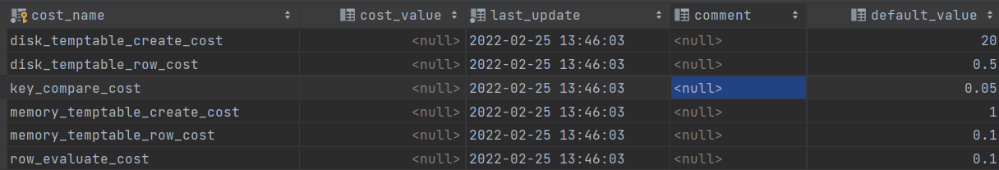
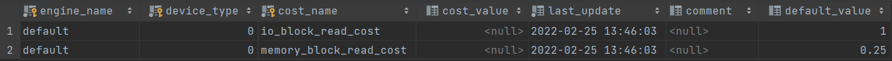

MySQL在执行一个查询时可以有不同的执行方案，MySQL会计算各个方案的成本，选择成本最低的

* IO成本——将页面从磁盘加载到内存（读取一个页面成本为1.0）
* CPU成本——在内存中，从页面读取记录并检测记录是否满足搜索条件，对结果集排序（从页面中读取记录并检测记录是否满足搜索条件的成本为0.2）

## 1. 单表查询的成本

1. 根据搜索条件，确定所有可能使用的索引
2. 计算全表扫描的成本
3. 计算使用不同索引执行查询的成本（优先分析唯一二级索引，再分析普通二级索引）
4. 选择成本最低的方案

### 1.1 全表扫描成本计算

全表扫描——把聚簇索引中的记录都依次与给定的搜索条件比较

* 将页面读入内存（IO成本）
* 检测页面内的记录是否符合搜索条件（CPU成本）

所以全表扫描的成本计算需要两个信息——**页面数目**，**每个页面内的记录数目**（这两个信息，InnoDB都有统计，直接获取）

* **全表扫描成本**= 页面数目 X 1.0 + 全部记录数目 X 0.2

### 1.2 二级索引查询成本计算

1. 确定扫描区间的个数（InnoDB规定，读取一个扫描区间内的所有二级索引记录的成本都是1.0）

2. 确定需要回表的记录数目
   
   * 在二级索引中查找到扫描区间最左记录和最右记录
     * 如果这两条记录相距<=10个页面，那么遍历两条记录之间的所有页面，从每个页面的Page Header中可以获取到每个页面的记录数目，累加即可
     * 如果这两条记录相距超过10个页面，
       1. 沿着最左记录所在页面，向右读10个页面，计算出每个页面含有记录数目的平均值
       2. 找到最左记录所在页和最右记录所在页对应的根目录项，计算这两个根目录项之间隔着多少条根目录项，就可以直到最左记录所在的页和最右记录所在的页相距多少个页面
       3. 相距页面数目 X 每个页面含有记录数目的平均值 = **需要回表的记录数目**

3. 执行回表操作
   
   每一条二级索引记录都会进行一次回表，从聚簇索引中将对应的页面读入内存（1.0），然后检测页面内的记录是否符合搜索条件（0.2）
* **成本= 扫描区间个数 X 1.0（第一步） + 需要回表的记录数目 X 0.2（第二步）  + 需要回表的记录数目X(1.0+0.2)（第三步）**

### 1.3 range和ref的区别

在使用range进行查询时，扫描区间中含有多少条记录，优化器件就认为需要进行多少次回表

在使用ref进行查询时，InnoDB在为ref计算回表产生的IO成本时设置了天花板——ref访问方法因为回表带来的IO成本<=访问全部记录数的 1/10 个页面的IO成本 或者 全部扫描的IO成本的3倍

因为InnoDB作者认为，在使用ref时，扫描区间内的二级索引记录的主键值离得更近，一次回表操作可能将多条需要访问的聚簇索引记录加载到内存

### 1.4 index dive与索引统计数据

* index dive——对于一个索引的扫描区间，如果直接去计算这个扫描区间里面有多少条索引记录，这种方式就叫做index dive

* 在扫描区间少的时候，index dive不是什么问题

* 但是如果查询使用IN，并且IN里面填充非常多的参数，就会形成非常多的单点扫描区间，需要进行非常多次的index dive，统计其索引记录数目的成本可能比直接全表扫描都大，所以在这种情况下就不能使用 index dive

* InnoDB提供了一个参数—— **eq_range_index_dive_limit(默认200)**
  
  * 如果IN语句生成的扫描区间数目< eq_range_index_dive_limit，那么使用index dive进行记录数目统计
  
  * 如果IN语句生成的扫描区间数目>eq_range_index_dive_limit，就必须使用 索引统计数据来估算了
    
    * **SHOW TABLES STATUS**显示的 **Rows值**——1张表有多少条记录
    * **SHOW INDEX的Cardinality属性**——索引列中不重复值的数目
    
    Rows/Cardinality——索引列中一个值平均重复次数
    
    **索引记录数目= 扫描区间数目 * Rows/Cardinality**

## 2. 连接查询成本

MySQL使用的是嵌套连接循环查询，成本包括

* 单次查询驱动表的成本，获得驱动表结果集
* 多次查询被驱动表的成本（驱动表结果集中的每一条记录都要查询一次被驱动表）
* 成本= 单词访问驱动表的成本+ 驱动表结果集记录数目X 单次访问被取驱动表的成本
* 对于内连接，需要考虑表的连接顺序对成本的影响，采用最优的连接顺序
* 优化重点
  * 尽可能减少驱动表结果集中的记录数目
  * 访问被驱动表的成本要尽可能低
  * 尽可能在被驱动表的连接列上建立索引

## 3. 成本常数

有2张表存储着成本常数—— **mysql.server_cost表**和 **mysql.engine_cost**

### 3.1 mysql.server_cost表

mysql.server_cost记录了server层进行的一些操作对应的成本常数

```sql
select * from mysql.server_cost
```



* **disk_temptable_create_cost**：创建基于磁盘的临时表的成本

* **disk_temptable_row_cost**：向基于磁盘的临时表写入或读取一条记录的成本

* **key_compare_cost**：两条记录进行比较的成本（如果提高该值，会提升filesort的成本）

* **memory_temptable_create_cost**：创建基于内存的临时表的成本

* **memory_temptable_row_cost**：向基于内存的临时表写入或读取一条记录的成本

* **row_evaluate_cost**：读取并检测一条记录是否符合搜索条件的成本

### 3.2 mysql.engine_cost表

mysql.engine_cost记录了存储引擎层进行一些操作对应的成本常数



* **io_block_read_cost**：从磁盘上读取一个页面的成本
* **memory_block_read_cost**：从内存中读取一个页面的成本（MySQL不能准确预测某个页面是在内存中还是在磁盘上，所以都是1.0）