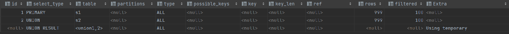
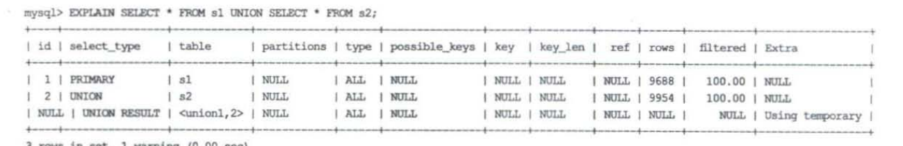
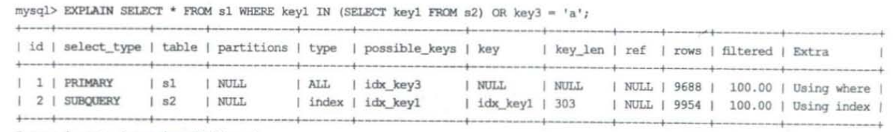
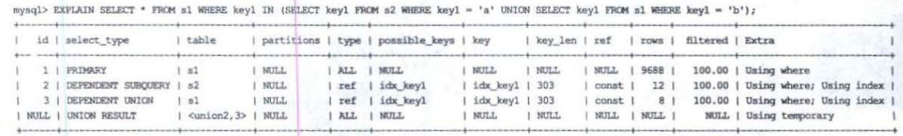
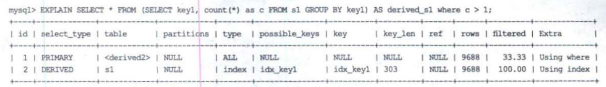
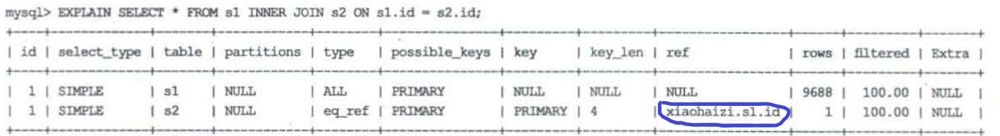

## 1. explain介绍

不管SQL多么复杂，到最后也是对每个表进行单表访问

EXPLAIN语句输出的每条记录都对应着某个单表的访问方法，会出现以下字段

* **id**：每个select关键字都有一个id
* **select_type**：SELECT关键字对应的查询的类型
* **table**：表名
* **partitions**：匹配的分区信息
* **type**：针对单表的访问方法
* **possible_keys**：可能用到的索引
* **key**：实际使用的索引
* **key_len**：实际使用的索引的长度
* **ref**：当使用索引列等值查询时，与索引列进行等值匹配的对象信息
* **rows**：预估的需要读取的记录数目
* **filtered**：针对预估的需要读取的记录，经过搜索条件过滤后剩余记录条数的百分比
* **Extra**：一些额外的信息

## 2. id

* 一条SQL可以有多个SELECT关键字，每个SELECT关键字代表一个查询语句，每个SELECT语句的FROM子句都可以包含多张表
  
  每一张表都对应着explain中的一条记录，并且在同一个SELECT关键字中的表，它们的id是相同的

* 连接查询中，一个SELECT关键字后面可以跟多个表，每个表都会在explain中有一条记录，并且id值都相同，出现在前面的是驱动表，出现在后面的是被驱动表

* 在子查询中，包含多个SELECT关键字，每个SELECT关键字都有一个唯一的id值，如果不同的SELECT关键字id相同，那么说明MySQL对子查询进行了优化，将其转变为了连接诶查询

* UNION中，除了每个SELECT关键字对应一条记录，一个唯一id外，explain中还会有一条对应着临时表，这个临时表是用来去重的
  
  UNION ALL就不会有，因为UNION不会去重
  
  

## 3. select_type

select_type可以为以下的值

* **SIMPLE**：查询中不包含UNION或者子查询

* **PRIMARY**：对于包含UNION，UNION ALL，子查询的SQL，其内部由多个小查询组成，最左边的小查询的select_type就是PRIMARY
  
  

* **UNION**：包含UNION，UNION ALL的查询来说，内部由多个小查询组成，除了最左边的小查询是PRIMARY，其余的小查询都是UNION

* **UNION RESULT**：使用临时表来完成UNION去重，这个临时表对应的执行计划记录就是UNION RESULT

* **SUBQUERY**：如果包含子查询的查询语句不能转换为对应的半连接形式，并且该子查询是不相关子查询，那么子查询中的第一个SELECT关键字代表的查询的select_type是SUBQUERY
  
  

* **DEPENDENT SUBQUERY**：如果包含子查询的查询语句不能转换为对应的半连接形式，并且该子查询被查询优化器转换为相关子查询的形式，那么子查询的第一个SELECT关键字代表的查询的select_type是DEPENDENT SUBQUERY

* **DEPENDENT UNION**：在包含UNION 或者 UNION ALL的大查询中，如果各个小查询都依赖于外层查询，那么除了最左边的小查询是PRIMARY，其余都是 DEPENDENT UNION
  
  

* **DERIVED**：在包含派生表的查询中，如果以物化派生表的方式执行查询，派生表对应的子查询是 DERIVED
  
  

## 4. type

单表访问方法

* **system**：表中只有一条记录并且使用的存储引擎的统计数据是精确的
* **const**：使用聚簇索引or唯一二级索引进行等值匹配
* **eq_ref**：执行连接查询时，如果被驱动表是通过主键 或者 NOT NULL的唯一二级索引进行等值匹配，那么被驱动表的访问是 **eq_ref**
* **ref**：普通二级索引进行等值匹配；普通二级索引查询NULL；唯一二级索引查询NULL；执行连接查询时，被驱动表通过普通二级索引进行等值匹配，那么被驱动表的访问可能是ref
* **fulltext**：全文索引
* **ref_or_null**：普通二级索引等值匹配且该索引列的值也可以为NULL（key='a' OR key is null）
* **index_merge**：使用了索引合并
* **unique_subquery**：针对包含 IN子查询的查询语句，如果查询优化器决定将IN子查询转换为 EXISTS子查询，而且子查询转换后可以使用主键或者NOT NULL唯一二级索引进行等值匹配——那么该子查询是 **unique_subquery**
* **index_subquery**：同上，不过这里是使用普通二级索引进行等值匹配
* **range**：使用索引（不管是聚簇索引还是二级索引），只要扫描区间是多个单点区间or范围区间，就是range
* **index**：可以使用覆盖索引，但需要扫描全部的索引记录；需要全表扫描 AND 需要根据主键排序
* **all**：全表扫描

## 5. possible_keys

可能使用到的索引

## 6. key

真正使用到的索引

## 7. key_len

key_len是这么计算的

1. 使用的索引列的最多占用的字节数（int—4字节，varchar(100)—300字节）
2. 如果索引列可以存储NULL，那么再加上1字节
3. 如果使用的是变长类型，那么还需要存储实际数据占用的字节数，需要再加上2字节

**key_len**——在使用联合索引时，能够让我们知道使用了多少个列的搜索条件来形成扫描区间

## 8. ref

如果访问方法type为 const，eq_ref，ref，ref_or_null，unique_subquery，index_subquery时

ref显示的是与索引列进行等值匹配的常量

## 9. rows

* 如果使用全表扫描，那么rows就是对表行数的估计值
* 如果使用索引来执行查询，那么rows就代表预计扫描的该索引的记录行数

## 10. filtered

* 预测查询语句的rows里面，有多少的记录满足所有搜索条件

## 11. Extra

* **Impossible WHERE**：查询的WHERE子句永远为FALSE
* **USING Index**：使用覆盖索引
* **Using Index condition**：使用索引条件下推
* **Using where**：某个搜索条件需要在server层进行判断
* **Using Join Buffer**：被驱动表不能有效地利用索引加快访问速度，MySQL会为其分配一块Join Buffer，使用基于块的嵌套循环算法来执行连接查询
* **Using intersect(...)，Using union(...)，Using sort_union(...)**：使用Intersection索引合并，Union索引合并，Sort-Union索引合并
* **Using filesort**：使用文件排序（效率低下），如果排序无法使用到索引，那么在内存或磁盘上进行排序
* **Using tempory**：使用临时表（效率低下），借助临时表完成去重，排序之类的功能
