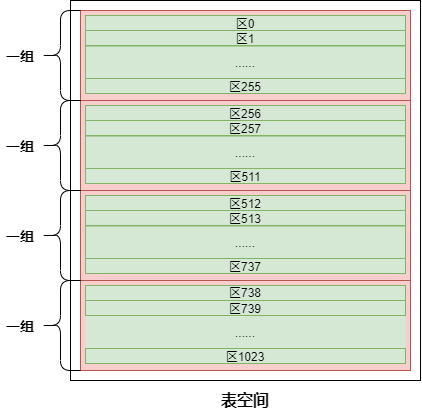
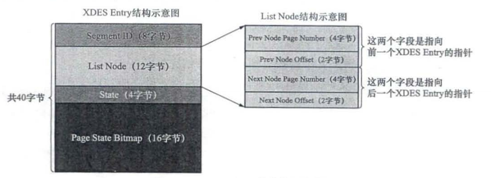
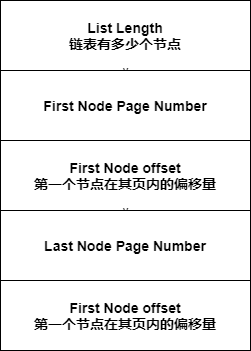
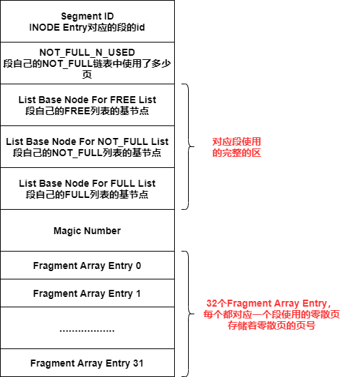
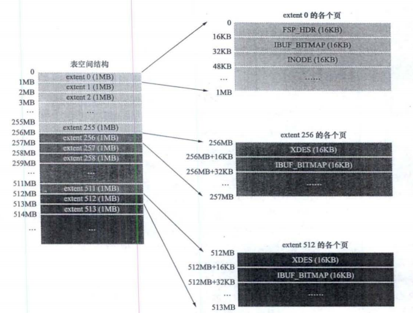
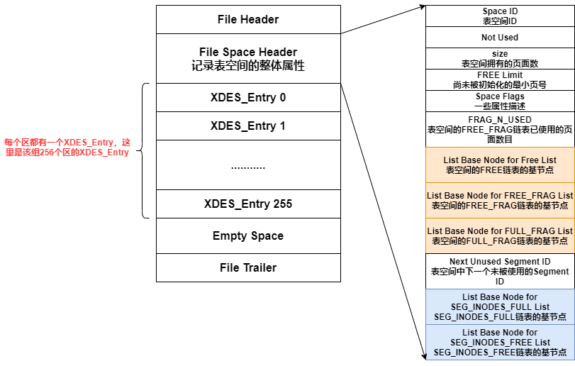
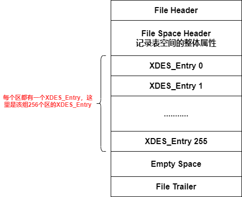
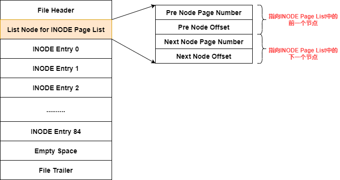
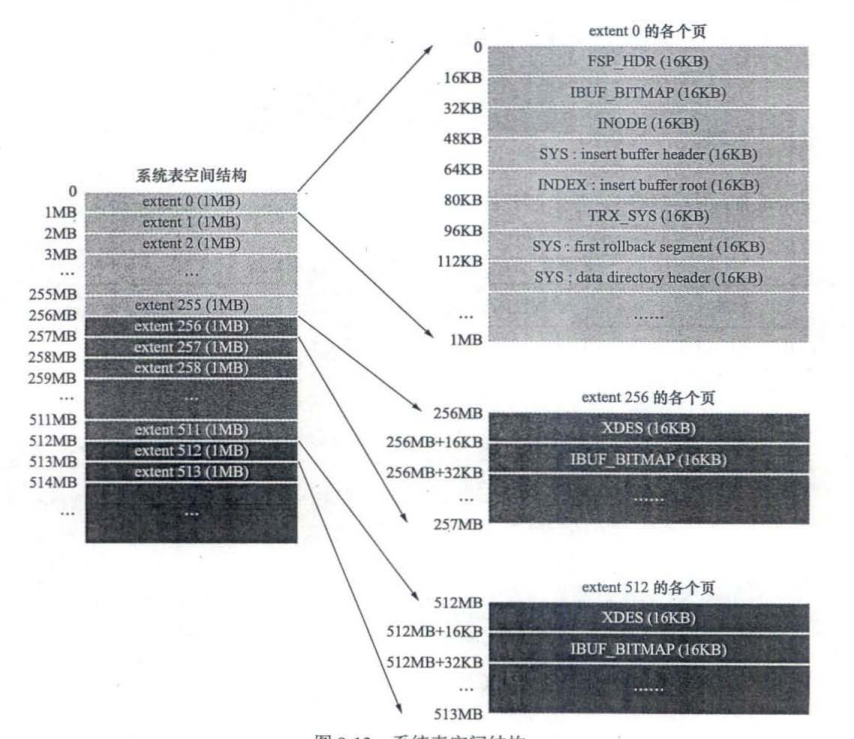

# 1. 表空间文件类型

表空间分为系统表空间和独立表空间，表空间中有着非常多类型的页

* 系统表空间——所有表共享
* 独立表空间——独属于某张表

## 1.1 共享的表空间文件

* **默认情况**，有一个初始大小10MB，名为ibdata1的文件——默认的共享表空间文件

* **所有使用InnoDB存储引擎的表的数据**都会记录到该**共享表空间**中

* 通过 **参数innodb_data_filr_path**可以对共享表空间文件进行设置
  
  ```
  innodb_data_file_path=/db/ibdata1:2000M; /db/ibdata2:2000M:autoextend
  使用/db/ibdata1和/db/ibdata2两个文件组成共享表空间，大小为2000M
  autiextend表示如果用完了这2000M，文件可以自动增长
  ```

## 1.2 表独有的表空间文件

* **参数innodb_file_per_table**：为每张使用InnoDB的表产生一个独立的表空间（表明.ibd)

如果使用了表独有的表空间文件，那么对于一张表来说

* **表的数据，索引，插入缓冲**等信息存储在其**独有的表空间文件**中
* 其余信息放在**共享表空间**中

# 2. 存储空间划分

表空间是非常大的一块存储区域，为了方便管理，我们对其进行以下划分

* **物理概念上存储空间的划分**
  
  * 64个页——为一个区
  
  * 256个区——为一个组
  
  * 所有的组——构成表空间

* **逻辑概念上存储空间的划分——段**

## 2.1 物理划分—区

* 64个页——组成一个区（1MB）
* 256个区——组成一个组（256MB）



### 2.1.1 区的分类

区分成两大类，四小类

* **碎片区**——碎片区是属于**表空间**的，所有的段都可以使用
  * **空闲的碎片区（state为FREE）**
  * **有剩余空闲页面的碎片区（state为FREE_FRAG）**
  * **没有剩余空闲也免得碎片区（state为FULL_FRAG）**
* **独属于某个段的区（state为FSEG）**——只属于一个段，只会存储该段中的数据

### 2.1.2 区的XDES Entry结构

每个区都有一个**XDES Entry**结构，用来记录区的属性



* **Segment ID**：区所属于的段
* **List Node**：用于将XDES Entry构建成一个双向链表，相同类型的XDES Entry构建成一个双向链表，可以非常快速的定位到一个期望状态的区
* **State**：区的状态
* **Page State Bitmap**：128位，每个页面分到2位，这2位中第1位表示页面是否空闲

#### XDES Entry形成的双向链表

* **系统表空间中的XDES Entry链表**
  
  * State为**FREE**的区的XDES Entry会构建成一个**FREE链表**（直属于表空间）
  * State为**FREE_FRAG**的区的XDES Entry会构建成一个**FREE_FRAG链表**（直属于表空间）
  * State为**FULL_FRAG**的区的XDES Entry会构建成一个**FULL_FRAG链表**（直属于表空间）
  * 这三个链表的基节点可以在 **FSP_HDR页面**中找到

* **每个段都有属于自己的3个XDES Entry链表**
  
  * **FREE链表**：同一个段中，空闲的区对应的XDES Entry会放入该链表
  
  * **NOT_FULL链表**：同一个段中，仍有空闲页面的区对应的XDES Entry会放入该链表
  
  * **FULL链表**：同一个段中，没有空闲页面的区对应的XDES Entry会放入链表
  
  * **这三个链表的基节点可以在段的 INODE_Entry中找到**

#### XDES Entry链表的基节点

上述说的每条XDES Entry都有一个 **List Base Node结构**



## 2.2 逻辑划分—段

* 段是逻辑概念上的划分——目的是将用途相同的页存储在一起，将不同用途的页分开存储

* 段是 **一些完整的区**+**零散的页** 的集合

* **一个索引至少有2个段**——**叶子节点段**，**非叶子节点段**
  
  （将不同用途的页分开，因为同一用途的页可能需要连续读取，如果混着存储，会让扫描效果大打折扣）

* 当段占用的空间<32个页时，从某个碎片区**以页面为单位**来分配存储空间
  
  当段占用了32个页之后，**以完整的区为单位**来分配存储空间（这个区中所有的页都属于这个段，只能用来存储这个段的内容，不能做他用）
  
  ```java
  //为什么后面要以完整的区为单位来分配存储空间
  我们经常需要访问多个逻辑上连续的页，如果以页为单位来分配存储空间，会在成逻辑上连续的页，在物理上不连续，这样访问多个逻辑上连续的页，会产生许多随机IO，影响性能
  以区为单位来分配存储空间——目的是消除随机IO，让逻辑上相邻的页在物理上页相邻，这个进行扫描时，使用的是顺序IO
  
  //为什么一开始先从碎片区中以页面为单位来分配存储空间
  因为一个区太大了，如果表很小，那么分配一个区太浪费，这么做是为了节约存储空间
  ```

### 2.2.1 段的INODE Entry结构

每个段都有一个 INODE Entry结构



## 2.3 独立表空间的特殊页

* 独立表空间中第一个组中的第一个区的前三个页，存储一些属性
  
  * **FSP_HDR页面**（跟XDES页面基本一致，只是多存了些表空间的整体属性）
    
    存储表空间的整体属性+本组256个区的XDES_Entry结构
  
  * **IBUF_BITMAP页面**
    
    存储Change Buffer相关的信息
  
  * **INODE页面**
    
    存储表空间中段的INODE Entry结构

* 独立表空间其余组中的第一个区的前两个页面，存储一些属性
  
  * **XDES页面**
    
    存储本组256个区的XDES_Entry结构
  
  * **IBUF_BITMAP页面**
    
    存储Change Buffer相关的信息



### 2.3.1 FSP_HDR页面

* FSP_HDR页面——存储表空间的整体属性+本组256个区的XDES_Entry结构



* **List Base Node for SEG_INDES_FULL List和 List Base Node for SEG_INODES_FREE List**
  
  每个段都有一个INODE_Entry结构，这写INODE_Entry会存放在INODE页面中，但是如果表空间中段太多，一个INODE页面放不下，就会存放在多个INODE页面中，这些INODE页面会构建成2个链表，这两个属性，存储的就是这两个链表的基节点
  
  * **SEG_INODES_FULL链表**——该链表中的INODE页面都已经被INODE_Entry填满
  * **SEG_INODES_FREE链表**——该链表中的INODE页面仍有空闲空间

### 2.3.2 XDES页面

XDES页面——存储本组256个区的XDES_Entry结构



### 2.3.3 IBUF_BITMAP页面

存储Changer Buffer的信息（不用去管）

### 2.3.4 INODE页面

* INODE页面——存储表空间中所有段的 INODE_Entry结构

* 一个INODE页面最多只能存储85个INODE_Entry
  
  如果段太多，那么就需要多个INODE页面，这些INODE Page会形成两个INODE Page List
  
  * **SEG_INODES_FULL List**：该链表中的INODE Page无可用空间（该链表的基址节点在FSP_HDR页面中0）
  * **SEG_INODES_FREE List**：该链表中的INODE Page都还有可用空间（该链表的基址节点在FSP_HDR页面中0）
  
  此时需要使用**List Node for INODE Page List**去定位链表中的前一个节点和下一个节点



## 2.4 找到一个段的INODE Entry

一个索引有两个段——叶子节点段和非叶子节点段

索引中，不管是叶子节点还是非叶子节点都存储在数据页中，**数据页的Page Header**中有两个字段——**PAGE_BTR_SEG_LEAF**和 **PAGE_BTR_SEG_TOP**

* **PAGE_BTR_SEG_LEAF**：索引的叶子节点段的Segment Header（只有B+树的根节点才有该属性）
* **PAGE_BTR_SEG_TOP**：索引的非叶子节点段的Segment Header（只有B+树的根节点才有该属性）

**Segment Header结构**

* Space ID of the INODE Entry：INODE Entry所在的表空间的ID

* Page Number of the INODE Entry：INODE Entry所在的页面页号

* Byte Offset of the INODE Entry：INODE Entry在页面内的偏移量

* 在数据字典中可以找到表的各个索引对应的根页面位置，系统表 **SYS INDEXES**中存储了各个索引对应的根页面信息

* 从SYS INDEXES中找到对应的根节点，从根节点的Page Header中读取 **PAGE_BTR_SEG_LEAF**和 **PAGE_BTR_SEG_TOP**，就可以获取到索引的叶子节点段和非叶子节段的INODE Entry的位置，从而获得INODE Entry

## 2.5 系统表空间的结构



* 系统表空间的extent0的第4到第7个页面——系统表空间特有
  * **SYS: insert buffer header页面**——存储change buffer头部信息
  * **INDEX: insert buffer root页面**——存储change buffer根节点信息
  * **TRX_SYS页面**——事务系统的相关信息
  * **SYS: first rollback segment页面**——第一个回滚段的信息
  * **SYS: data directory header页面**——数据字典头部信息，底层有一些**系统表**用来记录数据库的元数据，这些系统表就叫数据字典，这个页面中的信息是用来帮助我们找到这些系统表的
* 系统表空间中第一个区的extent1和extent2用作 **double write buffer**