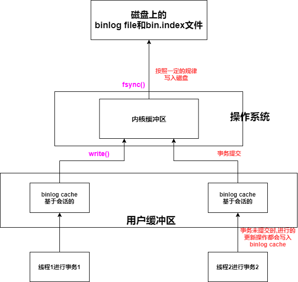

## 1. binlog作用

bin log记录了数据库所有的更新操作，有以下几个作用

* **恢复数据**：用delete误删表数据后，可以用binlog恢复
* **主从复制**
* **审计**：通过bin log中的信息进行审计，判断是否有对数据库进行注入的攻击

## 2. binlog的组成

bin log由以下三个部分组成

* **binlog cache**：会话级cache，每个会话都会分配一个binlog cache
* **binlog file**：二进制日志文件，写满后会创建一个新的binlog file(后缀+1)，并在bin.index文件中记录新的binlog file
* **bin.index**：记录所有的binlog file的路径

## 3. binlog的使用

1. 每个会话都会分配一个bin log cache，事务执行过程中将逻辑日志记录写入binlog cache

   **参数binlog_cache_size**：指定了binlog cache的大小，如果超过了，会生成一个临时文件来存(降低性能)

2. 事务提交后，会调用 **write()** 将 binlog cache中的内容写入 **操作系统的内核缓冲区**

   根据 **参数sync_binlog**的值来决定何时调用**fsync()**将**操作系统内核缓冲区**中的内容刷新到磁盘中

   **参数sync_binlog=[N]**——每往**操作系统内核缓冲区**中写入N次，就会调用一次fsync()

   **如果sync_binlog=1**——此时write() 与fsync()同步调用，事务提交完后，会立刻将binlog同步到磁盘

   **sync_binlog默认为0**——表示由OS自行判定

3. **参数binlog_size**——binlog file的最大大小，超过该大小会生成一个新的binlog file(后缀+1)，并在bin.index文件中记录新的binlog file

4. 因为binlog是服务层的文件，redo log是InnoDB层的文件，所以可能出现这种情况，一个事务Commit，bin log写入磁盘了，但是redo log还没有写入，此时MySQL宕机了，重启MySQL，通过redo log重做，这个事务被回滚了，但是binlog记录了该事务

   这种问题可以通过 **参数innodb_support_xa=1**启动**XA事务（两阶段提交）**来解决——确保了binlog与InnoDB文件的同步

## 4. binlog的格式

binlog的格式由 **参数binlog-format**决定，其值有 **STATEMENT**，**ROW**，**MIXED**

* **STATEMENT**

  binlog是**基于SQL语句**的

  可能会导致主从之间数据不一致（例如含有自增列的表的insert）

* **ROW**

  binlog是基于行的，不会导致主从之间数据不一致

  **优点：数据库的恢复和复制有更好的可靠性**

  **缺点：增加二进制日志文件的大小，增加了主从复制的网络开销**

* **MIXED**

  MySQL在默认情况下采用STATEMENT，一些情况下使用ROW

  * 表的存储引擎为NDB
  * 使用了UUID(),USER(),CURRENT_USER(),FOUND_ROWS(),ROW_COUNT()等不确定函数
  * 使用了 insert delay语句
  * 使用了用户自定义函数
  * 使用了临时表