# 1. 隐藏列

聚簇索引中每条记录一定有2个隐藏列——trx_id和 roll_pointer

## 1.1 trx_id

* 一个事务可以是只读事务，也可以是一个读写事务
  * 只读事务：可以对临时表进行增删改查（START TRANSACTION READ ONLY开启），只读事务只有在对临时表进行写操作时才会分配事务ID
  * 读写事务：可以对普通表/临时表进行增删改查（START TRANSACTION READ WRITE开启/START TRANSACTION开启），读写事务只有在对普通表/临时表进行写操作时才会分配事务ID
* **事务ID生成方式**
  * MySQL维护一个全局变量，当需要为某个事务分配事务ID时，将该变量的值作为事务id分配给事务，然后将变量自增1
  * 当这个变量为256的倍数时，将变量的值刷新到系统表空间中页号为5的页面中的Max Trx ID属性中
  * MySQL启动时，会将Max Trx ID读出，加上256后赋予全局变量

## 1.2 roll_pointer

聚簇索引记录中有一个roll_pointer的隐藏列

# 2. undo日志介绍

## 2.1 undo日志作用

* 回滚事务
* 为MVCC提供支持

## 2.2 undo日志与redo日志

* 对普通表进行修改时，将undo日志写入undo页时，对undo页发生了修改，也会产生redo日志
* 对临时表进行修改时，将undo日志写入undo页，对undo页的修改是不存在对应的redo日志的

# 3. undo日志格式

* **所有的undo日志**都会存储到 **类型为FIL_PAGE_UNDO_LOG**的页中
* undo日志分为两大类，三小类
  * **TRX_UNDO_INSERT**
    * insert undo日志
  * **TRX_UNDO_UPDATE**
    * delete mark undo日志
    * update undo日志

## 3.1 insert操作产生的undo日志

* insert 操作产生的undo日志

  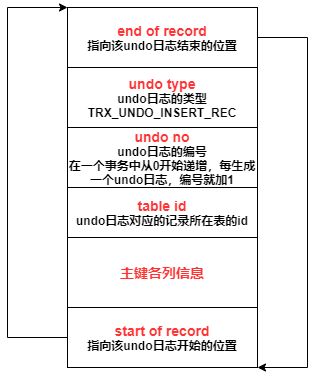

* **执行insert操作后**，记录与insert undo日志之间的关系

  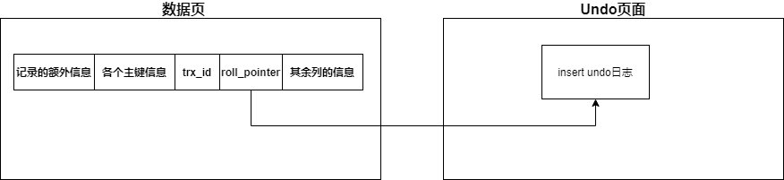

  

## 3.2 delete操作产生的undo日志

### 3.2.1 删除一条记录

删除一条记录需要经历2个阶段

1. **delete mark阶段（简单标记）**：事务运行期间进行了delete操作，只会将记录的deleted_flag属性标记为1，不会做其他任何操作

   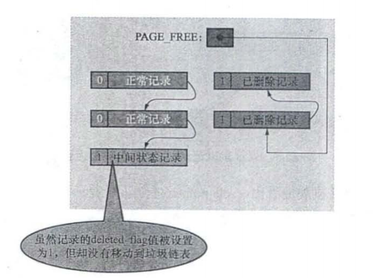

2. **purge阶段（进行真正的删除）**：事务提交后，才可能进入purge阶段，但是purge阶段并不是事务提交后立刻进行的，而是由purge线程负责，purge线程检测到记录符合条件后才会进行purge操作——purge操作会将记录由正常记录链表移除，加入页面的垃圾链表头部，并调整页面属性信息

   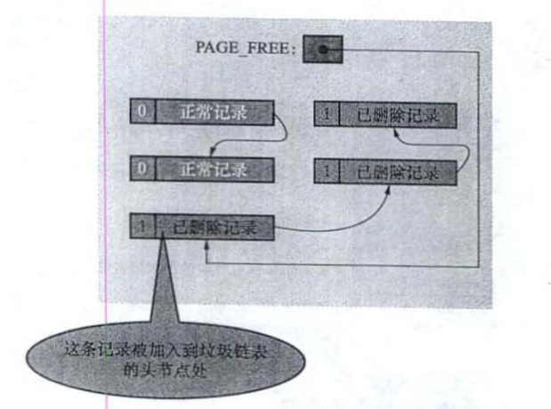

### 3.2.2 delete操作产生的undo日志的格式

* **delete mark阶段就会生成delete mark undo log**

* delete undo log中有2个非常重要的字段——trx_id和roll_pointer——用于构建版本链

  将对一条记录进行delete mark操作前，会将记录的trx_id和roll_pointer的值存储到delete undo log的这两个字段中

  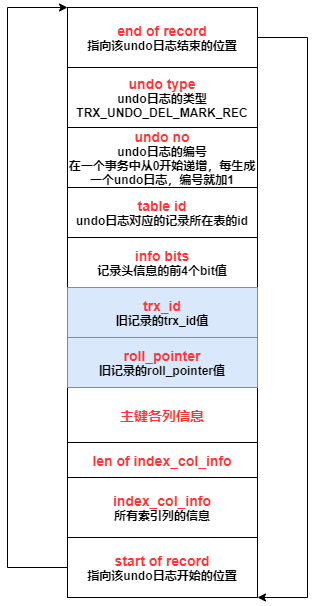

* 执行完delete操作后，记录与undo日志的关系——**形成了一条版本链**

  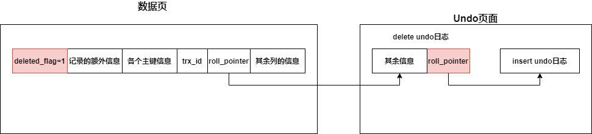

## 3.3 update操作产生的undo日志

update操作根据是否修改主键分为两种情况

### 3.3.1 不修改主键

不修改主键的情况下——生成的undo日志类型为 **TRX_UNDO_UPD_EXIST_REC**

* **就地更新——修改前后存储空间一样**，这种情况直接在原记录上修改
* 如果修改前后占用的存储空间不一样——先从页面中删除旧记录（真正的删除，由用户线程去执行），然后将新记录插入页面中

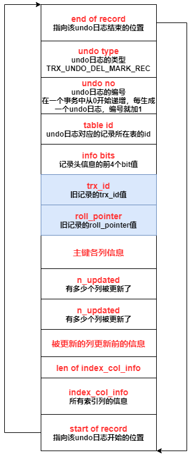

### 3.3.2 修改主键

1. 将旧记录进行delete mark操作（生成一条delete undo log）
2. 将新记录插入聚簇索引（生成一条insert undo log）

# 4. 增删改对二级索引的影响

* insert和delete操作与在聚簇索引中执行时产生的影响差不多
* update
  * 如果update不涉及二级索引列，那就不做任何操作
  * 否则，需要对旧的二级索引记录执行delete mark操作，然后插入一条新的二级索引记录
* 只有聚簇索引记录才会有trx_id，roll_pointer这些属性，对二级索引进行增删改时，只会影响二级索引记录所在页面的Page Header部分中的一个 **PAGE_MAX_TRX_ID属性（表示修改该页面的最大的事务id）**

# 5. 通用链表结构

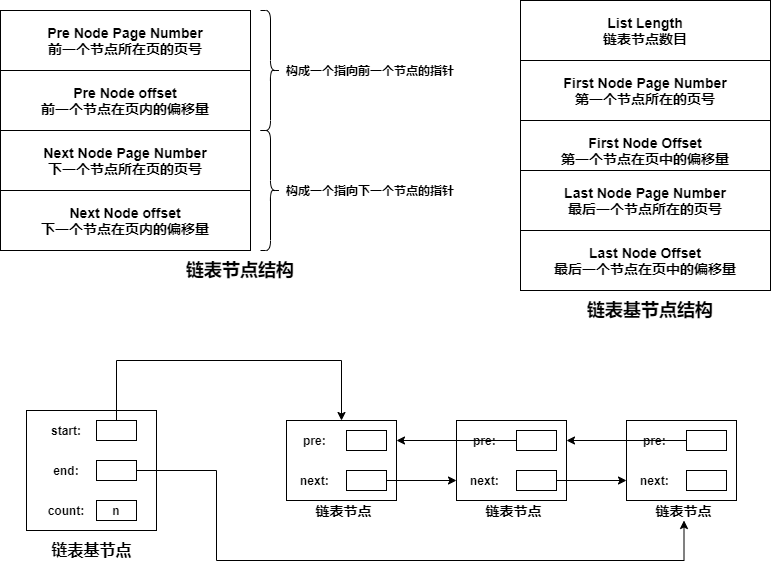

# 6. undo页

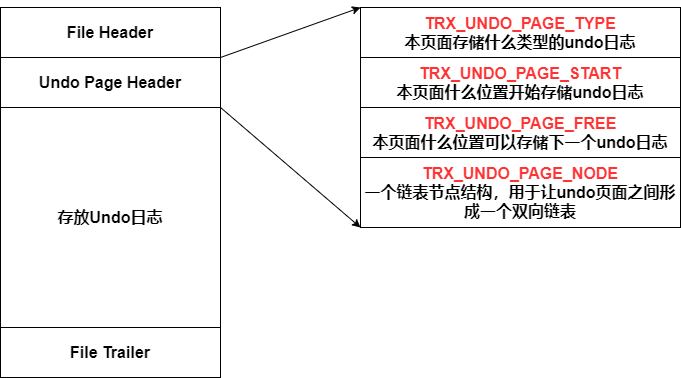

* **TRX_UNDO_PAGE_TYPE**：这个Undo页面存储什么类型的undo日志，一个页面只能存储指定类型的undo日志
  * **TRX_UNDO_INSERT**：insert undo日志
  * **TRX_UNDO_UPDATE**：delete mark undo日志，update undo日志

# 7. undo页链表

* 一个事务产生的undo日志都会存放在Undo页面中，一个Undo页面只能存放指定类型的undo日志，并且Undo页面之间通过Undo Page Header中的TRX_UNDO_PAGE_NODE结构形成一个双向链表

* 一个事务对普通表和临时表进行改动产生的undo日志需要分别记录

  并且**类型为TRX_UNDO_INSERT的undo页面要单独构成一个链表（insert undo链表）**

  **类型为TRX_UNDO_UPDATE的undo页面也要单独构成一个链表（update undo链表）**

  所以一个事务至多会产生4个Undo链表（分配策略：啥时候需要啥时候分配，不需要就不分配）

  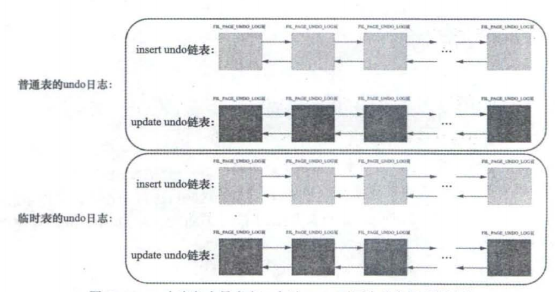

* 每一个Undo链表，都对应一个Undo Log Segment，链表中的页面都是从这个Undo Log Segment中申请的

* Undo链表的第一个页面很特殊，记录了很多控制信息

  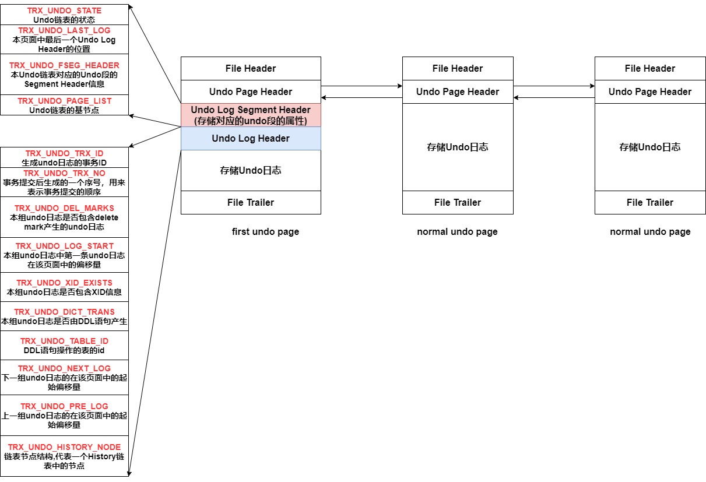

  * **Undo Log Segment Header**：记录了Undo链表对应的段的信息

    * **TRX_UNDO_STATE**：Undo链表处于什么状态
      * Active：活跃状态，事务正在向该链表中写入undo日志
      * Cached：可被其他事务重用
      * Free：事务提交后，undo链表不能被重用，等待被释放
      * Purge：等待被purge，update undo链表在事务提交后，如果无法被重用，就会变为这个状态
      * Prepared：二阶段提交时使用到的状态

  * **Undo Log Header**

    一个事务向Undo页面中写入Undo日志非常粗暴，就是一条写完接着写另一条，写完一个Undo页面后再申请一个新的Undo页面

    **一个事务向一个Undo链表中写入的所有undo日志**都算是一个组，会记录一些这个组的属性——Undo Log Header

# 8. 重用undo链表

一个Undo链表如果可以被重用，必须满足以下两个条件

1. 链表只有一个Undo页
2. 该Undo页使用的空间小于整个空间的3/4

* 如果一个insert undo链表可以被重用，由于insert undo日志在事务提交后就无用了，可以被清除掉，所以insert undo链表被重用时，是直接将其中所有旧的undo日志都覆盖掉

  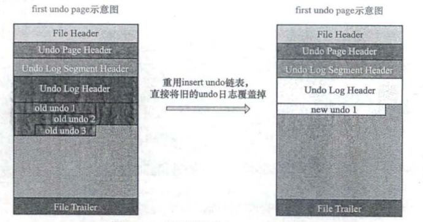

* 如果一个update undo链表可以被重用，其中的update undo日志不能立刻被删除（需要留着支持MVCC），所以update undo链表被重用时，不能覆盖其中旧的undo日志，而是追加写入

  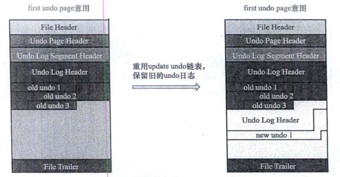

# 9. 管理所有undo链表—回滚段

* MySQL可以同时存在非常多的Undo链表，这些Undo链表通过回滚段进行管理
* 回滚段中只有一个页面—— **Rollback Segment Header页面**

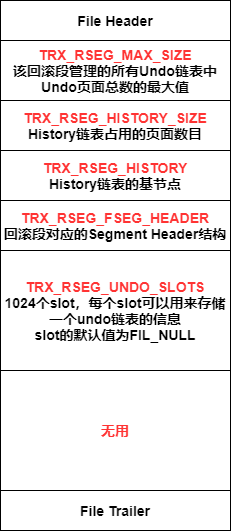

* **回滚段中维护着两个undo slot链表**

  * **insert undo cached链表**：如果一个insert undo链表可以被重用，那么其对应的undo slot就会加入该链表
  * **update undo cached链表**：如果一个update undo链表可以被重用，那么其对应的undo slot就会加入该链表
  * 如果一个事务需要分配一个insert undo链表，优先从insert undo cached链表中找
  * 如果一个事务需要分配一个update undo链表，优先从update undo cached链表中找

* **InnoDB定义了128个回滚段**

  在系统表空间的第5号页面中，有128个格子，每个格子都有两部分组成（表空间id+Page number），每个格子可以定位到一个回滚段的Rollback Segment Header页面

* **回滚段分类**

  * **第0号，第33—127号回滚段属于一类**——如果事务修改了普通表需要分配回滚段，那么必须从该类的回滚段中分配对应的undo slot（修改针对普通表的回滚段中的undo页面，需要记录redo日志）
  * **第1—32号回滚段属于一类**——如果事务修改了临时表需要分配回滚段，那么必须从该类的回滚段中分配对应的undo slot（修改针对临时表的回滚段中的undo页面，不需要记录redo日志）

  

# 10. 事务与undo链表

## 10.1 事务需要分配undo链表

如果事务需要分配Undo链表，进行以下操作

1. 事务首先到系统表空间的第5号页面中分配一个回滚段（后续就不会重复分配了，并且这里通过循环使用的方式来分配回滚段，比如当前事务分配第0号回滚段，那么下一个事务分配第33号回滚段，下一个事务分配34号回滚段）
2. 查看该回滚段中维护的2个cached链表，是否有可以复用的undo链表，如果有，就进行复用
3. 如果没有，遍历该Rollback Segment Header页面中的TRX_RSEG_UNDO_SLOTS，找到第一个值为FIL_NULL的slot
4. 在表空间创建一个心的Undo Log Segment，从段中申请一个页面作为Undo链表的first undo page，将这个slot的值设置为first undo page的地址

## 10.2 事务提交时,undo链表的处理

* 如果undo链表可以被重用
  * 如果是insert undo链表，那么将**first undo page**中的 **TRX_UNDO_STATE属性**设置为**Cached**，该链表对应的undo slot加入回滚段维护的 **insert undo cached链表**中
  * 如果是update undo链表，那么将**first undo page**中的 **TRX_UNDO_STATE属性**设置为**Cached**，该链表对应的undo slot加入回滚段维护的**update undo cached链表**中
* 如果undo链表不能被重用
  * 如果是insert undo链表——那么将**first undo page**中的 **TRX_UNDO_STATE属性**设置为**Free**，然后将对应的undo slot的值设置为 FIL_NULL，insert undo链表中的undo日志无用，可以被删除
  * 如果是update undo链表——那么将**first undo page**中的 **TRX_UNDO_STATE属性**设置为**Purge**，然后将对应的undo slot的值设置为 FIL_NULL，将本次事务写入的一组undo日志存放到**History链表**中（update undo链表中的undo日志还需要为MVCC提供支持，所以不会立刻删除而是放入History链表中，由Purge线程来决定何时删除）

# 11. undo日志在崩溃恢复时的作用(在XA事务中也会用到)

通过系统表空间第5号页面定位到128个回滚段的位置，然后对于每一个回滚段

1. 遍历回滚段的Rollback Segment Header页面的 **TRX_RSEG_UNDO_SLOTS**中，对于不为 FIL_NULL的undo slot，找到其对应的undo链表
2. 检查undo链表的first undo page中 Undo Segment Header中的 TRX_UNDO_STATE属性
   * 属性为Active——数据库崩溃时，事务还未提交，需要回滚
   * 属性为Prepare——数据库崩溃时，redo log落盘了，但是bin log可能落盘了，也可能还未落盘
     * 从undo链表的first undo page中的 Undo Log Header中的读出XA事务的XID，在最后一个bin log文件中查看是否有相同的xid的bin log
       * 如果有——bin log已经落盘了，不需要做任何操作
       * 如果没有——bin log还未落盘，通过undo log链表去回滚
   * 其他值——事务在崩溃前已经提交，不做任何操作

# 12. history list

* 事务提交时，事务产生的不可被重用的update undo链表中的undo日志会被放入History链表
* Undo链表的first undo page的 Undo Log Header的 TRX_UNDO_TRX_NO在事务提交时会写入一个值，该值表示事务的提交顺序（该值越小，提交的越早）
* History链表中的undo日志，按照事务的提交顺序来排序的
* history list中的undo支持是用来支持MVCC机制的，由purge线程来决定何时删除