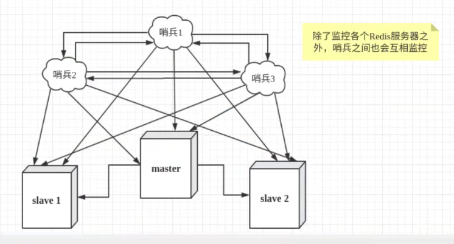
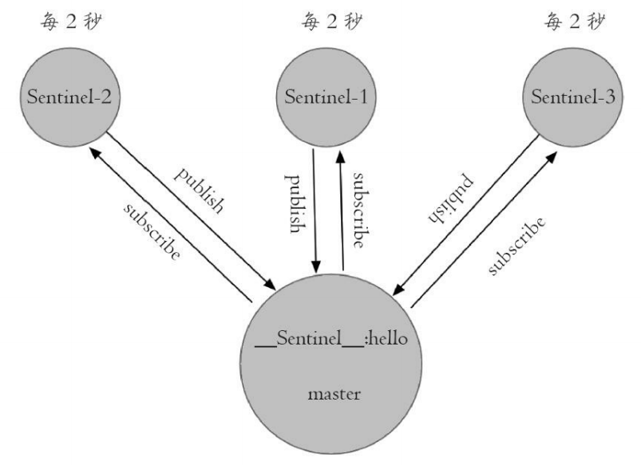
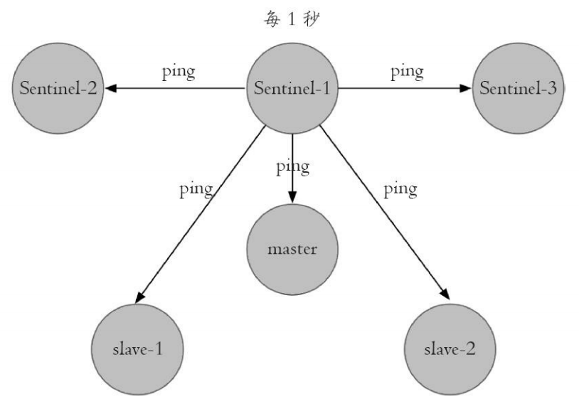
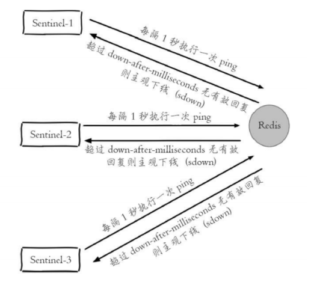
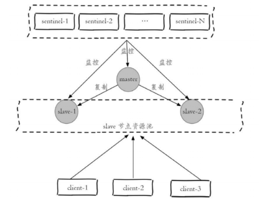

# 1. Redis Sentinel

* Redis Sentinel是一个分布式架构——包含若干个Sentinel节点和Redis节点

* 每个Sentinel节点会对Redis节点和其他Sentinel节点进行监控

  当它发现某个节点不可达时，会对该节点做下线标识

  如果被标识的是master，那么它还会与其他sentinel进行协商，当大多数sentinel都认为master不可达时，它们会选举出一个sentinel节点来完成自动故障转移的工作，并将这个变化实时通知给应用方

* Sentinel节点本身是独立的Redis节点，只不过有一点特殊——不存储数据，只支持部分命令   
* 哨兵模式下，不能保证数据不丢失，只能保证集群高可用

## 1.1 单机哨兵

## 1.2 哨兵集群

## 1.3 Redis Sentinel功能

* **监控**：Sentinel节点会定期检测所有的Redis节点和其他的Sentinel节点，判断这些节点是否可达
* **通知**：Sentinel节点会将故障转移的结果通知给应用方
* **主节点故障转移**
* **配置提供者**：Client初始化时连接的是sentinel节点，从Sentinel节点中获取Redis master信息

# 2. 配置Sentinel

>sentinel monitor <master-name> <ip> <port> <quorum>
>
>* Sentinel节点定期监控master（sentinel会从master中自动发现从节点和其他Sentinel节点的信息）
>* <quorum>
>  * 判定master不可达需要的票数
>  * 与Sentinel节点的领导者选举有关，至少要有 max(quorum,num(sentinels)/2+1)个Sentinel节点参与选举，才可以选出领导者进行故障转移
>
>
>
>sentinel down-after-milliseconds <master-name> <times>
>
>* 每个Sentinel节点定期发送ping命令来判断Redis节点和其余Sentinel节点是否可达，如果超过了down-after-milliseconds配置的时间还没有回复，则判定节点不可达
>
>
>
>sentinel parallel-syncs <master-name> <nums>
>
>* Sentinels之间会选举出leader进行故障转移，然后原本的从节点要向新master发起复制操作
>
>  parallel-syncs——限制一次故障转移后，每次像新master发起复制操作的从节点的个数
>
>
>
>sentinel failover-timeout <master-name> <times>
>
>
>
>sentinel auth-pass <master-name> <password>
>
>* 如果master设置了密码，那么auth-pass就要添加master的密码，防止sentinel无法对master进行监控
>
>
>
>sentinel notification-script <master-name> <script-path>
>
>* 故障转移期间，当一些警告级别的Sentinel时间发生，触发对应路径的脚本，并向脚本发送相应的参数
>* 具体参数为 <master-name> <role> <state> <from-ip> <from-port> <to-ip> <to-port>
>  * <master-name>：主节点名
>  * <role>:Sentinel的角色，分别是leader和observer
>  * <from-ip>：原master的IP
>  * <to-ip>：新master的IP
>* 脚本方面要注意
>  * <script-path>必须有可执行权限
>  * <script-path>开头必须包含shell脚本头(例如#!/bin.sh)
>  * Redis规定脚本的最大执行时间不能超过60s，超时会杀死脚本
>  * 如果脚本以exit 1结束，那么脚本会重试
>
>
>
>sentinel client-reconfig-script <master-name> <script-path>
>
>* 故障转移结束后，会触发对应路径的脚本，并向脚本发送故障转移结果的相关参数
>* 具体参数为 <master-name> <role> <state> <from-ip> <from-port> <to-ip> <to-port>
>  * <master-name>：主节点名
>  * <role>:Sentinel的角色，分别是leader和observer
>  * <from-ip>：原master的IP
>  * <to-ip>：新master的IP
>* 脚本方面要注意
>  * <script-path>必须有可执行权限
>  * <script-path>开头必须包含shell脚本头(例如#!/bin.sh)
>  * Redis规定脚本的最大执行时间不能超过60s，超时会杀死脚本
>  * 如果脚本以exit 1结束，那么脚本会重试

# 3. Sentinel API

> sentinel masters——展示所有被监控的master的统计信息
>
> sentinel master <master name>——展示指定master的统计信息
>
> sentinel slaves <master name>——展示指定master的从节点的统计信息
>
> sentinel sentinels <master name>——展示指定master的Sentinel集合的信息
>
> sentinel get-master-addr-by-name <master name>——返回指定master的IP和port
>
> sentinel reset <pattern>——对符合<pattern>的master的配置进行重置(包含清除master的相关状态，重新发现从节点和Sentinel节点)
>
> sentinel failover <master name>——对指定的master进行强制故障转移
>
> sentinel ckquorum <master name>——检测当前可达的sentinel节点数目是否达到<quorum>的个数
>
> sentinel flushconfig——将sentinel节点的配置刷新到磁盘上
>
> sentinel remove <master name>——取消Sentinel节点对master的监控
>
> sentinel monitor <master name> <ip> <port> <quorum>——监控master
>
> sentinel set <master name>——动态修改sentinel的配置
>
> 
>
> sentinel is -master-down-by-addr <ip> <port> <current_epoch> <runId>——Sentinel之间交互关于master是否下线的判定 and Sentinel领导选举
>
> * ip：master的IP
> * port：master的port
> * current_epoch：当前的配置纪元
> * runId
>   * runId为 * 时，Sentinel节点直接交换对主节点下线的判定
>   * runId为当前Sentinel节点的runId时——当前Sentinel节点希望目标Sentinel节点同意自己成为领导者
>
> sentinel is-master-down-by-addr的响应结果包含三个参数
>
> * down_state：目标Sentinel对master的下线判定，1是下线，0是在线
> * leader_runId
>   * leader_runId为 * 时，表示该响应是用来判定master是否下线的
>   * leader_runId为具体的runId时，表示目标Sentinel同一runid称为领导者
> * leader epoch：领导者纪元

# 4. Redis Sentinel客户端

## 4.1 Redis Sentinel客户端实现原理

1. 遍历Sentinel节点集合获取一个可用的Sentinel节点（所有的Sentinel之间共享相同的数据）
2. 通过 sentinel get-master-addr-by name <master name>获取master的相关信息
3. 验证获取的master是否是真正的master（防止故障转移期间master的变化）
4. 订阅Sentinel节点的**+switch-master频道**，该频道在主节点完成故障转移后会**发布切换主节点的消息**，客户端通过订阅该频道可以实时关注master的信息变化

# 5. Sentinel实现原理

Sentinel的实现分为以下几个流程

* 三个定时监控任务
* 主观下线和客观下线
* Sentinel领导者选举
* 故障转移

## 5.1 三个定时监控任务

### 5.1.1 第1个定时监控任务

每隔10s，每个Sentinel节点会向主节点，从节点发送info命令得到结果后解析——获取最新的拓扑信息

#### 作用

* 通过向master发送info命令，获取从节点信息——Sentinel只需要配置监控master，不需要配置从节点
* 有新的从节点加入时，可以立刻感知
* 节点不可达or故障转移后，可以通过info命令实时更新节点拓扑信息

### 5.1.2 第2个定时监控任务

每个Sentinel节点会**订阅** **master**的  **_sentinel__:hello频道**

每隔2s，每个Sentinel节点会向master的  **_sentinel__:hello频道** 发送**该Sentinel节点对主节点的判断以及当前Sentinel节点的信息**

每个Sentinel节点都可以收到**其余Sentinel节点对主节点的判断和信息**

#### 作用

* **发现新的Sentinel节点**——可以通过订阅master的   **_sentinel__:hello频道**获取其余Sentinel节点的信息，如果是新加入的Sentinel节点，会将该Sentinel节点的信息保存起来，并创建连接
* Sentinel节点之间交换主节点的状态，作为后面客观下线和领导者选举的依据

### 5.1.3 第3个定时监控任务

每隔1s，每个Sentinel节点会向master，slave，其余Sentinel节点发送一条ping命令做一次心跳检测，来确认这些节点是否可达

## 5.2 主观下线和客观下线

### 5.2.1 主观下线

每隔1s，每个Sentinel节点会向master，slave，其余Sentinel节点发送一条ping命令做一次心跳检测，来确认这些节点是否可达，如果这些节点超过 **down-after-milliseconds**没有进行恢复，那么Sentinel节点会对该节点做失败判定——主观下线

### 5.2.2 客观下线

如果Sentinel节点发现主观下线的节点是master，Sentinel节点会通过 **sentinel is-master-down-by-addr**命令想起他Sentinel节点询问对master的判断

当超过<quorum>个Sentinel节点认为该master有问题——对该master做出客观下线的决定

## 5.3 领导者Sentinel选举—Raft算法

**Redis通过Raft算法实现Sentinel leader选举**

Redis中的epoch——每个主节点都会

1. 每个在线的Sentinel都可以成为领导者，当一个Sentinel节点确认master主观下线后，会向其他Sentinel节点发送  **sentinel is-master-down-by-addr**命令，要求将自己设置为leader
2. 其他Sentinel节点收到命令后，如果没有同意过其他Sentinel的  **sentinel is-master-down-by-addr**命令——同意该请求，否则拒绝
3. 如果发起请求的Sentinel节点发现同意的票数超过了 max(quorum, num(sentinels)/2+1 )，那么它将成为Leader
4. 如果没有选举出leader，进行下一次选举

**基本上，谁先发现master主观下线，谁就是leader**

## 5.4 故障转移

**选举出的leader**负责进行故障转移工作

1. leader在从节点列表中选出一个从节点作为新的master
   * **过滤**主观下线，断线，5s内没有回复过Sentinel节点ping请求的，与master失联超过down-after-milliseconds*10秒
   * 选择 slave-priority最高的从节点，不存在就继续
   * 选择复制偏移量最大的从节点，不存在就继续
   * 选举runid最小的从节点
2. Sentinel对选出的从节点执行slaveof no one命令让其成为master
3. leader向其他从节点发出命令，让他们成为新master的从节点(从节点们会重新进行复制，复制规则由parallel-syncs参数决定)
4. leader将旧master更新为从节点

# 6. Redis Sentinel下读写分离架构

