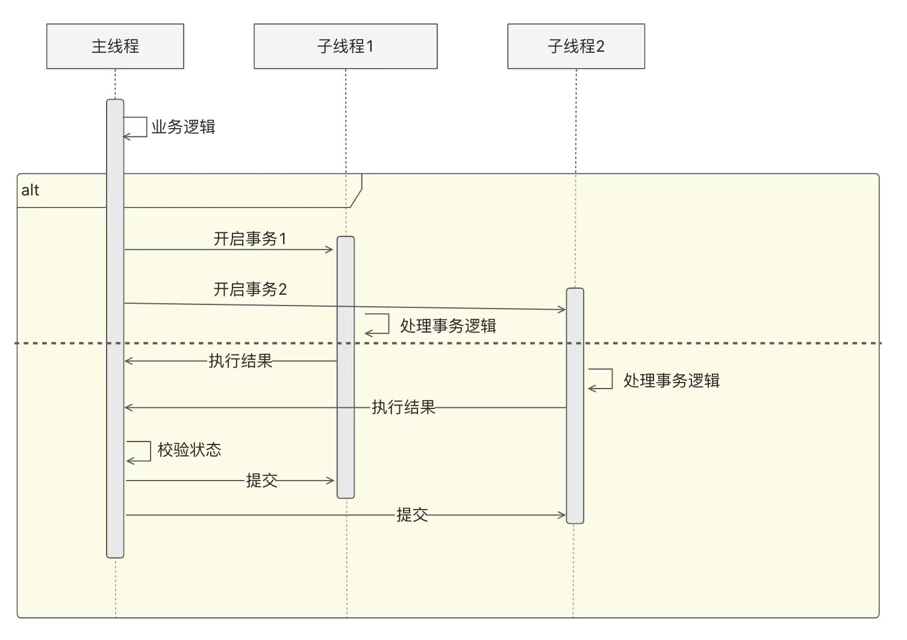

### 1. 分库分表数据访问特别

* 事务中的写操作不能跨库

* 对数据库的访问要携带分库分表位


### 2. 分库分表下数据库表结构设计

表结构设计要考虑到分库分表的特点，最好的情况是让一个事务的所有业务操作都可以落到一个库上，比较场景的做法是业务相关的所有库表使用相同的分库分表位（融资域使用ipId作为分库分表位，账务域使用accountId作为分库分表位）


### 3. 跨库方案

#### 3.1 分布式事务

数据库为参与者，业务系统管理者，数据一致性要求高

#### 3.2 嵌套事务(简易版分布式事务)

```java
transactionTemplate.execute(new TransactionCallbakWithoutResult() {
    @Override
    protected void doInTransactionWithoutResult(TransactionStatus status) {
        //访问库A

        //开启新事物访问库B
        transactionNewTemplate.execute();
    } 
});
```

内部事务的状态可以决定外部事物

* 内部事务抛异常回滚——外部事务如果不捕获异常的话也会回滚

* 内部事务提交——大部分情况下，外部事务提交

有数据不一致的风险，事务的提交是一次IO操作，如果内部事务提交后，服务宕机，外部事务就无法提交，只能超时回滚，数据不一致


#### 3.3 子线程信号量(简易版分布式事务)



本机模拟简易的TCC

* 主线程为管理者，子线程负责事务处理

* 主线程收到所有子线程的成功消息后，才向所有子线程发送commit指令

* 如果有子线程失败，或者超时，那么主线程向所有子线程发送rollback指令

极端情况还是会有不一致（部分子线程提交后，服务宕机，导致剩余子线程无法提交，事务超时回滚）
