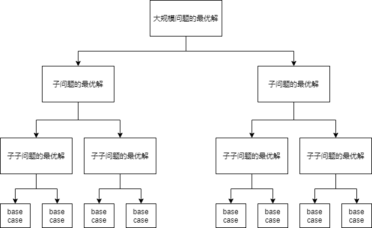

## 1.三个特征

### 1.1 最优子结构

可以通过小问题的最优解推导出大问题的最优解（递推函数）

换句话说，要获得大问题的最优解，首先要先获得小问题的最优解

### 1.2 重复子问题

动态规划的本质是穷举，所以动态规划的问题一定可以用回溯解决

我们构建递归树，动态规划问题一定会存在重复子问题，那么在递归树就会有多个相同的节点

### 1.3 无后向性

推导后面阶段的状态的时候，**只关心前面阶段的状态值**，不关心这个状态是怎么推导出来的

某阶段状态一旦确定，就不受后面阶段的影响

## 2. 动态规划解题思路

### 2.1 回溯+备忘录

1. 动态规划问题可以用回溯暴力解决，所以我们拿到问题后先尝试用回溯解决

2. 根据回溯解决逻辑，画出递归树，每个状态代表一个节点，从递归树中可以很容易看出是否有重复子问题

3. 如果有重复子问题，可以采用回溯+备忘录的方式进行优化（**自顶向下**）

### 2.2 dp table

* dp table与回溯+备忘录基本一致，不同的是回溯+备忘录是**自顶向下**的解法，dp table是**自底向上**d额解法
1. 确定状态数目，状态数目=dp数组的维度

2. dp数组的每个元素代表一个状态

3. 确定dp数组的含义

4. 明确动作有哪些

5. 对于dp数组的每一个状态，思考如果通过动作从其他状态转换而来

```java
//1.初始化dp数组，base case
dp[0][0][...]=base;

//2.进行状态转移
for 状态1 in 状态1所有取值:
    for 状态2 in 状态2所有取值:
        for ...
            dp[状态1][状态2][...]=求最值(选择1,选择2,...);
```

## 3. 回溯+备忘录与dp table的关系

1. 这两种解法本质是一样的，不过一个是自顶向下，一个是自底向上

2. dp table中的base case就是回溯+备忘录中的递归终止条件

3. dp table就是备忘录

## 4. 动态规划本身就是递归

动态规划具有最优子结构——子问题的最优解可以推导出更大规模问题的最优解，那么反过来，我们要获得大规模问题的最优解，首先需要获得子问题的最优解，那跟递归的思想一样


