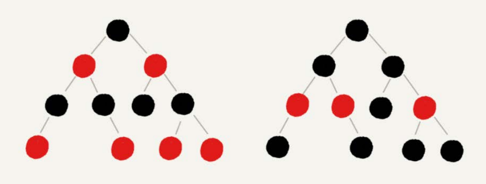

# 1. 二叉树

每个节点至多有2个子节点

## 1.1 完全二叉树

* 最后一层叶子节点都靠左排列

* 除了最后一层，其他层节点个数都达到最大值

## 1.2 满二叉树

* 叶子节点全都在底层
* 除了叶子节点以外，每个节点都有左右两个子节点

## 1.3 二叉查找树

对于每个节点

* 左子节点<该节点
* 右子节点>该节点

## 1.4 AVL树

平衡二叉查找树

* 任何一个节点的左右子树高度相差不能大于1

* 左子节点<当前节点，右子节点>当前节点

## 1.5 红黑树

* 根节点是黑色
* 每个叶子节点都是黑色的空节点（叶子结点不存储数据）
* 任何相邻的节点不能同时为红色
* 对于任何一个节点，从该节点到其可达叶子节点的所有路径，包含相同数目的黑色节点

## 1.6 递归树

树可以用于递归算法的复杂度分析