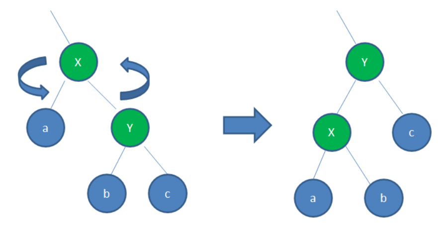
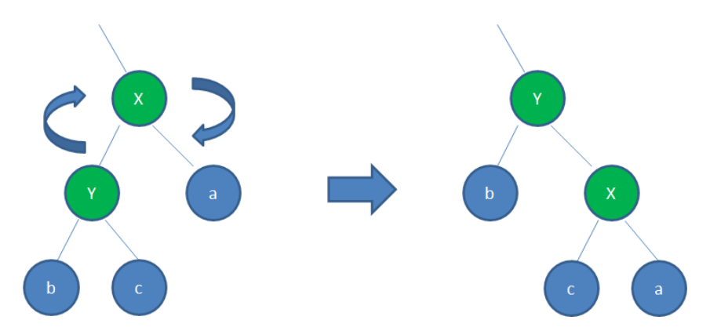
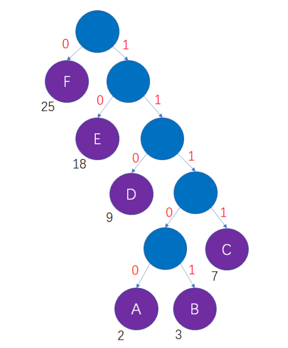

## 1. B树

* B树是平衡的多路查找树
* 在等量的大量数据下，B树的高度小于红黑树，可以减少磁盘IO次数

## 2. B+树

## 3. B*树

## 4. 红黑树

红黑树是一种自平衡的二叉查找树

* 具有二叉查找树的特性
* 每个node是红色or黑色
* root是黑色
* 每个叶子节点都是黑色的空节点
* 红色节点的子节点只能是黑色节点
* 从任一节点触发，到其每个子节点的各个路径都包含相同数目的黑色节点

* 这些规则保证红黑树的自平衡，红黑树从root到叶子节点的最长路径不会超过最短路径的2倍

* 在插入，删除操作时候，通过 变色和旋转保证整棵树符合上述规则

  * 变色

  * 旋转

    * 左旋转：逆时针旋转

      

    * 右旋转：顺时针旋转

      

## 5. AVL树

* AVL树具有二叉搜索树的特性

* AVL树遵循高度平衡，任何节点的两棵子树的高度差不超过1
* 插入，删除可能破坏AVL树的高度平衡，所有有旋转操作来保证
  * 左旋转：同红黑树
  * 右旋转：同红黑树

## 6. 哈夫曼树

* 每个叶子节点都有权重
* 叶子节点的带权路径长度=叶子节点的权重 x root到叶子节点的路径长度
* 树的带权路径长度=所有叶子节点的带权路径长度之和
* 给定一些列叶子节点，这些叶子节点构成的 树的带权路径长度最小的树——哈夫曼树

### 6.1 哈夫曼编码

哈夫曼编码可以压缩信息的长度，哈夫曼编码是一种不定长的编码方式

* 任何一个字符编码，都不是其他字符编码的前缀
* 信息编码的总长度最小
* 哈夫曼编码的产生要借助哈夫曼树，哈夫曼树的叶子节点有左右两个分支，左分支代表0，右分支代表1
* 通过哈夫曼树的带权路径长度最小的特性，可以保证生成的哈夫曼编码的编码长度最小

