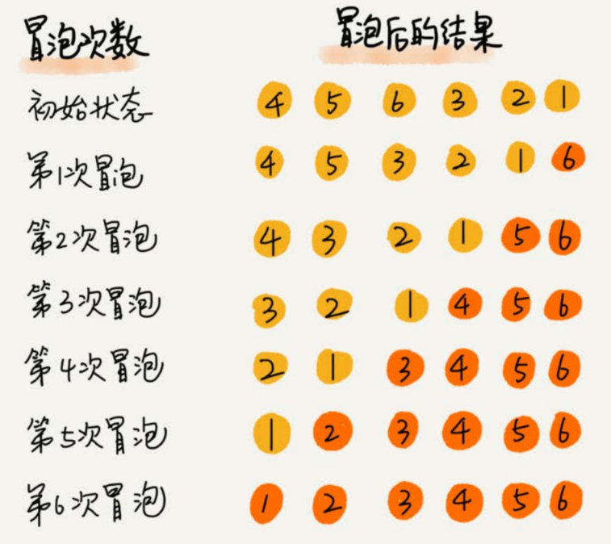
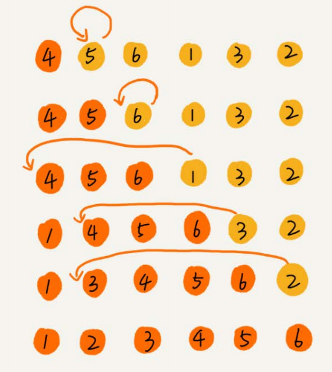
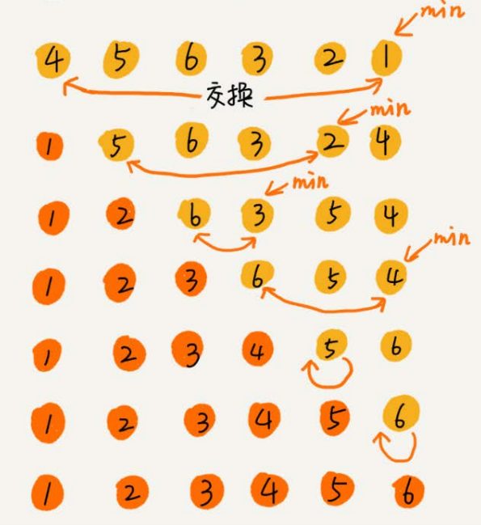
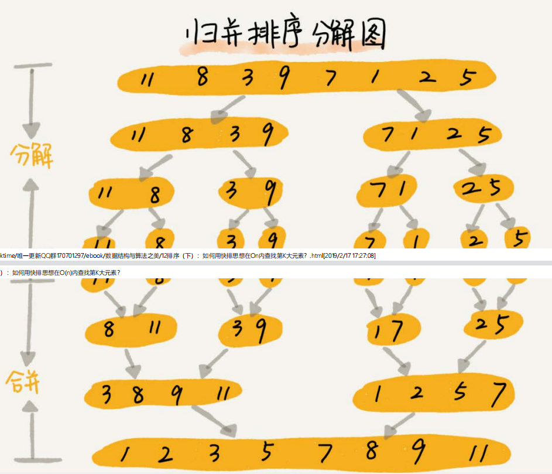
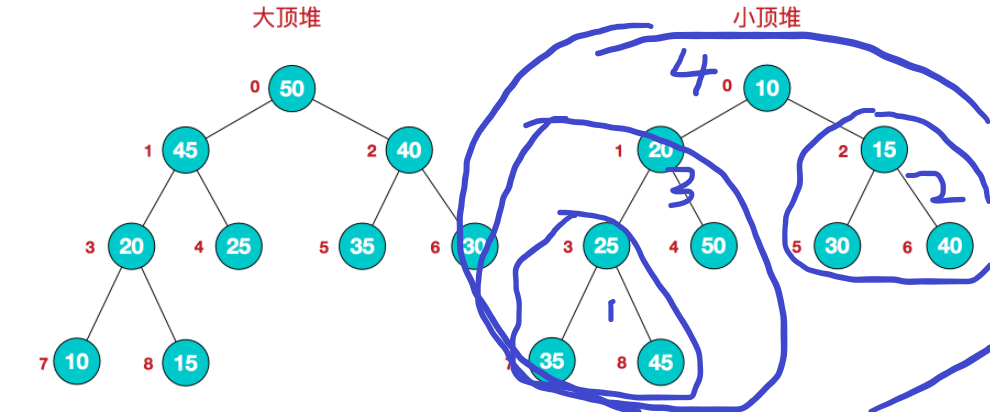
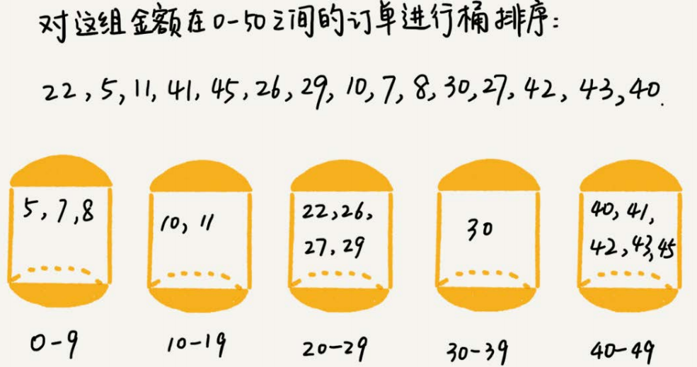
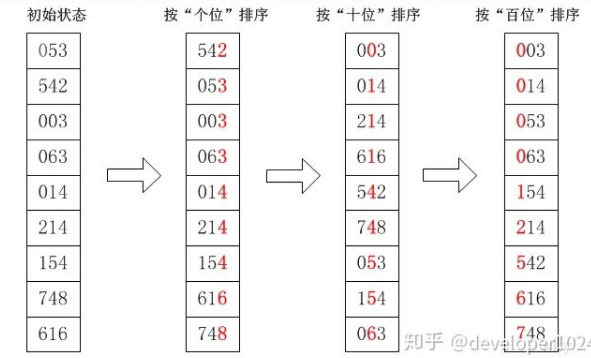

* O(n^2)
  * 冒泡排序
  * 插入排序
  * 选择排序
  * 希尔排序
* O(nlogn)
  * 归并排序
  * 快速排序
  * 堆排序
* **O(n)——这三种排序是基于非比较的排序，但是对要排序的数据要求严苛**
  * 计数排序
  * 基数排序
  * 桶排序

**稳定的排序算法**——相同大小的元素，排序前后相对位置不变；否则就是**不稳定的排序算法**


|   算法   |  最差时间复杂度   | 最好时间复杂度 | 平均时间复杂度 |   空间复杂度    | 是否稳定 |
| :------: | :---------------: | :------------: | :------------: | :-------------: | :------: |
| 冒泡排序 |      O(n^2)       |      O(n)      |     O(n^2)     |      O(1)       |   稳定   |
| 插入排序 |      O(n^2)       |      O(n)      |     O(n^2)     |      O(1)       |   稳定   |
| 选择排序 |      O(n^2)       |     O(n^2)     |     O(n^2)     |      O(1)       |  不稳定  |
| 希尔排序 |      O(n^2)       |      O(n)      |  O(n^(1.3-2))  |      O(1)       |  不稳定  |
| 归并排序 |     O(nlogn)      |    O(nlogn)    |    O(nlogn)    |      O(n)       |   稳定   |
| 快速排序 |      O(n^2)       |    O(nlogn)    |    O(nlogn)    | O(logn) or O(1) |  不稳定  |
|  堆排序  |     O(nlogn)      |    O(nlogn)    |    O(nlogn)    |      O(1)       |  不稳定  |
|  桶排序  |      O(n^2)       |      O(n)      |      O(n)      |     O(n+k)      |   稳定   |
| 计数排序 | O(n+k)：k是桶个数 |     O(n+k)     |     O(n+k)     |     O(n+k)      |   稳定   |
| 基数排序 |   O(dn):d是维度   | O(dn):d是维度  | O(dn):d是维度  |     O(n+d)      |   稳定   |


## 1. 冒泡排序



* **思想**：冒泡排序进行n轮，每轮都会将**未排序的元素中的最大元素**移动到合适位置，最大元素像泡泡一样逐个上升
* 如果一轮没有发生任何元素移动，那么说明整个序列已经有序，可以结束了

```java
    public static void maopaoSort(double[]arr){
        int length=arr.length;
        for(int i=0;i<length;i+=1){//进行n轮
            boolean flag=false;//标记该轮是否发生元素移动
            for(int j=0;j<length-i-1;j+=1){
                if(arr[j]>arr[j+1]){
                    swap (arr,j,j+1);
                    flag=true;
                }
            }
            if(!flag){
                break;//如果该轮结束还没有元素一定，那么说明序列已经有序，可以结束了
            }
        }
    }
```


## 2. 插入排序

* **思想**：进行n轮，第i轮时，前i-1个元素已经有序，将第i个元素放入合适的位置



```java
    public static void insertSort(double[]arr){
        int length=arr.length;
        for(int i=0;i<length;i+=1){//进行n轮,
            for(int j=i;j>0;j-=1){
                if(arr[j]>=arr[j-1]){
                    break;//第i个元素已经放在了合适的位置，结束
                }else{
                    swap (arr,j,j-1);
                }
            }
        }
    }
```


## 3. 选择排序

* **思想**：每轮从未排序的元素中找到最小值，放到已排序的区间的末尾



```java
    public static void selectSort(double[]arr){
        int length=arr.length;
        for(int i=0;i<length;i+=1){
            int min=i;
            for(int j=i;j<length;j+=1){
                if(arr[j]<arr[min]){
                    min=j;
                }
            }
            swap (arr,min,i);
        }
    }
```


## 4. 希尔排序

* **思想**

  >将整个数组划分为多个增量序列（增量为k），每个增量序列采用插入排序的思想保证其有序性
  >
  >当我们逐步缩小k时，整个数组越来越有序

* **初始增量不同**，希尔排序的最差时间复杂度也不同

  * 2*k——最差时间复杂度**O(n^2)**
  * 2^k-1——最差时间复杂度为**O(n^(3/2))**
  * 9*4^k - 9 * 2^k + 1 或者 4^k - 3*2^k + 1——最差时间复杂度为**O(n^(4/3))**

```java
    public static void ShellSort(double[]arr){
        int length=arr.length;
        int k=length/2;
        while(k>0){//k为增量，每轮除以2
            for(int i=k;i<length;i+=1){
                for(int j=i;j>=k;j-=k){
                    if(arr[j]>=arr[j-k]){
                        break;
                    }else{
                        swap (arr,j,j-k);
                    }
                }
            }
            k=k/2;
        }
    }
```


## 5. 归并排序

思想：

> 采用递归思想，要保证一个序列有序，分两步走
>
> 1. 将该序列分为2个子序列，这两个子序列分别有序
> 2. 将这两个有序子序列合并为完整的徐磊



```java
    public static void mergeSort(double[]arr,int begin,int end){
        if(begin>=end){
            return;
        }
        //以mid为界将数组分为2个子数组
        int mid=(begin+end)/2;
        //保证左子数组有序
        mergeSort (arr,begin,mid);
        //保证右子数组有序
        mergeSort (arr,mid+1,end);
        //将左子数组和右子数组合并
        merge (arr,begin,mid,end);
    }

    public static void merge(double[]arr,int begin,int middle,int end){
        double[]temp=new double[end-begin+1];
        int i=begin;
        int j=middle+1;
        int index=0;
        while(true){
            if(i>middle){
                if(j>end){
                    break;
                }else{
                    temp[index++]=arr[j++];
                }
            }else{
                if(j>end){
                    temp[index++]=arr[i++];
                }else{
                    if(arr[i]<arr[j]){
                        temp[index++]=arr[i++];
                    }else{
                        temp[index++]=arr[j++];
                    }
                }
            }
        }

        //将排序好的数组拷贝回原数组
        for(int k=0;k<end-begin+1;k+=1){
            arr[begin+k]=temp[k];
        }
    }
```


## 6. 快速排序

* **思想**：找到一个数据作为pivot，pivot左边的数据都比它小，右边的数据都比它大，然后对左边元素进行快排，右边元素进行快排

  快排的关键在于寻找pivot

  >维持两个游标i，j
  >
  >i从最左边开始向右遍历，遇到> pivot的元素停下来
  >
  >j从最右边开始向左遍历，遇到< pivot的元素停下来

```java
    public static void quickSort(double[]arr,int begin,int end){
        if(begin>=end){
            return;
        }
        int index=partition(arr,begin,end);
        quickSort (arr,begin,index-1);
        quickSort (arr,index+1,end);
    }

    public static int partition ( double[] arr, int begin, int end ){
        int i=begin;
        int j=end-1;
        double value=arr[end];
        while(true){
            while(i<end&&arr[i]<=value){
                i+=1;
            }
            while(j>0&&arr[j]>=value){
                j-=1;
            }
            if(i<j){
                swap (arr,i,j);
            }else{
                break;
            }
        }
        swap (arr,i,end);
        return i;
    }
```

* **空间复杂度**

  快排的空间复杂度

  * 如果考虑递归产生的栈空间的使用——O(logn)

  * 如果不考虑递归产生的栈空间——O(1)

## 7. 堆排序



* **思路**

  >核心实现——下沉函数sink(double[]arr,int i,int end)——将arr[i]下沉到合适的位置，考虑的范围为arr[0]-arr[end-1]
  >
  >1. 将无序堆构建为一个有序堆
  >2. 将栈顶元素与未排序元素中的末尾元素交换，然后将栈顶元素进行下沉操作，让未排序元素中的最大值上升到栈顶（重复第2步直到所有元素有序）

```java
    public static void heapSort(double[]arr){
        //构建一个最大堆
        for(int i=arr.length/2-1;i>=0;i-=1){
            sink(arr,i,arr.length);//堆中第i个节点下沉——保证以第i个节点为root的子堆为最大堆
        }

        for(int i=arr.length-1;i>0;i-=1){
            //将堆顶元素(未排序的最大元素)移动到堆的末尾,然后让堆顶元素下沉
            swap (arr,0,i);
            sink (arr,0,i);
        }

    }

    public static void sink(double[]arr,int i,int end){
        int temp=i;
        while(temp*2+1<end){//保证temp位置一定有子节点，如果没有子节点就结束了
            //index为temp最大子节点的索引，默认为temp位置左子节点的索引
            int index=temp*2+1;
            if(temp*2+2<end){
                //temp位置有左右两个子节点
                if(arr[index]<arr[index+1]){
                    index+=1;//如果左子节点<右子节点,那么index为右子节点的索引
                }
            }
            if(arr[index]>arr[temp]){
                swap (arr,index,temp);
                temp=index;
            }else{
                break;
            }
        }
    }
```


## 8. 线性排序——桶排序

* **思想**：将要排序的数据分到几个有序的桶里，每个桶中的数据再**单独排序**——然后将每个桶中的数据按照顺序依次取出



* **时间复杂度分析**

  有n个要排序的数据，分散到m个桶中，每个桶中分到k个数据(k=n/m)，对每个桶中的数据进行快排，然后依次从这m个桶中取出数据

  时间复杂度=m* klogk + n= n*log(n/m)+n=n ( log(n/m)很小 )


## 9. 线性排序——计数排序

**技术排序是桶排序的特殊情况（bucket sort中桶的粒度大，counting sort中桶的粒度小）**

假设要排序数据的min和max相差不大——max-min+1=k(k不大)

那么准备k个桶，每个桶中的数据大小相同，只需要扫描每个桶就可以得到排序好的数据

> 例如：考试成绩为0到100分，考生50W
>
> 我们准备0——100总共101个桶，将考生的成绩分散到各个桶中


* **思路**

  >假设数组arr中10个元素分散在[0,5]，我们准备k=6个桶
  >
  >创建bucket[6]，bucket[i]表示<=i的元素的个数
  >
  >* 先遍历arr让，统计每个桶中的元素个数
  >* 然后利用动态规划思想bucket[i]=bucket[i]+bucket[i-1]——让bucket[i]表示<=i的元素的个数

  ```java
      /**
       * @param arr 待排序的数组
       * @param begin 数组中的下限
       * @param end 数组中的上限
       */
      public static void countingSort(int[]arr,int begin,int end){
          int[]bucket=new int[end-begin+1];
          //统计每个桶中的元素数目
          for(int i=0;i<arr.length;i+=1){
              bucket[arr[i]-begin]+=1;
          }
          //bucket[i]表示 <=i+begin的元素个数
          for(int i=1;i<bucket.length;i+=1){
              bucket[i]=bucket[i]+bucket[i-1];
          }
          int index=0;
          for(int i=0;i<bucket.length;i+=1){
              int number=i==0?bucket[i]:bucket[i]-bucket[i-1];
              for(int j=0;j<number;j+=1){
                  arr[index++]=i+begin;
              }
          }
      }
  ```

  

## 10. 线性排序——基数排序

原理是将整数按位数切割成不同的数字，然后按每个位数分别比较。

基数排序的方式可以采用LSD（Least significant digital）或MSD（Most significant digital）

LSD的排序方式由键值的最右边开始，而MSD则相反，由键值的最左边开始。

- **MSD**：先从高位开始进行排序，在每个关键字上，可采用计数排序
- **LSD**：先从低位开始进行排序，在每个关键字上，可采用桶排序



