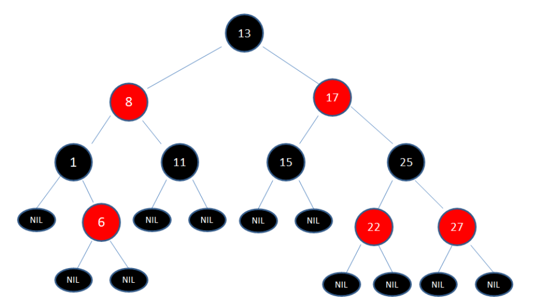
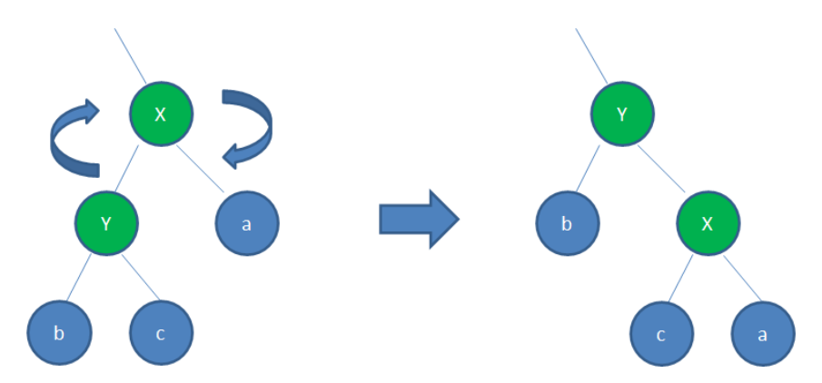
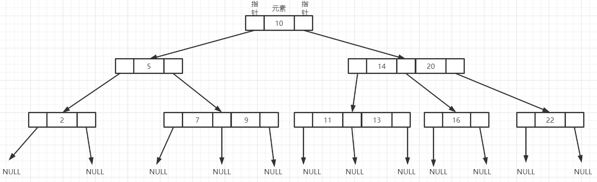
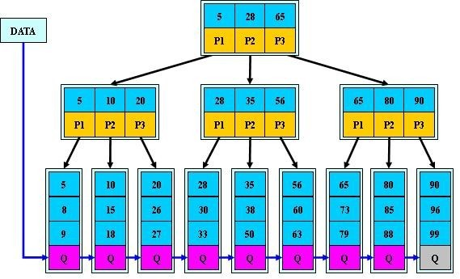
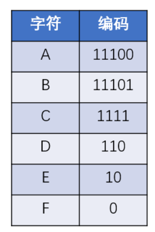

# 1. 二叉树

每个节点至多有2个子节点

## 1.1 完全二叉树

* 最后一层叶子节点都靠左排列

* 除了最后一层，其他层节点个数都达到最大值

## 1.2 满二叉树

* 叶子节点全都在底层
* 除了叶子节点以外，每个节点都有左右两个子节点

## 1.3 二叉查找树

对于每个节点

* 左子节点<该节点
* 右子节点>该节点

## 1.4 AVL树

平衡二叉查找树

* AVL树具有二叉搜索树的特性
* AVL树遵循高度平衡，任何节点的两棵子树的高度差不超过1
* 插入，删除可能破坏AVL树的高度平衡，所有有旋转操作来保证
  * 左旋转：同红黑树
  * 右旋转：同红黑树

## 1.5 红黑树

* 红黑树是一种自平衡的二叉查找树
  * 具有二叉查找树的特性
  * 每个node是红色or黑色
  * root是黑色
  * 每个叶子节点都是黑色的空节点
  * 红色节点的子节点只能是黑色节点（红色的性质就这条）
  * 从任一节点触发，到其每个子节点的各个路径都包含相同数目的黑色节点

* 这些规则保证红黑树的自平衡，红黑树从root到叶子节点的最长路径不会超过最短路径的2倍

* 在插入，删除操作时候，通过 变色和旋转保证整棵树符合上述规则
  
  * 变色
  
  * 旋转
    
    * 左旋转：逆时针旋转
      
      
    
    * 右旋转：顺时针旋转
      
      

## 1.6 递归树

树可以用于递归算法的复杂度分析

# 2. B树

* 平衡的多路查找树
* 树中每个结点至多有m棵子树
* 根节点有**[2,m]**个子树（根节点不是叶子节点）
* 如果不是根节点或者叶子节点，那么有**[m/2向上取整，m]**棵子树
* 如果一个节点有k个子树，那么该节点有k-1个键
* 所有的叶子节点都在同一层次，不携带信息

# 3. B+树

B+树在B树的基础上，加入了以下特点

* 叶子节点存储真实数据，非叶子不存储真实数据，只有索引值
* 如果一个节点拥有k个子树，那么该节点有k个键
* 所有叶子节点位于同一层，叶子节点之间构成链表

# 4. B*树

# 5. 哈夫曼树

* 每个叶子节点都有权重
* 叶子节点的带权路径长度=叶子节点的权重 x root到叶子节点的路径长度
* 树的带权路径长度=所有叶子节点的带权路径长度之和
* 给定一些列叶子节点，这些叶子节点构成的 树的**带权路径长度**最小的树——哈夫曼树

## 5.1 哈夫曼编码

哈夫曼编码可以压缩信息的长度，哈夫曼编码是一种不定长的编码方式

* 任何一个字符编码，都不是其他字符编码的前缀
* 信息编码的总长度最小
* 哈夫曼编码的产生要借助哈夫曼树，哈夫曼树的叶子节点有左右两个分支，左分支代表0，右分支代表1
* 通过哈夫曼树的带权路径长度最小的特性，可以保证生成的哈夫曼编码的编码长度最小

