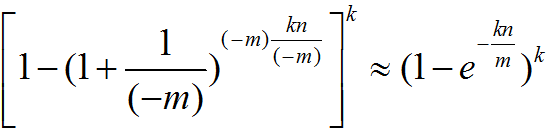

## 1. Bloom Filter介绍

* Bloom Filter由一个二进制序列和多个hash function组成——用于判断一个元素是否在集合中，但并不保证100%正确

* **特点**
  
  * 占用空间小，查询快
  * 但存在误判
    * Bloom Filter说某个值存在——该值可能不存在
    * Bloom Filter说某个值不存在——该值一定不存在
  * 标准的Bloom Filter不支持删除操作，需要引入Counting Bloom Filter

## 2. 应用场景

* 网页爬虫对URL去重
* 反垃圾邮件
* 缓存击穿——将已存在的缓存放到布隆中，当黑客访问不存在的缓存时迅速返回避免缓存及DB挂掉
* HTTP缓存服务器——当本地局域网中的PC发起一条HTTP请求时，缓存服务器会先查看一下这个URL是否已经存在于缓存之中，如果存在的话就没有必要去原始的服务器拉取数据了
* 黑/白名单
* Bigtable——Bigtable使用Bloom Filter来查找不存在的行or列
* 文件存储系统使用Bloom Filter来检测先前存在的数据
* Key-Value系统——使用Bloom Filter来加快查询过程（通过Bloom Filter判断某个key是否存在，减少不必要的磁盘IO）
* HTTP Proxy-Cache——在Internet Cache Protocol中的Proxy-Cache很多都是使用Bloom Filter存储URLs，除了高效的查询外，还能很方便得传输交换Cache信息

## 3. Bloom Filter实现

### 3.1 标准的Bloom Filter——BitSet

* 创建一个m为的BitSet，将所有位初始化为0，选择k个不同的hash function
* 加入BitSet过程——key通过k个hash function计算出k个index，将BitSet在这些index的位置都设置为1

* 校验key是否存在——key通过k个hash function计算出k个index，查看BitSet中这些index的位置是否都为1
* **缺点**——标准的Bloom Filter不支持删除操作

### 3.2 Counting Bloom Filter

* Couting Bloom Filter支持删除操作
* Couting Bloom Filter将Bloom Filter的每一bit拓展为一个Counter，插入时，对应index位置的Counter会加1，删除时减1

## 4. 减少错误率

### 4.1 错误率公式

* 二进制序列位数：m
* hash函数数目：k
* 放入Bloom Filter的元素个数：n

### 4.2 减少错误率措施

1. 选择最优的哈希函数个数（根据错误率公式可以计算出最优的哈希函数个数）
2. 选择最优的二进制序列大小（根据错误率公式可以获得）