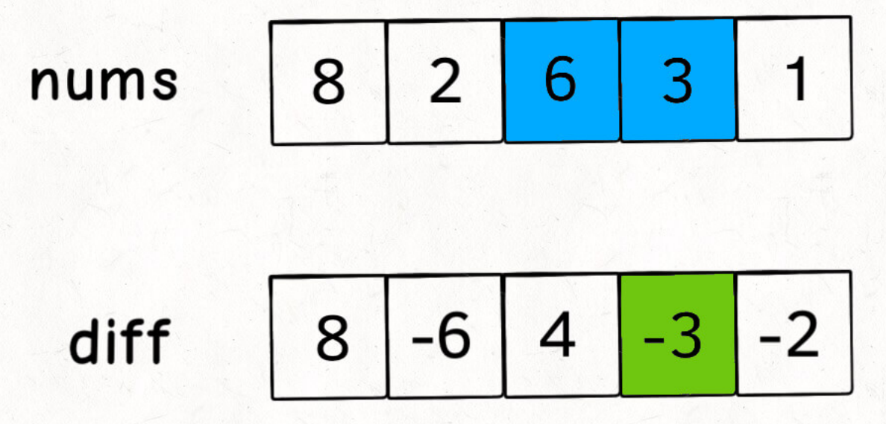
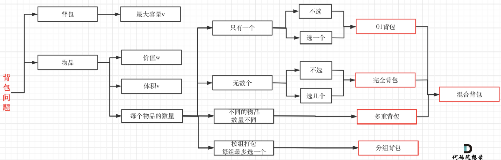

# 1. 数组

## 1.1 前缀法

```
题目：
303.区域和检索-数据不可变
304.二维区域和检索-矩阵不可变
560.和为k的子数组
```

### 1.1.1 适用场景

原始数组不被修改，频繁查询某个区间内元素和

### 1.1.2 使用方法

* 对于一维数组，构建一个pre[] ,pre[i]表示nums[0]—nums[i-1]之和
* 对于二维数组，构建一个pre[] []，pre[i] [j] 表示 以nums[0] [0] 为左上角，nums[i-1] nums[j-1]为右下角构成的矩阵中元素之和


## 1.2 差分数组

```
题目
1109. 航班预订统计
1094. 拼车
```


### 1.2.1 适用场景

对原始数组频繁修改，询问完成所有修改后，新数组的样子


### 1.2.2 使用方法

* 对于一维数组

  * 构建一个差分数组diff[]，diff[0]=nums[0]，diff[i] = nums[i]- nums[i-1]

    

  * **如果我们要让nums[i]——nums[j]都加上val，那么在diff中只需要将diff[i]+val，diff[j+1]-val即可**——数组中一块连续区域都需要加减val时，通过差分数组可以将O(N)降低为O(1)


# 2. 双指针

链表子串数据题，用双指针别犹豫
**双指针家三兄弟**，各个都是万人迷


**快慢指针**最神奇，链表操作无压力

归并排序找中点，链表成环搞判定


**左右指针**最常见，左右两端相向行

反转数组要靠它，二分搜索是弟弟


**滑动窗口**老猛男，子串问题全靠它

左右指针滑窗口，一前一后齐头进


## 2.1 快慢指针

### 2.1.1 适用场景

* 判断链表是否有环
* 已知链表有环，返回环的起始位置
* 寻找链表的中点——当fast走完链表的时候，slow走到链表中间偏右的位置
  * 寻找链表的中点——可以用于对链表进行归并排序
* 删除链表倒数第n个元素

### 2.1.2 使用方法

维护2个指针fast和slow，fast在前，slow在后


## 2.2 左右指针

### 2.2.1 使用场景

* 二分查找
* 两数之和
* 反转数组

### 2.2.2 使用方法

维护两个指针left，right——初始化left=0 , right=nums.length-1


## 2.3 滑动窗口

```
76.最小覆盖子串
567.字符串的排列
438.找到字符串中所有字母异味词
3.无重复字符的最长子串
```


### 2.3.1 代码模版

```c
//窗口左边界，窗口右边界，window=[left,right];
int left=0,right=0;
while(right<nums.length){
  //增大窗口
  window.add(nums[right]);
  right++;
  
  while(窗口需要缩小){
    window.remove(nums[left]);
    left+;
  }
}
```


# 3. 二分

## 3.1 二分搜索

**二分搜索分为三种情况**

1. **搜索一个元素**
2. **搜索区间的左边界**
3. **搜索区间的右边界**

### 3.1.1 整体框架

```java
int left=0,right=nums.length-1;

while(left<=right){
  int mid=left+(right-left)/2;
  if(nums[mid]==target){
    //搜索一个元素——return mid;
    //搜索左边界—— right=mid-1;
    //搜索右边界—— left=mid+1;
  }else if(nums[mid]<target){
    left=mid+1;
  }else if(nums[mid]>target){
    right=mid-1;
  }
}

//搜索一个元素——return -1;
//搜索左边界—— if(left>=nums.length||nums[left]!=target){return -1;}  return left;
//搜索右边界—— if(right<0||nums[right]!=target){return -1;} return right;
```

```
大家模板都一样，搜索区间两端闭    (搜索区间为[left,right]——left=0，right=nums.length-1)
while条件带等号，mid必须加减一   (while(left<=right); left=mid-1,right=mid+1)
大于小于都一样，只有等于要讨论 
搜索一个元素时,mid等于就返回
搜索左边界时,mid等于right缩     (right=mid-1)
搜索右边界时,mid等于left缩      (left=mid+1)
while循环结束时,左右边界要特判
搜索左边返回左，搜索右边返回右
```


# 4. 链表

## 4.1 反转链表

有两种思路

* 递归
* 迭代


# 5. 栈和队列

## 5.1 单调栈

栈里面的元素有序

### 5.1.1 适用场景

单调栈只处理一种问题——Next Greater Element

```
给你一个数组nums，对于每一个元素nums[i]，返回nums[i]——nums[末尾]中第一个比nums[i]大的元素
nums=[2,1,2,4,3]——> res=[4,2,4,-1,-1]
```


### 5.1.2 解题思路

从nums.length-1开始遍历数组，**每个元素都要入栈**

对于nums[i]，入栈时，要保证入栈后，整个栈是有序的(从小到大or从大到小)

```java
Stack<Integer> stack=new Stack<>();
for(int i=nums.length-1;i>=0;i-=1){
  while(!stack.isEmpty()&&stack.peek()<=nums[i]){
    stack.pop();
  }
  res[i]=stack.isEmpty():-1?stack.peek();
  stack.push(nums[i]);
}
return res;
```


## 5.2 单调队列


# 6. 回溯法

回溯法的本质是穷举


## 6.1 回溯法可以解决的问题

* 组合问题
* 切割问题：一个字符串可以切割为多少符合某种条件的子串
* 子集问题：一个集合有多少符合条件的子集
* 排列问题
* 棋盘问题：N皇后，数独等


## 6.2 如何理解回溯算法

回溯算法解决的问题都可以抽象为树形结构

递归必须有终止条件


## 6.3 回溯算法模板

```java
public void backtracking(){
  if(终止条件){
    存入结果，返回;
  }
  for(Selection select: allSelections){
    做出选择;
    backtracking(路径,下一个选择列表)
    撤销选择;
  }
}
```


## 6.4 岛屿问题

岛屿问题——用DFS/BFS来遍历二维数组

```java
void DFS(int[][]grid,int i,int j,boolean[]visit){
    int m=grid.length;
    int n=grid[0].length;
    if(i<0||j<0||i>=m||j>=n){
        return;
    }
    //该岛屿访问过了
    if(visit[i][j]){
        return;
    }
    visit[i][j]=true;//访问岛屿
    DFS(grid,i-1,j,visit);//上
    DFS(grid,i+1,j,visit);//下
    DFS(grid,i,j-1,visit);//左
    DFS(grid,i,j+1,visit);//右
    
}
```


# 7. 动态规划

动态规划的一般形式是求最值

动态规划的核心问题是穷举（会有重复的子问题）

动态规划一定具备 **最优子结构**——通过子问题的最值找到原问题的最值

动态规划需要列出正确的 **状态转移方程**


## 7.1 思考状态转移方程

明确初始状态——明确状态——明确选择——定义dp数组的含义

```JAVA
//初始化状态
dp[][][...]=base;

//状态转移
for 状态1 in 状态1的所有取值:
  for 状态2 in 状态2的所有取值:
    for ...
        dp[状态1][状态2][...]= 求最值(状态1,状态2,...)
```


## 7.2 动态规划解题步骤

1. 确定dp数组及其下标的含义
2. 确定递推公式
3. dp数组如何初始化
4. 确定遍历顺序
5. 举例推导dp数组

## 7.3 dp数组遍历方向

1. 遍历的过程中，所需要的状态是已经计算出来的
2. 遍历的终点必须是存储结果的那个位置


## 7.4 debug方法

如果代码AC不了，灵魂三问

1. 这道题目我举例推导状态转移公示了么
2. 我打印dp数组的日志了么
3. 打印出来的dp数组跟我想的一样吗


## 2.3 背包问题



**面试基本只有01背包问题和完全背包问题**


### 2.3.1 01背包问题——每个物品放0or1次

```
n件物品，1个容量为w的背包，每件物品重量为weight[i]，得到的价值是value[i]，每件物品只能用一次，如何让背包里面物品的价值最大？

n件物品，每个物品的重量为weight[i]，背包容量为target，每件物品只能用一次，能否让物品装满背包
```

#### 1. 暴力解法——回溯

每个物品只有2种情况——取or不取，所以可以构建一颗决策树，进行回溯

#### 2. 二维dp数组——01背包

* 确定dp数组的含义

​		dp[i] [j]——从下标0—i 的物品里面任意取，放进容量为j的背包里时，该背包中物品的价值的最大值

* 确定递推公式

  对于dp[i] [j]有2种情况

  * 下标为i的物品不取——dp[i] [j]=dp[i-1] [j]
  * 下标为i的物品取——dp[i] [j] =dp[i-1] [j-weight[i] ] + value[i]（取了i，可选择的物品只有0—i-1，背包中剩余的容量也只有j-weight[i] ）

* 初始化

  ```
  for (int j = 0 ; j < weight[0]; j++) {  // 当然这一步，如果把dp数组预先初始化为0了，这一步就可以省略，但很多同学应该没有想清楚这一点。
      dp[0][j] = 0;
  }
  // 正序遍历
  for (int j = weight[0]; j <= bagweight; j++) {
      dp[0][j] = value[0];
  }
  ```

* 确定遍历顺序

  * **先物品后容量（推荐）**

    ```
    // weight数组的大小 就是物品个数
    for(int i = 1; i < weight.size(); i++) { // 遍历物品
        for(int j = 0; j <= bagweight; j++) { // 遍历背包容量
            if (j < weight[i]) dp[i][j] = dp[i - 1][j]; 
            else dp[i][j] = max(dp[i - 1][j], dp[i - 1][j - weight[i]] + value[i]);
    
        }
    }
    ```
  
  * **先容量后物品**

    ```
    // weight数组的大小 就是物品个数
    for(int j = 0; j <= bagweight; j++) { // 遍历背包容量
        for(int i = 1; i < weight.size(); i++) { // 遍历物品
            if (j < weight[i]) dp[i][j] = dp[i - 1][j];
            else dp[i][j] = max(dp[i - 1][j], dp[i - 1][j - weight[i]] + value[i]);
        }
    }
    ```

#### 3. 01背包优化——使用滚动数组(一维数组)

* dp数组的含义——在每一轮遍历中的含义不同，假设正在遍历第i个物品，那么dp[j]——背包中只可以放入0—i物品时的最大价值

  计算dp[j]时候，dp[0]—dp[j]为背包只放入0—i-1物品的最大价值，dp[j+1]—dp[尾]为背包只放入0—i物品的最大价值

* 递推公式——dp[j]有2个选择

  * 不放物品i——相当于dp[i] [j]= dp[i-1] [j]——dp[j]=dp[j]
  * 放物品i——相当于dp[i] [j] =dp[i-1] [j-weight[i] ]+value[i]——dp[j]=dp[j-weight[i]]+value[i]

* **遍历顺序**——**先物品后容量，第二层for倒序**

  ```
  for(int i = 0; i < weight.size(); i++) { // 遍历物品
      for(int j = bagWeight; j >= weight[i]; j--) { // 遍历背包容量,倒序遍历，保证物品i只放入1次，正序遍历会导致物品放多次
          dp[j] = max(dp[j], dp[j - weight[i]] + value[i]);
  
      }
  }
  ```


### 2.3.2 完全背包问题——每个物体可以放多次

#### 1. 暴力解法——回溯

#### 2. 二维dp数组

* dp[i] [j]——背包容量为j，只能从下标0—i的物品中取，背包中所能装的物品的价值的最大值
* 递推公式——dp[i] [j]有以下情况

  * 第i个物体不放——dp[i] [j] =dp[i-1] [j]
* 第i个物体放——dp[i] [j]= dp[i] [j-weight[i]]+value[i] (取了i，可选择的物品仍为0—i，背包剩余容量为j-weight[i] )
* 遍历顺序——先物品后容量，先容量后物品都可以，第二层for正序

#### 3. 滚动数组(一维数组)

* 遍历——先物品后容量，先容量后物品都可以，第二层for正序

```
//先物品后容量，第二层for正序
for(int i=0;i<weight.size();i+=1){
    for(int j=weight[i];j=<背包容量;j+=1){
       dp[j]=Math.max(dp[j],dp[j-weight[i]]+value[i]);
    }
}

//先容量后物品，第二层for正序
for(int j=0;j<=背包容量;j+=1){
  for(int i=0;i<weight.size();i+=1){
    if(j-weight[i]>=0){
       //背包j放得下第i个物品
       dp[j]=Math.max(dp[j],dp[j-weight[i]]+value[i])
    }
  }
}
```


### 2.3.3 背包问题解题模版

#### 1. 背包分类的模版

* 01背包

  * 二维数组——先物品后容量，先容量后物品都是可以的，第二层for正序
  * 一维数组——先物品后容量，第二层for倒序

* 完全背包

  * 二维数据——先物品后容量，先容量后物品都是可以的，第二层for正序

  * 一维数组
    * 求组合数——先物品后容量，第二层for正序
    * 求排列数——先容量后物品，第二层for正序
    * 其他情况——先物品后容量，先容量后物品都可以，第二层for正序

#### 2. 问题分类的模板——找递推公式


 
