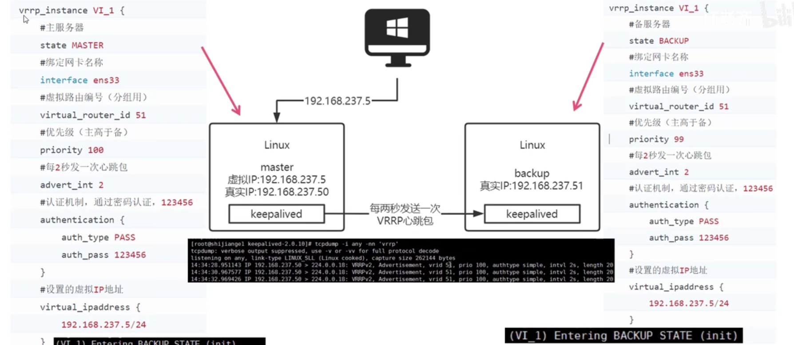
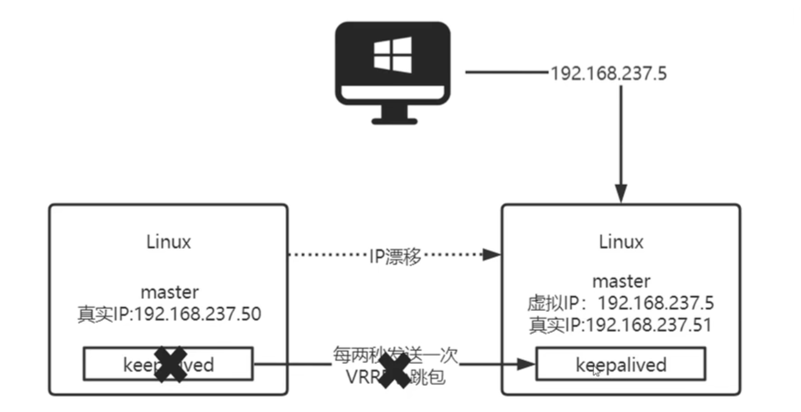
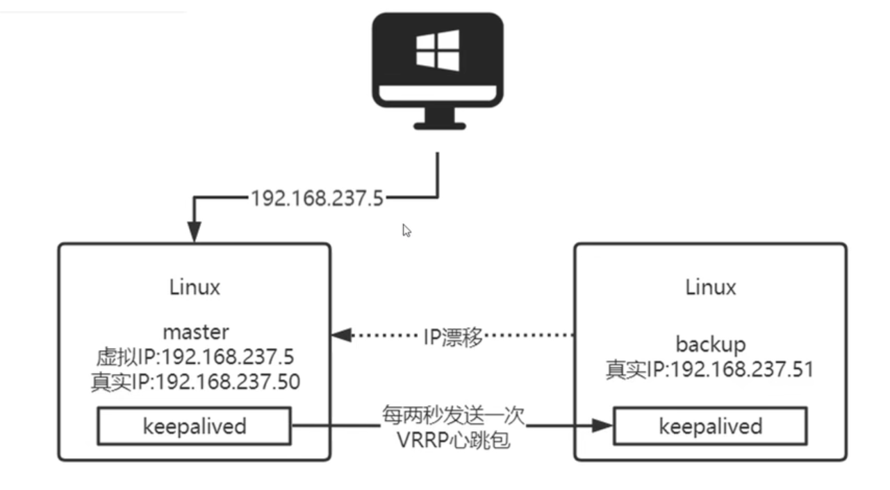
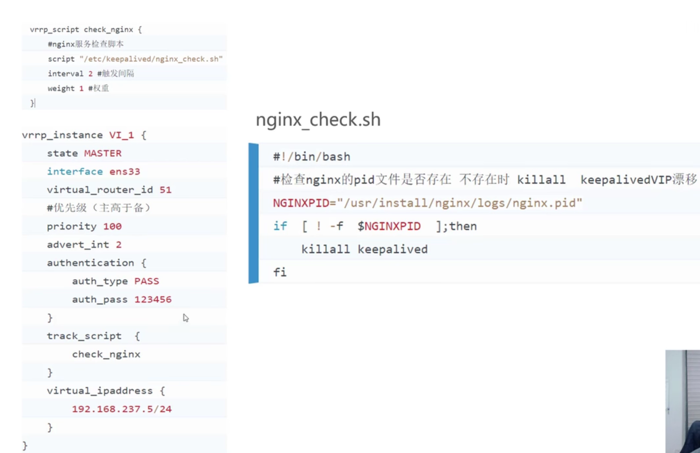
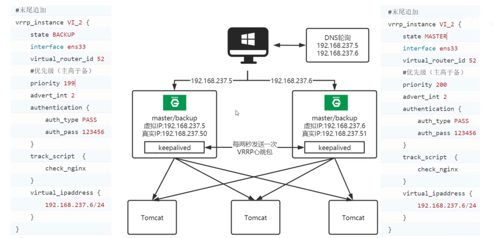
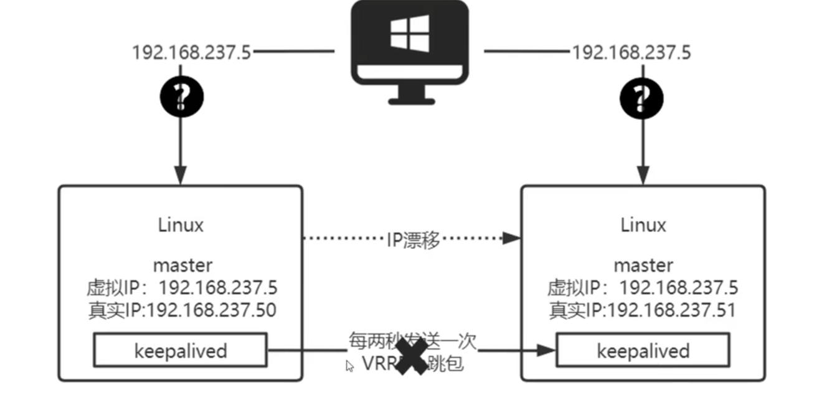

规避单点是高可用架构设置的最基本考量

* Keepalived是Linux轻量级别的高可用解决方案

  Keepalived主要是通过虚拟路由冗余(VRRP)来实现高可用功能（虚拟IP+IP漂移）

  虚拟路由冗余（VRRP）是一个解决**局域网中配置静态网关出现单点失效现象**的路由协议

* VIP(Virtual IP)——虚拟IP，VIP在内网中被**动态映射**到不同MAC地址上（映射到不同的机器设备上），Keepalived通过 "心跳机制" 检测服务器状态，如果master宕机就将master的虚拟IP漂移到备机上，实现高可用

### Keepalived和虚拟IP规避单点

* 虚拟IP由Keepalived自动创建与维护，无需人工介入

* 客户端通过虚拟IP访问服务

* 如果master上的keepalived挂了，无法发送心跳包——备机自动升级为master，产生 **IP漂移**继续提供服务

* 如果旧master上的keepalived恢复，那么Keepalived自动将IP漂移回原master（默认情况）

  **我们也可以通过配置，让旧master恢复后，成为备机，避免再次发生IP漂移**——使用 **nopreempt非抢占模式**

  >只需要在配置文件中添加
  >
  >nopreempt
  >
  >即可

#### 问题1——Nginx宕机时IP漂移

上面描述的过程中，只有master上的keepalived挂了，才会触发IP漂移

如果我想在两台服务器上部署2个Nginx，master上的Nginx挂了，但是keepalived没挂，此时要触发IP漂移，该怎么做？——需要引入**脚本**

>keepalived每隔2秒执行1次脚本
>
>脚本会检查Nginx是否存活，如果nginx死了，那么强行杀死keepalived——触发IP漂移

#### 问题2——如何让备机也工作

上述的Keepalived模式，只有一台服务器在工作，备机处于空闲状态，那么如何让备机也工作呢

* 在keepalived中配置2个——让两台服务器互为主备
* 通过DNS轮询

#### 问题3——脑裂

master上的keepalived没有任何问题，但是由于网络问题，keepalived的心跳包无法发送给备机，备机自动升级为主机，那么此时就有两个master

* 此时需要杀死备机keepalived，禁止使用 **pkill -9 keepalived**，使用 **pkill keepalived**正常结束
* 然后解决网络问题，解决完网络问题后，在备机上执行 **systemctl restart network**提供网络可用性