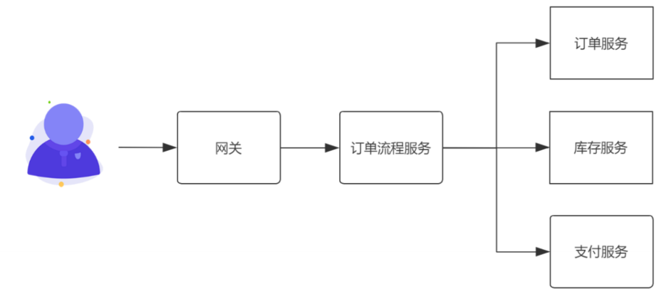

 

### 1. 单机架构—>微服务架构

从网络，性能，运维成本，组织架构，集成测试 5个方面进行阐述

1. 以往单体应用在单机中进行进程内通信，通信稳定性相当好。但是打散为分布式系统后，变为进程间通信，往往还伴随着跨设备的网络访问，架构师必须考虑因为网络问题而无法通信的情况，要假设网络是不可靠——设计微服务在网络异常时也能进行符合预期的处理

2. 相比于传统单体架构进程内通信，跨进程，跨网络的微服务通信在网络传输与消息序列化带来的延迟是不可被忽略的，如果业务对延迟的容忍度很低，那么不适合使用分布式设计

3. 运维成本直线上升

   早期单体应用运维容易，交付周期段，手动部署即可满足要求，但是对于微服务架构，每一个i而服务都是可独立运行，独立部署，独立维护的单元，传动手动部署无法满足需要

4. 组织架构层面的调整

   微服务不但是一种架构风格，同样也是一种软件组织模型，微服务的实施过程中，以业务模块划分团队，每一个团队要求可以独立完成从调研到发版的全流程，减少对外界的依赖，如果划分团队也是一项挑战

5. 服务间的集成测试困难

   微服务架构，要想获得准确的测试结果，必须搭建完整的微服务环境

### 2. 微服务架构最佳实践

1. 微服务的划分原则

   * **单一职责原则**——每一个微服务只做好一件事，体现出 “高内聚，低耦合”，尽量减少对外界环境的依赖
   * **服务依赖原则**——避免服务之间的循环依赖，在设计时要对服务进行分级——核心服务，非核心服务；服务调用要遵循“核心服务”到“非核心服务”，不允许出现反向调用，同时对于核心服务要做好保护，避免非核心服务出现问题影响核心服务正常运行
   * **Two Pizza原则**——团队规模保持在2个披萨可以吃饱的程度

2. 为每一个微服务模块明确使用，集中体现 “只做好一件事”的原则

   >模板 
   >
   >XX微服务用来 
   >
   >在出现痛点场景的情况下 
   >
   >解决现有的XX问题 
   >
   >从而达到了XXX的效果 
   >
   >提升了微服的价值 
   >
   >============================================== 
   >
   >示例 
   >
   >商品检索微服务用例 
   >
   >在商品数据全量多维度组合查询的情况下 
   >
   >解决了MySQL数据库全表扫描查询慢的问题 
   >
   >从而让查询响应降低到50ms以下 
   >
   >有效提升了用户体验 

3. 微服务保证独立的数据存储

   不同的微服务对于数据存储的需求是不同的，好的做法是——为每个微服务提供符合自身业务特性的数据库

   > 问题随之而来
   >
   > 微服务架构下，一个微服务的数据库不允许其他微服务直接访问——只能通过API调用形式来实现跨库操作
   >
   > 同时还有多表写入时的一致性问题

4. 服务间通信优先采用聚合器模式。

   微服务通信存在两种模式—— **链式模式**，**聚合器模式**

   * **链式模式**

     

   * **聚合器模式**

     聚合器模式——以服务作为入口，组装其他服务的调用

     

5. 不要强行微服务化，在满足需要的前提下，选择合适的而不是最好的，合理降低成本

   

