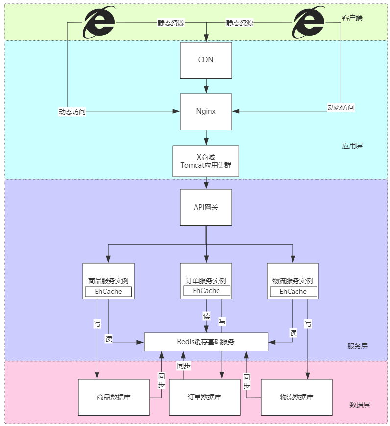

## 1. 客户端缓存

客户端缓存——游览器会在本地缓存静态资源，同时会为这些静态资源设置过期时间，在过期时间内再次获取静态资源时只需从本地缓存中获取即可

## 2. 应用层缓存

### 2.1 CDN

重量级的应用层缓存方案

### 2.2 Nginx

通过Nginx缓存**静态资源+压缩**的功能，我们可以使用Nginx来作为轻量级的应用层缓存方法

## 3. 服务层缓存

服务层缓存分为——**进程内缓存**+**进程外缓存**(分布式缓存,Redis)

> 如果仅仅使用进程外缓存
>
> 那么数据量一大，超过进程外缓存的上限，就会导致其崩溃
>
> 通过进程内缓存，可以一定程度上分担进程外缓存的压力

> 增加缓存后，就必然出现数据一致性的问题

**适合引入缓存的情况**

* 缓存的数据稳定
* 瞬时可能会产生极高并发的场景
* 一定程度上允许数据不一致