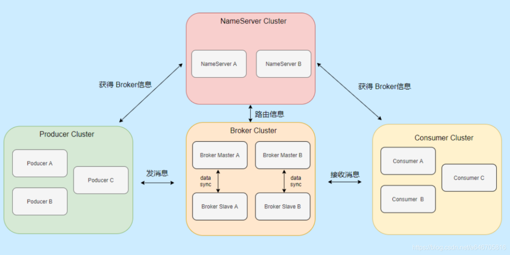
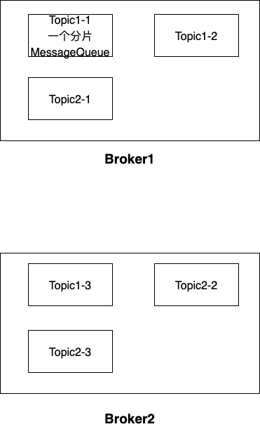
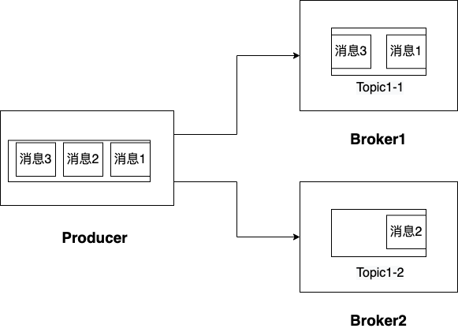

## 1. 整体架构



### 1.1 Producer

消息的生产者，向Broker发送消息

### 1.2 Producer Group

* 同一类Producer的集合，同一个Producer Group中的Producer生产消息的逻辑一致

* 如果发送的是事务消息，但是原Producer在发送消息后崩溃，那么Broker会联系同一个Producer Group中的其他Producer来commit or rollback

### 1.3 Consumer

消息的消费者，从Broker拉取消息

支持两种消费形式——拉取式消费，推动式消费

**RocketMQ没有真正意义的push，都是pull，push的底层实现采用的是长轮询机制（拉取方式）**

* 拉取式消费——Consumer主动从Broker拉取消息
* 推动式消费——Broker将收到的消息主动推送给Consumer，实时性高

### 1.4 Consumer Group

* 同一类Consumer的集合，同一个Consumer Group中的Comsumer消费消息的逻辑一致，并且必须订阅相同的Topic

* 对于Consuemr Group，RocketMQ支持两种消费模式——集群消费，广播消费

  * **集群消费**——Consumer Group中的所有Consumer平摊消息（一条消息发送了，Consumer Group中只有一个Consumer可以接受到消息）

  * **广播消费**——Consumer Group中的每个Consuemr都会收到全量消息（一条消息发送了，Consumer Group中每个的Consumer都会接受到消息）

### 1.5 Broker

* Broker负责存储消息，转发消息

* 每个Broker可以存储多个Topic的消息

* 每个Topic的消息可以分片存储于不同的Broker中

  Broker中某一个Topic的分片叫做一个Message Queue

  
  
  

### 1.6 NameServer

*  Topic 路由注册中心，支持 Broker 的动态注册和发现，保存 Topic 和 Borker 之间的关系，生产者和消费者可以通过NameServer查找各个Topic对应的Broker IP列表

* NameServer主要有2个功能

  * **Broker管理**

    * NameServer接收Broker的注册信息并保存下来作为路由的基本数据

    * 提供心跳检测机制，检查Broker是否存活

  * **路由信息管理**

    * Producer和Consumer可以通过NameServer查询Broker的路由信息，进行消息的投递和消费

* NameServer无状态，多个NameServer可以组成集群，但是各个NameServer之间不会互相通信

  Broker会向每一台NameServer注册自己的路由信息

## 2. 基础概念

### 2.1 Topic

* Topic是RocketMQ中进行消息订阅的基本单位

* 一个Topic中含有多条消息

* 一个Topic中的消息存储于多个Message Queue中

* 一个Topic中的消息可以分片存储在不同的Broker上，Broker中一个Topic的分片叫做一个Message Queue

* 一个Broker可以存储多个Topic的分片消息

  


## 3. 消息发送模式

### 3.1 同步消息

等待消息发送完毕会返回结果，然后才会继续执行程序，比较可靠

### 3.2 异步消息

异步发送一般用于响应时间敏感的业务场景，调用发送方法后当前线程就返回，交由另一个线程去发送信息，该发送信息的线程会根据发送结果，调用对应的回调函数

### 3.3 单向消息(One-Way)

只发送信息，不等待响应（适用于可靠性要求没那么高的业务场景，例如日志收集）

### 3.4 事务消息


**事务消息发送步骤如下**：

1. 生产者将半事务消息发送至RocketMQ服务端。
2. RocketMQ服务端将消息持久化成功之后，向生产者返回Ack确认消息已经发送成功，此时消息为半事务消息。
3. 生产者开始执行本地事务逻辑。
4. 生产者根据本地事务执行结果向服务端提交二次确认结果（Commit或是Rollback），服务端收到确认结果后处理逻辑如下：
   - 二次确认结果为Commit：服务端将半事务消息标记为可投递，并投递给消费者。
   - 二次确认结果为Rollback：服务端不会将该消息投递给消费者，并按照如下逻辑进行回查处理。

**事务消息回查步骤如下**：

1. 服务端将对消息生产者即生产者集群中任一生产者实例发起消息回查。
2. 生产者收到消息回查后，需要检查对应消息的本地事务执行的最终结果。
3. 生产者根据检查得到的本地事务的最终状态再次提交二次确认，服务端仍按照步骤4对半事务消息进行处理


* 执行本地事务时，可以返回以下三种状态
  * Commit：提交事务
  * RollBack：回滚事务
  * Unknown：未知
* 服务端进行回查的时机
  * Producer执行本地事务时，返回Unknown
  * Producer未提交任务状态

### 3.5 定时消息

消息到达Broker后，不会立刻发送到指定的Topic中，而是先暂存在定时Topic中，等待一定时间后，才会放到指定的Topic中，然后才能被消息

* 开源的RockerMQ仅支持延迟多长时间，并不支持在特定的时间出发消息

## 4. 消息模式

### 4.1 集群消费

**集群消费**——Consumer Group中的所有Consumer平摊消息（一条消息发送了，Consumer Group中只有一个Consumer可以接受到消息）

### 4.2 广播消费

**广播消费**——Consumer Group中的每个Consuemr都会收到全量消息（一条消息发送了，Consumer Group中每个的Consumer都会接受到消息）

## 5. 消息顺序

### 5.1 普通顺序消息(分区顺序)

一个Topic可能有多个Message Queue

消费者从同一个Message Queue中收到的消息一定是有序的（消息的消费顺序，与生产顺序一致）

消费者从不同Message Queue中收到的消息可能是无序的（消息的消费顺序，与生产顺序不一致）



Producer按照消息1，消息2，消息3的顺序发送消息到Topic1，Consumer订阅Topic1

普通顺序消息可以保证

* 消息1比消息3先消费
* 消息1和消息2的消费顺序不确定

### 5.2 严格顺序消息(全局顺序)

消费者从一个Topic中收到的消息一定是有序的（消费顺序与生产者的生产顺序一致）


Producer按照消息1，消息2，消息3的顺序发送消息到Topic1，Consumer订阅Topic1

Consumer消费顺序一定为消息1，消息2，消息3

**RocketMQ不支持，哈哈**


## 6. 特性

### 6.1 消息可靠性

RocketMQ支持消息的高可靠，影响消息可靠性的几种情况：

1. Broker非正常关闭
2. Broker异常Crash
3. OS Crash
4. 机器掉电，但是能立即恢复供电情况
5. 机器无法开机（可能是cpu、主板、内存等关键设备损坏）
6. 磁盘设备损坏

1)、2)、3)、4) 四种情况都属于硬件资源可立即恢复情况，RocketMQ在这四种情况下能保证消息不丢，或者丢失少量数据（依赖刷盘方式是同步还是异步）。

5)、6)属于单点故障，且无法恢复，一旦发生，在此单点上的消息全部丢失。RocketMQ在这两种情况下，通过异步复制，可保证99%的消息不丢，但是仍然会有极少量的消息可能丢失。通过同步双写技术可以完全避免单点，同步双写势必会影响性能，适合对消息可靠性要求极高的场合，例如与钱相关的应用。注：RocketMQ从3.0版本开始支持同步双写。

### 6.2 回溯消费

Consumer已经消费成功的消息，由于业务上需求需要重新消费

* Broker在Consumer消费完消息后，仍然后保留消息
* Broker可以按照时间维度来回退消费进度

### 6.3 消息重试

* Consumer消费消息失败后，要提供一种重试机制，令消息再消费一次

* RocketMQ会为**每个消费组**都设置一个Topic名称为“%RETRY%+consumerGroup”的重试队列，用于暂时保存因为各种异常而导致Consumer端无法消费的消息

  RocketMQ为重试队列设置多个重试级别，每个重试界别都有与之对应的重试投递延时，重试次数越多，延迟就越大

* RocketMQ对于重试消息的处理是先保存至Topic名称为“SCHEDULE_TOPIC_XXXX”的延迟队列中，后台定时任务按照对应的时间进行Delay后重新保存至“%RETRY%+consumerGroup”的重试队列中

### 6.4 消息重投

生产者在发送消息时

* 同步消息失败会重投
* 异步消息有重试
* oneway没有任何保证

消息重投保证消息尽可能发送成功，不丢失，但可能会造成消息重复，消息重复在RocketMQ中是无法避免的问题

消息重复在一般情况下不会发生，但当出现消息量大，网络抖动，消息重复是大概率事件，另外生产者主动重发，consumer负载变化也会导致重复消息

如以下方法设置消息重投策略

- retryTimesWhenSendFailed:同步发送失败重投次数，默认为2，因此生产者会最多尝试发送retryTimesWhenSendFailed + 1次。不会选择上次失败的broker，尝试向其他broker发送，最大程度保证消息不丢。超过重投次数，抛出异常，由客户端保证消息不丢。当出现RemotingException、MQClientException和部分MQBrokerException时会重投。
- retryTimesWhenSendAsyncFailed:异步发送失败重试次数，异步重试不会选择其他broker，仅在同一个broker上做重试，不保证消息不丢。
- retryAnotherBrokerWhenNotStoreOK:消息刷盘（主或备）超时或slave不可用（返回状态非SEND_OK），是否尝试发送到其他broker，默认false。十分重要消息可以开启。

### 6.5 流量控制

* 生产者流量控制——因为broker的处理能力达到瓶颈
  * commitLog文件被锁时间超过osPageCacheBusyTimeOutMills时，参数默认为1000ms，返回流控。
  * 如果开启transientStorePoolEnable == true，且broker为异步刷盘的主机，且transientStorePool中资源不足，拒绝当前send请求，返回流控。
  * broker每隔10ms检查send请求队列头部请求的等待时间，如果超过waitTimeMillsInSendQueue，默认200ms，拒绝当前send请求，返回流控。
  * broker通过拒绝send 请求方式实现流量控制
* 消费者流量控制——消费能力达到瓶颈（结果是降低拉取信息的频率）
  * 消费者本地缓存消息数超过pullThresholdForQueue时，默认1000。
  * 消费者本地缓存消息大小超过pullThresholdSizeForQueue时，默认100MB。
  * 消费者本地缓存消息跨度超过consumeConcurrentlyMaxSpan时，默认2000

### 6.6 死信队列

死信队列用于处理无法被正常消费的消息，当一条消息初次消费失败后，消息队列会进行消息重试，达到最大重试次数后，就表明消费者无法正确地消费该消息，此时，该消息不会立刻被抛弃，而是发送到死信队列

我们可以通过console控制到，对死信队列中的消息进行重发


### 6.7 消息过滤

RocketMQ的消费者可以根据Tag进行消息过滤，消息过滤在Broker端实现——减少了对Consumer无用消息的网络传输


### 6.8 每个消息至少被消费一次

Consumer将消息pull到本地，消费完成后，才会向服务器返回ACK，如果没有消费就一定不会ACK消息


### 6.9 事务消息

RocketMQ事务消息可以让 发送消息操作 与 本地操作 要么都成功，要么都失败（基于RocketMQ的XA事务）


### 6.10 定时消息

定时消息——消息发送到Broker后，不会立即被消息，需要等待特定时间后才会投递给真正的topic 

```shell
broker有配置项messageDelayLevel，默认值为“1s 5s 10s 30s 1m 2m 3m 4m 5m 6m 7m 8m 9m 10m 20m 30m 1h 2h”，18个level。可以配置自定义messageDelayLevel

发消息时，设置delayLevel等级即可：msg.setDelayLevel(level)。level有以下三种情况：
level == 0，消息为非延迟消息
1<=level<=maxLevel，消息延迟特定时间，例如level==1，延迟1s
level > maxLevel，则level== maxLevel，例如level==20，延迟2h
```

定时消息会暂存在名为SCHEDULE_TOPIC_XXXX的topic中，并根据delayTimeLevel存入特定的queue，queueId = delayTimeLevel – 1（一个queue只存储相同延迟的消息，只会保证具有相同延迟的消息能被顺序消费）

broker会调度SCHEDULE_TOPIC_XXXX，在到达延迟时间后，将消息写入真正的topic


