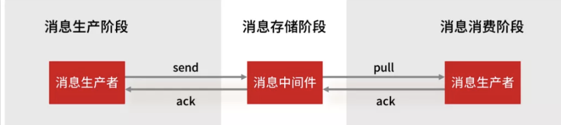

### 1. RocketMQ Broker的消息被消费后会立刻删除吗？

不会，消息会被持久化到CommitLog文件中中，每个Consumer连接到Broker后会维持消费进度信息，当有消息消费后只是当前Consumer的消费进度（CommitLog的offset）更新了

#### 什么时候清除消息？

默认48小时后后删除不再使用的CommitLog文件

### 2. RocketMQ消息消费是push还是pull

* RocketMQ有push也有pull

* 但是RocketMQ没有真正意义的push，都是pull，虽然有push类，但实际底层实现采用的是**长轮询机制**，即拉取方式

#### 为什么要用pull而不是事件监听方式？

事件驱动是建立好长连接，通过事件通知的方式来实时push数据

如果broker主动push可能导致push过快，造成消息在Consumer堆积过多，又不能被其他Consumer消费

pull可以根据Consumer自身情况来pull，不会造成过多的压力

### 3. 怎么确保信息100%不丢失

先看看哪些环节可能出现消息丢失



一条消息从生产到消费会经过三个阶段

* 消息生产阶段：消息由Producer生成，发送给MQ
  
  * 获得ack确认相应——发送成功，否则发送失败，在这个阶段只要处理好返回值和异常，就不会出现消息丢失的
    * 我的处理方式为
      1. send()同步发送，发送结果同步感知，对返回值和异常进行处理
      2. 发送失败后，进行重试（3次）
      3. 如果还是失败，发送邮件告急

* 消息存储阶段：由MQ保证（RocketMQ团队做）
  
  * 修改刷盘策略为同步刷盘，默认为异步刷盘
  * 集群部署采用主从架构，有多副本

* 消息消费阶段：Consumer从MQ拉取消息，返回ack表示消费完成
  
  业务下游具体怎么做我就不了解了，但是我知道在这里可以先执行业务逻辑后再**手动确认**，保证消息不丢失

除此之外，还提供**消息检测机制**，每个消息都有唯一标识（商品ID，任务ID），下游应用会定时过来拉取已经发送的信息，和下游应用收到的信息进行比对

* 如果发现，一个消息我这里已经发送，但是下游没法，会调用提供的接口重发

### 4. 如果解决重复消费？

每个消息都有唯一标识（商品ID，任务ID），下游应用通过唯一标识做**幂等**

### 5. 如果保证消息不积压

因为消息发送之后才会出现积压问题，所以和消息生产端没有关系，又因为绝大部分的消息队列单节点可以达到每秒几万的处理能力，相对于业务逻辑来说，性能不会出现在MQ的消息存储上面，所以最有可能出现问题的是Consumer

* 先定位消费慢的原因，如果是bug就处理bug，如果是消费能力弱，就优化消费逻辑
* **提供消费并行度**
  * 增加Consumer的数量（要同步扩容Topic的分区数，让Consumer数量与分区数相同，因为分区是单线程消费，如果Consumer数量多于分区数，扩容是没有效果的），降级一些非核心业务
  * 提供单个Consumer的消费并行线程（可以通过修改参数consumerThreadMin，consumerThreadMax来实现）
* 看看业务能否采用批量方式消费（设置Consumer的consumerMessageBatchMaxSize，默认是1，如果设置为N，那么每次消费的消息数<=N）
* 通过监控，日志等手段分析是否Consumer的业务逻辑出现问题，优化业务逻辑

### 6. RocketMQ如何保证消息全局有序

RocketMQ支持单个queue中的消息是有序的，如果一个topic拆分成了多个queue，那么RocketMQ是无法支持全局有序的

* 如果流量小，可以一个topic只使用一个queue，这就可以保证全局有序，但是效率低

### 7. 同步刷盘和异步刷盘

刷盘策略通过——FlushDiskType参数进行设置（影响消息可靠性）

* **同步刷盘**——Producer向Broker发送信息后，Broker将信息成功落盘后才会向Producer返回ACk
* **异步刷盘**——Producer向Broker发送消息后，Broker将信息写入内存后就会向Producer返回ACK，后台有一个线程去异步地将内存中的信息落盘

### 8. 同步复制和异步复制

**影响可用性**

* **同步复制**：Producer向Broker发送消息后，消息必须同步给从节点后才会向Producer返回ACK
* **异步复制**：Producer向Broker发送消息后，消息写入主节点后就会向Producer返回ACK

```
采用异步复制的方式，在主节点还未发送完需要同步的消息的时候主节点挂掉了，这个时候从节点就少了一部分消息。但是此时生产者无法再给主节点生产消息了，消费者可以自动切换到从节点进行消费(仅仅是消费)，所以在主节点挂掉的时间只会产生主从结点短暂的消息不一致的情况，降低了可用性，而当主节点重启之后，从节点那部分未来得及复制的消息还会继续复制
```
