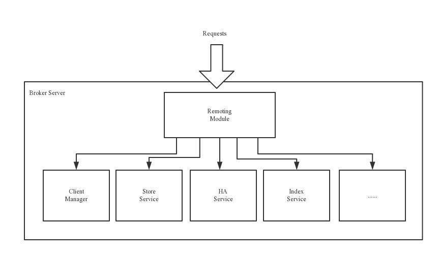

Broker主要负责消息的存储，投递和查询，以及服务高可用保证，为了实现这些功能，Broker包含以下几个重要子模块

* **Remoting Module**：负责处理来自Client端的请求
* **Client Manager**：负责管理客户端，维护Consumer的Topic订阅信息
* **Store Service**：提供API接口——将消息存储到物理磁盘AND查询消息
* **HA Service**：高可用服务，提供Master Broker和Slave Broker之间的数据同步功能
* **Index Service**：根据特定的Message key对消息进行索引服务，以提供消息的快速查询

