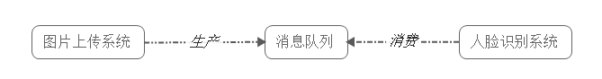
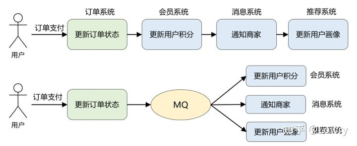
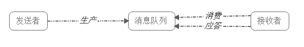
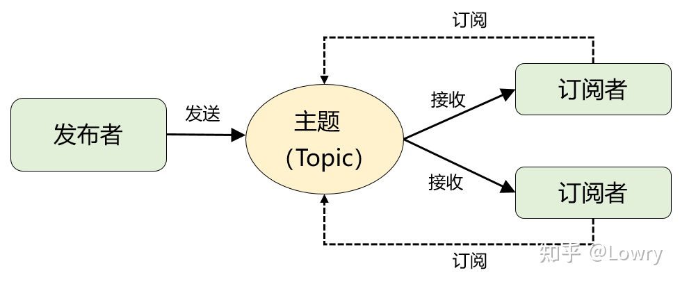

* **应用场景**

  * **应用解耦**

    普通的处理方式——调用接口失败的话，会导致图片上传失败

    

    使用消息队列

    

    

  * **异步处理（中间添加了一个节点，将同步操作转变为异步操作）**

    多个应用对消息队列中的同一消息进行处理，应用间并发处理消息

    （把信息放到消息队列中，多个应用一起取出消息，并发处理）

    

  * **限流削峰**

    请求先进入消息队列，而不是由业务处理系统直接处理，做了一次缓冲，减少了业务处理系统的

    压力，业务处理系统逐个从消息队列读取消息进行处理

    

    

  * **消息通讯**

    
  
    * 避免了直接调用下一个系统导致当前系统失败
    * 每个子系统对消息的处理方式更为灵活，可以自己决定如何处理消息
    
  * **日志处理**

* **消息队列两种模式**
  * **点对点模式（最原始的模式）**
    * 三个角色——消息队列，发送者(生产者)，接受者(消费者)
    * 
    * 
    * 生产者生产消息，发送到MQ中，消费者从MQ中取出消息进行消费，消息消费后，MQ中不再存储该消息
    * 特点
      1. 每个消息只有一个消费者（消息一旦被消费，就是出队列，会从MQ中移除）
      2. 生产者和消费者之间无依赖，独立工作，互不影响
      3. 消费者成功接受消息后要通知MQ，以便MQ删除消息
  * **发布-订阅模式**
    * 三个角色——主题(Topic)，发布者(Publisher)，订阅者(Subscriber)
    * 
    * 发布者把消息发送给主题（消息队列），订阅者在接受消息之前需要先**订阅主题**，然后每个订阅者都可以收到同一个主题的所有消息
    * 特点
      * 每个消息可以有多个订阅者

