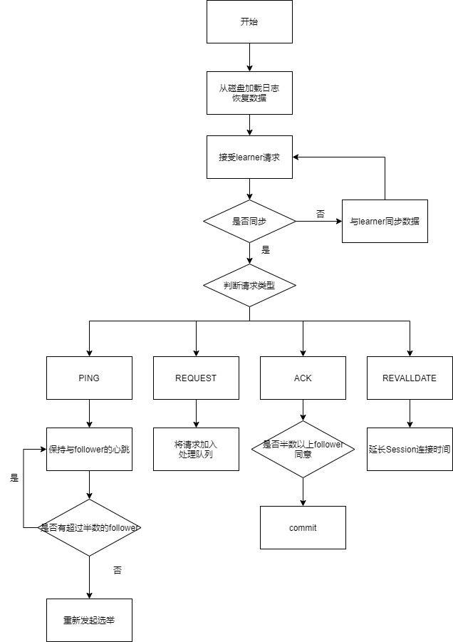

集群有三种角色

* leader

  1. proposal的唯一调度者和处理者

  2. 在Zookeeper集群启动时候从磁盘读取日志恢复数据
  3. 维持与learner的心跳，接受learner请求并判断learner的请求类型

* learner

  * follower——只提供读服务器，参与Proposal投票，参与Leader选举投票
  * observer——跟follower相近，只是不参与写操作的“过半写成功”策略，也不参与leader选举

**leader工作流程**

