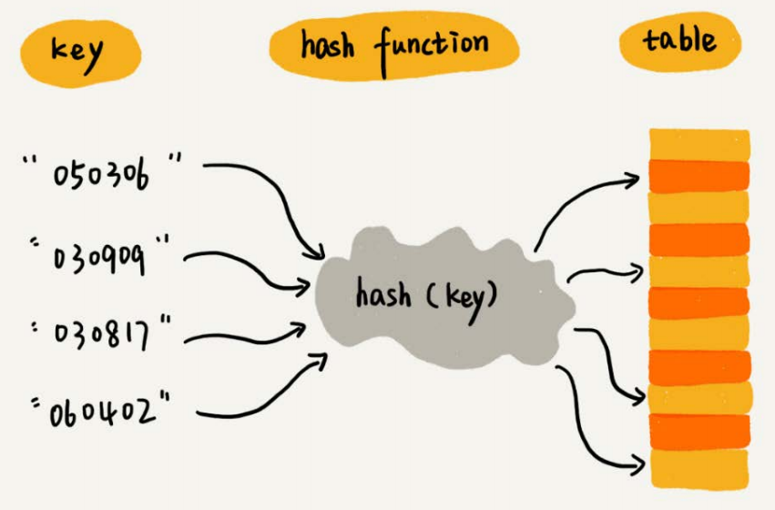
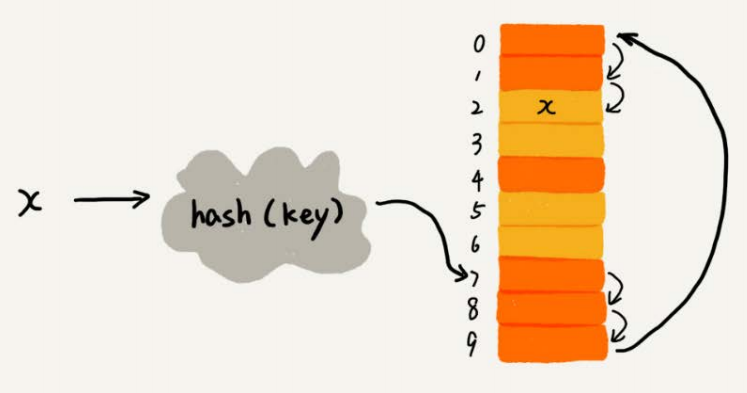
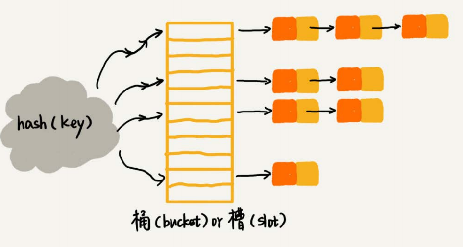

### 1. 散列表介绍

* 散列表用的是数组支持下标级访问数据的特性

### 2. 散列冲突

#### 2.1 开放寻址法

* 线性探测

  hash(key)+1，hash(key)+2，逐个试，找到空位置为止

* 二次探测

  hash(key)+1，hash(key)+4，hash(key)+9，逐个试，找到空位置为止

* 双重散列

  准备多个哈希函数——hash1，hash2，hash3

#### 2.2 链表法

### 3. 如何打造一个工业级散列表

#### 3.1 设计良好的hash函数

#### 3.2 装载因子过大时扩容

装载因子越大，说明散列表中的元素越多，空闲位置越少，散列冲突的概率越大

**如何避免低效扩容**

> 当装载因子达到阈值时，我们申请一个新的空间，但是不马上将老数据搬移到新的散列表中
>
> 每一次插入操作，都将新数据插入新散列表，同时从老散列表中拿出一个数据放到新散列表

#### 3.3 如何选择散列冲突的解决方法

* **开放寻址法**

  散列表的数据存储在数组中可以有效吕勇CPU缓存加快查询速度，并且序列化简单

  但是散列冲突的代价比较高

  所以适合数据量比较小，装载因子小的场景——Java的ThreadLocalMap使用寻址法解决散列冲突

* **链表法**

  对内存利用率高，对大装载因子容忍度高

  但是比较消耗内存

  我们还可以对链表法进行改造——某个slot的链表长度过长，将其改造为**红黑树**，跳表等

  所以适合存储大对象，大数据量的场景