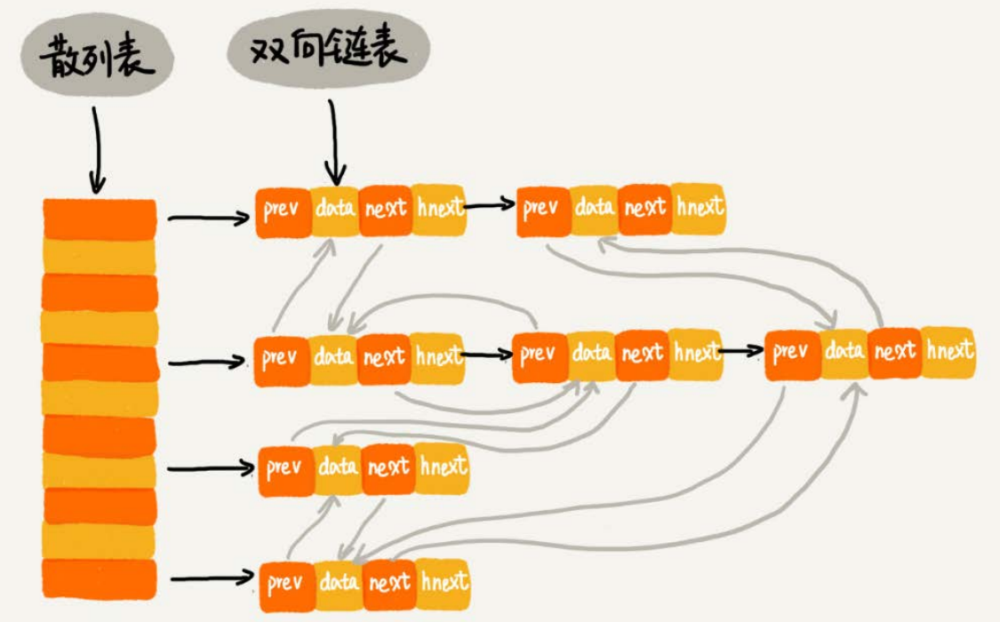

### 1. 链表实现LRU

维护一个按照访问时间从早到晚排序的链表，当缓存空间不够时，需要淘汰一个数据，直接淘汰链表头部节点即可

当要缓存某个数据的时候，先在链表中查找这个数据，如果找到了，将其移动到链表尾部，如果没找到，直接放到链表尾部——O(n)

### 2. 散列表+双向链表实现LRU

三个指针

* hnext：指向链表中的下一个节点
* prev和next——构建一个按照访问时间从早到晚排序的双向列表（还有两个指针head，tail，分别指向这个列表的头结点和尾节点）

