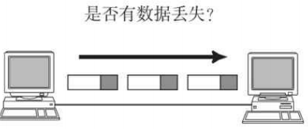
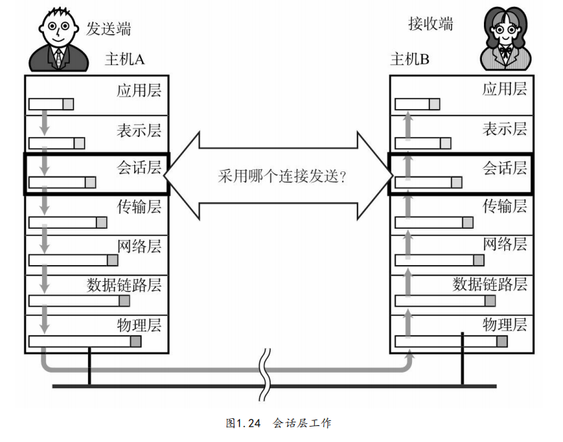

# 1. 协议的分层

OSI将通信协议分为7层

* 每个分层都接收由它下一层所提供的特定服务，并且负责为自己的上一层提供特定的服务
* 上下层之间进行交互遵循的约定叫 **"接口"**
* 同一层之间进行交互遵循的约定叫 **"协议"**

# 2. OSI模型

|    名称    |                             功能                             |       概述       |
| :--------: | :----------------------------------------------------------: | :--------------: |
|   应用层   |       为应用程序提供服务并规定应用程序中通信相关的细节       |  |
|   表示层   | 1.将应用的信息转换为适合网络传输的格式 2.将下一层传递的数据转换为应用层能够处理的格式 |  |
|   会话层   |          负责连接的建立和断开，管理传输层以下的分层          |  |
|   传输层   |                      起着可靠传输的作用                      |  |
|   网络层   |         将数据传输到目标地址，这要负责寻址和路由选择         |  |
| 数据链路层 |           负责发送同一个分段内的节点之间的数据传输           |  |
|   物理层   |           负责0,1与电压的高低，光的闪灭之间的互换            |  |

# 3. OSI通信举例

## 3.1 应用层

## 3.2 表示层

## 3.3 会话层

## 3.4 传输层

## 3.5 网络层

## 3.6 数据链路层和物理层

# 4. 传播类型划分

## 4.1 单播

1对1通信

## 4.2 广播

1台主机将信息发送给同一个分区内的所有主机

## 4.3 多播

1台主机将信息发送给多台主机

## 4.4 任播

在指定的多台主机中选出一台作为接收端