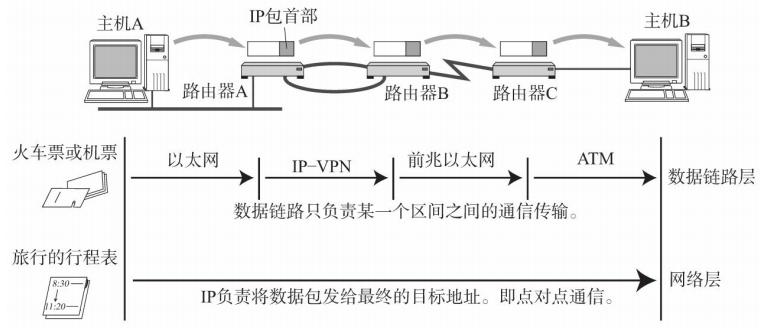

## 1. 网络层的作用

**网络层的作用**——实现节点之间的通信(点对点通信)

> **数据链路层**的作用——同一分区内的节点之间进行通信(包传递)
> 
> 一旦需要跨越多个分区，就需要借助网络层——网络层可以跨越不同的分区来传输数据

## 2. 网络层与数据链路层的关系

**数据链路层**——同一分区内的节点之间进行通信

**网络层**——实现节点之间的通信(点对点通信)(可以跨越多个分区)

