# 1. IP介绍

## 1.1 IP组成

* IP(32位)——网络号和主机号

* **网络号相同的主机位于同一网段内**

* 主机号不能全为0，不能全为1
  
  * 主机号全为1——广播地址

## 1.2 IP早期分配

IP地址在早期分为**A，B，C，D四类**

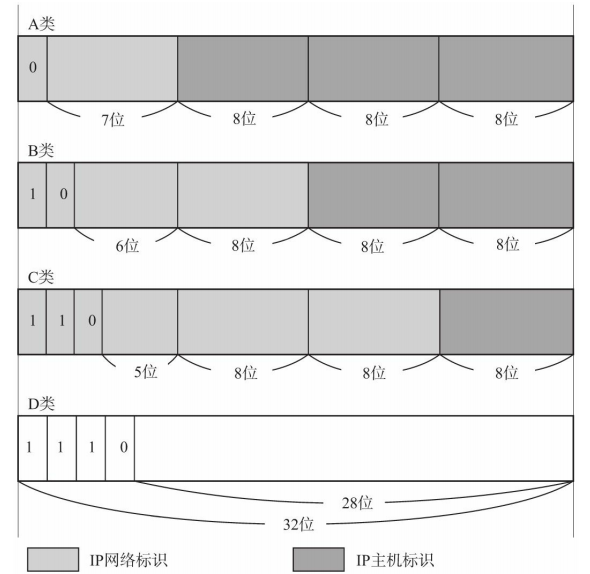

## 1.3 广播

* 主机号全为1——广播地址——用于在同一个链路中相互连接的主机之间发送数据报
  
  例如网络号为192.168.0.0/24，广播地址为192.168.0.255

* 广播分为——**本地广播** 和 **直接广播**

### 1.3.1 本地广播

**本地广播**——在本网络内的广播

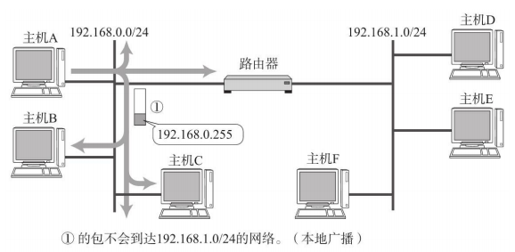

### 1.3.2 直接广播

**直接广播**——不同网络间的广播

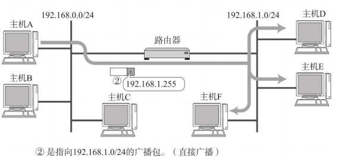\

## 1.4 多播

* 多播用于将包发送给特定组内的所有主机

* 多播使用D类地址——前4位为"1110"，后28位为多播的组编号

## 1.5 现在的IP—CIDR

随着互联网的不断发展，IP的A，B，C，D分类方式不够用了，所以出现了——无类型域间路由(CIDR)

### 1.5.1 CIDR概念

采用任意长度分割IP地址的网络号和主机号，这种方式叫CIDR

### 1.5.2 CIDR的使用

要使用CIDR需要引入子网掩码

* 子网掩码32位
* IP中网络号的部分在子网掩码中为1，主机号部分为0
* IP&子网掩码=IP的网络号

## 1.6 私有IP

我们不要求为每台主机分配一个全局IP——因为这样的话，全局IP不够用

每台主机都处于一个网段中，我们在网段中为主机分配私有IP

* **私有IP**
  
  * A类(10/8)：10.0.0.0——10.255.255.255
  * B类(172.16/12)：172.16.0.0——172.16.255.255
  * C类(192.168/16)：192.168.0.0——192.168.255.255

* **全局IP**
  
  除了上述私有IP地址以外的IP为全局IP

* 全局IP必须保证唯一

* 私有IP只需要在所处网段中保证唯一即可，不同网段中可以有相同的私有IP

# 2. ip addr

```shell
root@test:~# ip addr
1: lo(loopback回环接口): <LOOPBACK,UP,LOWER_UP> mtu 65536 qdisc noqueue state UNKNOWN group default  //网络设备状态标识符 
    link/loopback 00:00:00:00:00:00 brd 00:00:00:00:00:00  //MAC地址
    inet 127.0.0.1/8 scope host lo      //IPv4地址
       valid_lft forever preferred_lft forever
    inet6 ::1/128 scope host    //Ipv6地址
       valid_lft forever preferred_lft forever
2: eth0: <BROADCAST,MULTICAST,UP,LOWER_UP> mtu 1500 qdisc pfifo_fast state UP group default qlen 1000   //网络设备状态标识符 
    link/ether fa:16:3e:c7:79:75 brd ff:ff:ff:ff:ff:ff //MAC地址
    inet 10.100.122.2/24 brd 10.100.122.255 scope global eth0 //IPv4地址
       valid_lft forever preferred_lft forever
    inet6 fe80::f816:3eff:fec7:7975/64 scope link    //Ipv6地址
       valid_lft forever preferred_lft forever
```

* IP地址是一个 **网卡**在网络世界的通讯地址（这里显示了2个网卡）

* **第一行**——网络设备设备状态标识符
  
  * **lo**：loopback回环接口，表示该网卡是用于主机自己与自己通信的，常用的地址为 **127.0.0.1**
  * **UP**：网卡处于启动的状态
  * **BROADCAST**：表示这个网卡有广播地址，可以发送广播包
  * **MULTICAST**：网卡可以发送多播包
  * **LOWER_UP**：表示L1是启动的(网线插着)

* **第二行**——MAC地址

* **第三行**——IPv4地址
  
  * 一开始IP分为ABCDE五种类型
  
  * 后来IP不够用了，采用  **无类型域间路由(CIDR)**
    
    * 10.100.122.2/24，前24位网络号，后8位主机号
    * 子网掩码——网络号都为1，主机号全为0(255.255.255.0)
    * 子网掩码&IP=网络号(10.100.122.0)
    * 主机号全为1——广播地址(子网中所有机器都能收到)
  
  * **IP**还分为 **公有地址**和 **私网地址**
    
    | 类型  | IP地址范围                    | 最大主机数   | 私网IP范围                      |
    | --- | ------------------------- | ------- | --------------------------- |
    | A   | 0.0.0.0-127.255.255.255   | 1677214 | 10.0.0.0-10.255.255.255     |
    | B   | 128.0.0.0                 | 65534   | 172.16.0.0-172.31.255.255   |
    | C   | 192.0.0.0-223.255.255.255 | 254     | 192.168.0.0-192.168.255.255 |
    
    私网IP地址由所在子网的IT人员管理，可以重复（A子网中可以有私网IP1，B子网也可以有私网IP1）
    
    公有IP必须统一购买，供其他子网访问
    
    最常用的私网**IP192.168.0.X**
    
    * 私网网络的出口地址是GateWay的地址，**其IP的主机号一般为1或2**（192.168.0.1 or 192.168.0.2）
    
    * **192.168.0.255**是广播地址
      
      ```
      这就像每个小区有自己的楼编号和门牌号，你们小区可以叫6栋，我们小区也叫6栋，没有任何问题。但是一旦出了小区，就需要使用公有IP地址。就像人民路888号，是国家统一分配的，不能两个小区都叫人民路888号。
      ```

# 3. IP的使用

假设主机1(IP1,MAC1)要向主机2(IP2,MAC2)发送消息

**前提**

* 每台Linux主机的网络文件中都会配置自己的**CIDR地址**，**子网掩码**，**广播地址**，**GateWayIP地址**

* Linux要求**CIDR地址**与**GateWayIP地址**在**同一网段**下

* 要想成功通信，除了需要目标的IP地址外，还需要目标的**MAC地址**

**过程**

1. 主机1检查IP2是否与自己的IP1在同一个网段
2. 如果是——**通过广播地址发送ARP请求，获得主机2的MAC2，然后填充到包中，进行发送**
3. 如果不是——**通过GateWayIP地址和ARP获得GateWay的MAC地址，填充到包中，将包发送给GateWay**，至于后面，就看GateWay如何处理了

# 4. 路由Routing

Routing——将分组数据发送到最终目标地址的功能

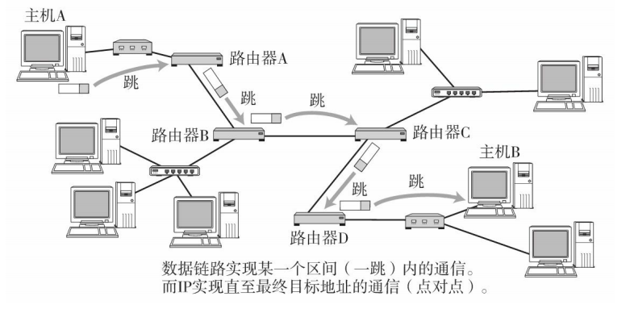

* 主机A想要发送数据给主机B，中间要经过**许多路由器**

* **一跳(1 Hop)**
  
  利用数据链路层在一个区间内传输数据帧
  
  数据链路层使用MAC地址传输数据帧，一跳指是数据帧在**源MAC地址和目标MAC地址这一区间**内的传输（不经过路由器）

* 到达路由器后，会查询路由器的路由表——根据数据中的目标IP地址查找下一跳的方向

## 4.1 IP地址与路由控制

* IP地址的网络号部分用于进行路由控制

* 路由器的路由表中记录着**网络号**与**下一步应该要发送至的路由器的地址**的映射

* 发送IP包时，首先确定IP包首部中的 **目标IP地址**，然后在路由表中找到与该地址有相同网络号的记录，根据该记录将IP包转发给相应的下一个路由器

* 经过路由器时，IP首部不会变化（源IP地址，目标IP地址不会变），但是数据链路首部会重新填充（源MAC地址和目标MAC地址发生变化）

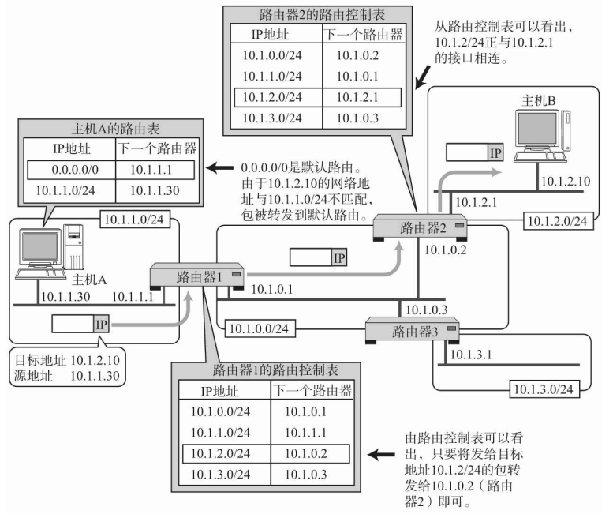

## 4.2 默认路由

默认路由——路由表中任何一个地址都能够与之匹配的记录

（如果目标IP地址在路由表中找不到匹配的记录，那么就匹配默认路由）

默认路由一般为 0.0.0.0/0 或 default

## 4.3 路由器

### 4.3.1 路由器介绍

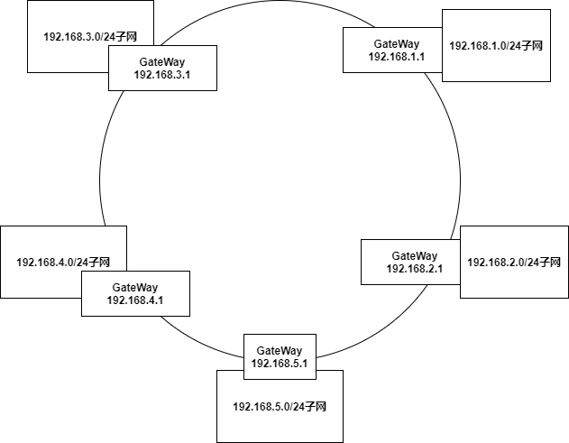

* 路由器是一个设备，由5个网卡或网口，每个连着一个子网(局域网)
* 每个网卡都是其连接着的子网的**GateWay**，该网卡的IP与其连接的子网的IP在同一网段下

### 4.3.2 路由器类型

路由器分为——**转发路由**，**NAT路由**

### 4.3.3 转发路由

经过转发路由，不会改变包的IP首部(不会改变源IP地址和目标IP地址)，但会重新填充数据帧首部(改变源MAC地址和目标MAC地址)，然后将包发到下一跳的目标

**下图全部使用公网IP进行通信，经过的都是转发路由**

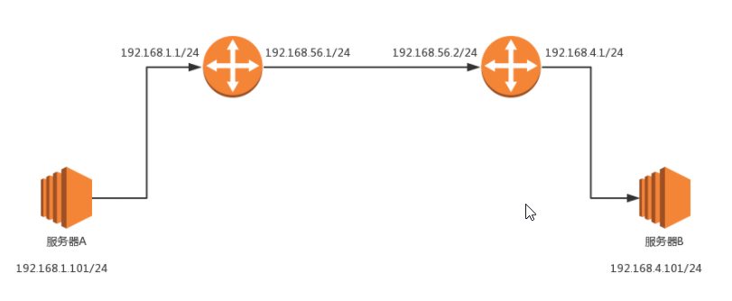

* **第一个包**
  - 源MAC：服务器A的MAC
  - 目标MAC：192.168.1.1这个网口的MAC
  - 源IP：192.168.1.101
  - 目标IP：192.168.4.101
* **第二个包**
  - 源MAC：192.168.56.1的MAC地址
  - 目标MAC：192.168.56.2的MAC地址
  - 源IP：192.168.1.101
  - 目标IP：192.168.4.101
* **第三个包**
  - 源MAC：192.168.4.1的MAC地址
  - 目标MAC：192.168.4.101的MAC地址
  - 源IP：192.168.1.101
  - 目标IP：192.168.4.101

### 4.3.4 NAT路由(现在基本都是这个)

**NAT(Net Address Translation)**

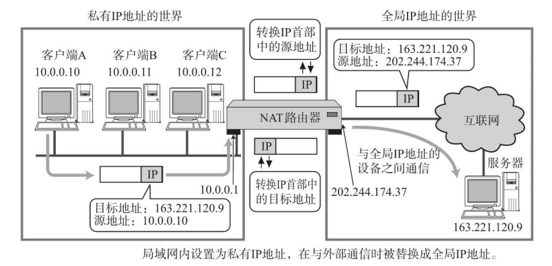

* 现在的网络时间中，公有IP非常珍贵，每台主机都处在一个私网网络中，被分配有一个私网IP

* **NAT转换表**中存储**私网IP与公有IP的映射**，配置有**NAT路由**中有一张**NAT转换表**
  
  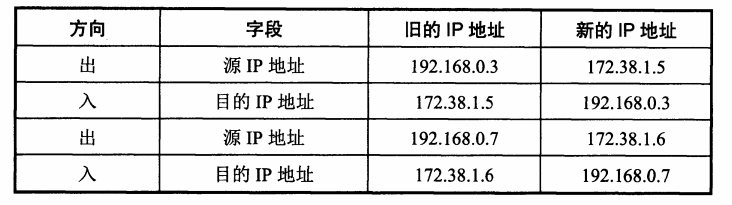

* 如果一台主机使用了私网IP，那么其与外界通信时，都必须将**私网IP转换为公有IP**

* NAT路由器必须至少有一个**公网IP**(可以有多个)

* NAT路由有**n个公网IP**时，私网网络内**同一时间**最多可以有**n台主机**接入（因为私网IP与公网IP一一对应）
  
  当主机较多时，每台主机分配一个私网IP，NAT路由会不断更新NAT转换表，让这些主机轮流使用公网IP

* 使用私网IP的主机与使用公网IP的主机的通信，**只能由私网网络下的主机发起**

* NAT分为 **静态NAT**和 **动态NAT**
  
  * **静态NAT**
    
    公网IP与私网IP一一对应，不会改变
  
  * **动态NAT**
    
    维护一个公网IP池，每有一台设备想接入网络，为其分配一个私网IP的同时，也会分配一个公网IP与其映射，使用完后将公网IP放回池中

> **下面举个私网网络中的主机与使用公有IP的主机通信的例子**
> 
> **主机1的私网IP为192.168.0.3，其分配到的公有IP为172.38.1.5**
> 
> 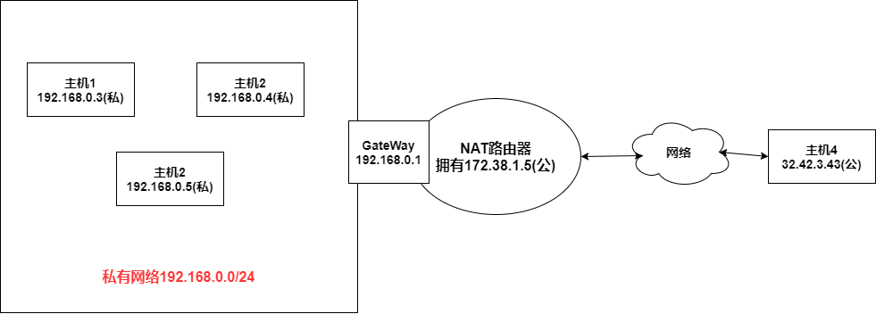
> 
> * **主机1向主机4发送消息**
>   
>   1. 主机1向向GateWay发送包（源IP为192.168.0.3(私)，目标IP为32.42.3.43(公) ）
>   2. NAT路由器通过NAT映射表，将私有IP192.168.0.3映射为172.38.1.5
>   3. NAT路由器发出包（源IP为172.38.1.5(公)，目标IP为32.42.3.43(公) ）
> 
> **主机4收到信息后，以为主机1的IP为172.38.1.5**
> 
> * **主机4向主机1发送消息**
>   
>   1. 主机4发出包（源IP为32.42.3.43(公)，目标IP为172.38.1.5(公) ）
>   2. NAT路由器接受到包后，将公有IP172.38.1.5映射为私有IP192.168.0.3
>   3. NAT路由将包发送到私有网友（源IP为32.42.3.42(公)，目标IP为192.168.0.3(私) ）

# 5. IP首部

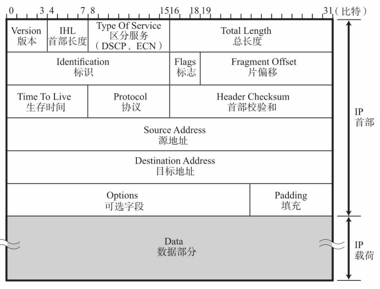

* **TTL**
  
  Time To Live生存时间，指的是可以经过多少个路由器
  
  每经过一个路由器，TTL会减1，如果TTL为0，那么路由器会将其丢弃

* **Header Checksum**
  
  首部校验和——**只校验首部**，不校验数据，用来确保IP数据报的首部不被破坏
