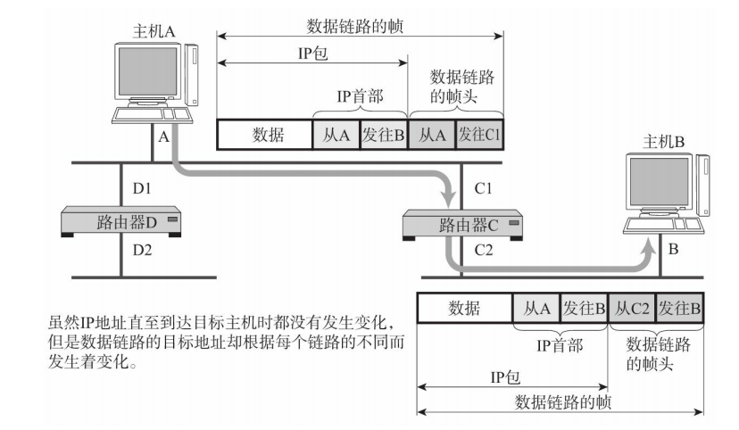

* ARP——以目标IP地址为线索，来查找拥有目标IP的设备的MAC地址
* ARP的作用范围——同一个网段内的主机
* 通过ARP，可以动态的通过IP地址解析出MAC地址

#### 工作原理

* 主机A向同一网段内的主机B发送IP数据报，需要先获得主机B的MAC地址
* 主机A广播一个ARP请求包（包含了自己的IP地址,MAC地址，目标IP地址）
* 该网段内的主机都会接受到该ARP请求包，并进行解析，如果请求包中的目标IP地址与自己的IP一致，那么会将自己的MAC地址写入ARP响应包返回给主机A

