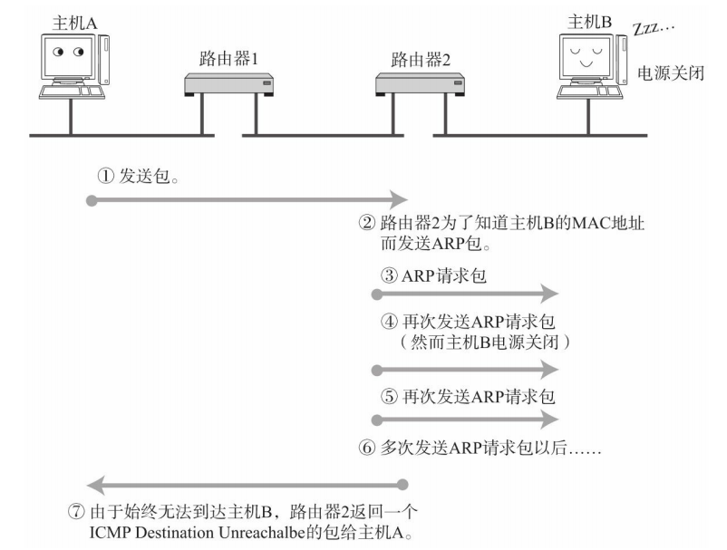
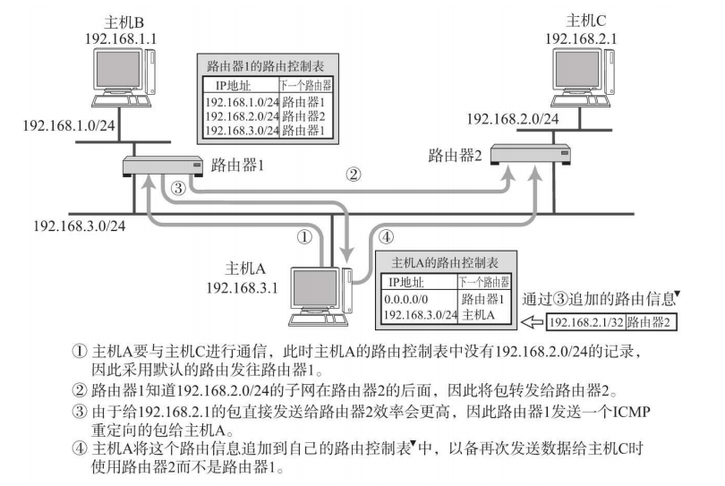
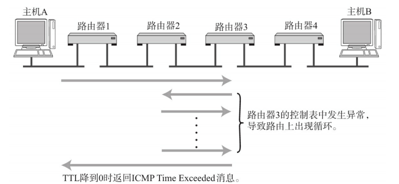

ICMP的主要功能有

1. 确认IP包是否成功送达目标地址
2. 通知在发送过程中IP包被丢弃的原因

## 1. 目标不可达

如果在IP通信中，某个IP因为某种原因未能达到目标地址，那么这个原因由ICMP通知

## 2. 重定向

如果路由器发现端主机使用了次优的路径发送数据，那么它会发送一个ICMP重定向消息给这个主机，在这个消息中包含了最适合的路由信息和源数据

## 3. 超时

IP包中有TTL字段，如果TTL为0，那么路由器会丢弃该IP包，并发送一个ICMP超时消息给发送主机，通知该包已被丢弃

