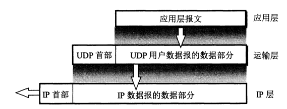
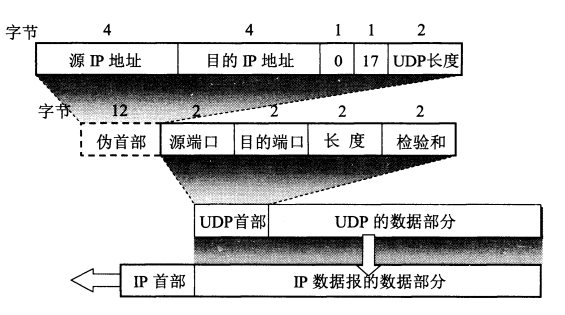

## 1. UDP特点

* UDP是无连接的——发送数据之前不需要建立连接

* UDP尽最大努力交付——不保证可靠交付

* UDP是面向报文的——UDP将应用程序发来的报文，添加首部后就交付给网络层；UDP收到UDP数据报后，直接上交给上层应用
  
  

* UDP没有拥塞控制

* UDP支持一对一，一对多，多对一，多对多通信

## 2. UDP首部

- UDP首部——8个字节
- **伪首部**—不是UDP真正的首部，而是计算校验和时，临时添加在UDP数据报前面
- **UDP校验和**——**首部和数据都校验**