# 1. TCP特点

* TCP是面向连接的

* TCP是一个可靠数据传输服务

* TCP是面向字节流的——TCP将应用程序的数据看做一串无序的字节流

* TCP提供全双工通信——TCP允许通信双方在任何时候都能发送数据，TCP连接的两端都有发送缓存和接收缓存
  
  - 发送时，应用程序将数据写入TCP发送缓存，就可以做自己的事，TCP会在合适的时候将数据发送出去
  - 接收时，TCP将数据写入接收缓存，上层应用在合适的时机读取接收缓存即可
  
  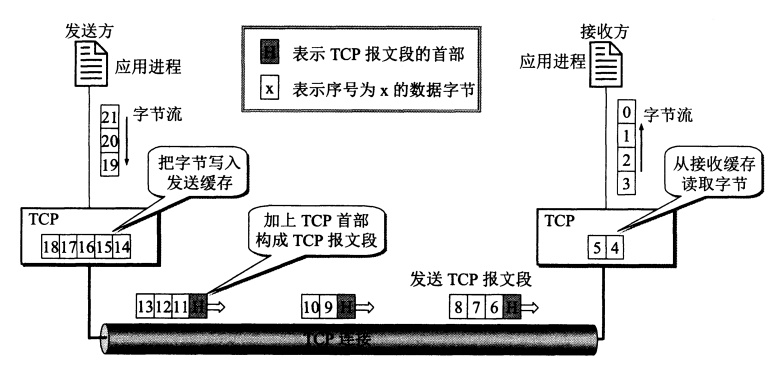

# 2. TCP首部

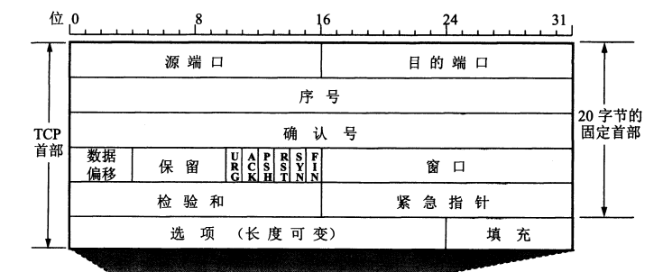

* **序列号**：TCP传输的字节流中每个字节都有一个编号，TCP报文段首部中的序列号——**该报文段传输的数据中第一个字节的编号**——**用来解决网络包乱序的问题**
  
  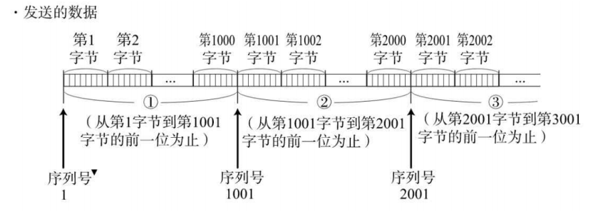

* **确认号**——期望下一个应该收到的TCP报文段的序列号；若确认号为N，那么表示：到序号N-1为止的所有数据都已经正确收到——**用来确认是否丢包**

* **数据偏移**：指出TCP报文段首部长度

* **控制位**：URG，ACK，PSH，RST，SYN，FIN

* **窗口**——窗口值告诉对方：从本报文段首部中的确认号算起，我还允许你发送的数据量；**窗口值是接收方让发送方设置其发送窗口的依据**
  
  > 发送一个报文段，确认号是701，窗口字段是1000，这就是告诉对方：从701号算起，我的接收缓存空间还可接收1000个字节

* **校验和**——**检验首部和数据**

* **选项**
  
  * **最大报文段长度MSS(Maximum Segment Size)**：一个TCP报文段中允许的**数据**最大长度
  * **窗口扩大**
  * **时间戳**

# 3. TCP如何实现可靠性传输

## 3.1 通过序列号和确认应答提高可靠性

* 通过序列号可以知道哪些消息重复了，哪些消息确实了
* 通过确认号可以知道接收端接收数据的进度

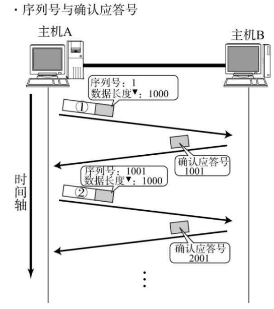

## 3.2 连接管理

### 3.2.1 三次握手

* 三次握手目的——确认双方接收能力和发送能力是否正常，指定初始化序列化为后面的可靠性传输做准备

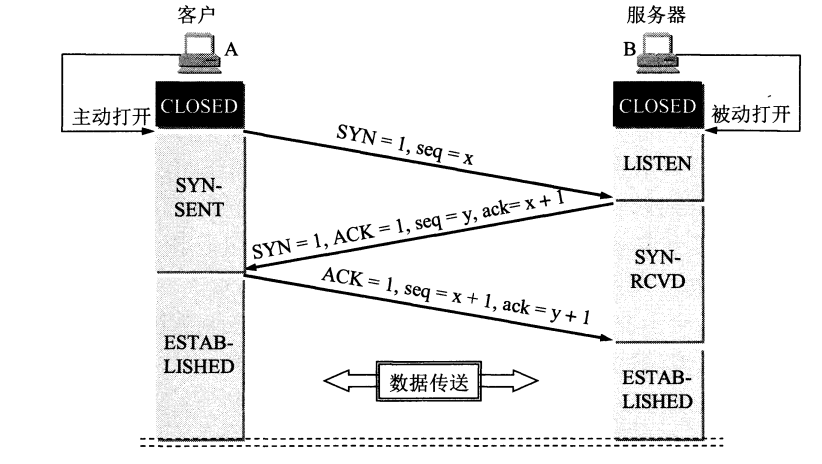

* 一开始，Client和Server都处于**Closed状态**，先是Server主动监听某个端口，处于**Listen状态**
* 客户端生成自己的初始化序列号（x），填充到**TCP首部的序号字段**中，同时将**TCP首部的SYN控制位设置为1**，表示该报文段为SYN报文段，然后将该报文段发送给Server，向Sever发起连接，之后**Client处于Syn-Sent状态**
* Server收到第一次握手信息后，Server也会生成自己的初始化序列号（y），将序号填充到**TCP首部的序号字段**，然后将第一次握手信息中的序号+1，填充到**TCP首部的确认号字段**，同时将**TCP首部的SYN控制位和ACK控制位**设置为1，将该TCP报文段发送给Client，随后**Server处于Syn-Revc状态**
* Client收到第二次握手信息后，将第二次握手信息中的序号+1，填充到**TCP首部的确认号字段**，将自己第一次握手时产生的序号+1，填充到**TCP首部的序号字段**，同时将TCP首部的ACK控制位设置为1，将该TCP报文段发送给Server，随后Client处于 **Established状态**
* Server收到第三次握手信息后，Server处于 **Established状态**

**（第一次握手和第二次握手时不可以携带数据的，第三次握手可以携带数据）**

#### TCP为什么是三次握手，而不是两次？

1. **防止历史连接请求建立连接，造成Server资源浪费**
   
   Client发送第一次握手信息，因为网络问题发生了超时重传，Client再发送了一次第一次握手信息，第一次发出的握手信息就是历史连接请求
   
   在2次握手的前提下，历史连接请求发送给Server，Server返回ACK响应，并为该请求分配服务器资源，但是两次握手下Client并不会处理Server的ACK响应，这就会导致Server端分配了无人使用的资源，造成资源浪费
   
   在3次握手的情况下，Client收到Server的第二次握手信息，通过确认号可以知道这是历史连接请求，那么Client就会向Server发送RST报文（报文段中的RST控制位设置为1），中断历史连接

2. **防止SYN范洪攻击**
   
   在两次握手的情况下，Server接收到第一次握手的信息后就会返回ACK，并为其分配服务器资源，那么就可能出现这种情况，一个恶意程序不断向Server发送第一次握手信息，Server不断地为其分配服务器资源，导致Server崩溃

3. **确认客户端有接受并返回消息的能力**

### 3.2.2 四次挥手

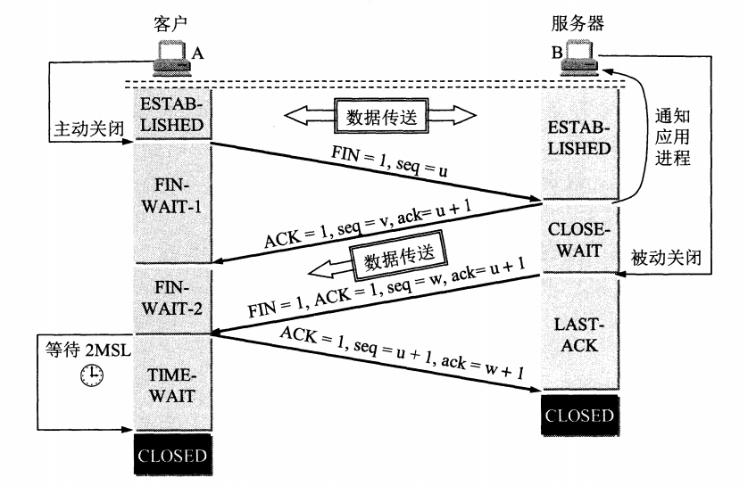

* Server发送完第二次挥手信息后，Server中TCP进程会通知应用进程，释放Client到Server这个方向的连接——TCP处于 **半关闭状态**：Client无法向Server发送数据，但是Server扔可以向Client发送数据
* Client接受到第三次挥手信息后，自己会进入 **TIME-WAIT状态**，此时TCP连接还未被释放掉，必须经过 2MSL(Maximum Segment Lifetime)的时间后，Client才进入Closed状态

#### 为什么挥手需要四次？

* 关闭连接时，Client向Server发送FIN报文，仅仅表示Client不再发送数据了，但还是能接收数据
* Server收到Client的FIN报文后，先回复一个ACK报文，而服务端可能还有数据需要处理和发送，等待Server不再发送数据时，才会发送FIN报文给Client

由上述过程可知，Server需要等待完成数据的处理和发送，所以Server的ACK报文与FIN报文要分开发送，所以比三次握手多了一次

#### 为什么TIME_WAIT等待的时间是2MSL？(为什么需要TIME_WAIT状态)

1. **保证连接正常关闭**

第四次挥手信息可能丢失，如果挥手信息丢失，那么Server会超时重传第三次挥手信息，如果Client在2MSL时间内收到了重传的第三次挥手信息，就会重传一次第四次挥手信息，并重新计时

如果没有这个等待，Client发送完第四次挥手信息就关闭了，那么如果第四次挥手信息丢失，Server就无法进入关闭状态

2. **防止下一个连接中出现旧连接的数据**

Client发送完第四次挥手信息，经过2MSL时间，可以使本连接存在期间产生的所有报文段都从网络中消失，这样下一个新的连接中就不会出现旧连接的数据

## 3.3 重传机制

### 3.3.1 超时重传

发送端发送数据后会等待对方的确认应答，如果有确认应答，那么说明数据到达对方。反之，数据丢失的可能性很大

**发送方只要超过一段时间还没有收到确认应答，就认为刚才发送的数据丢失了，会重新发送**

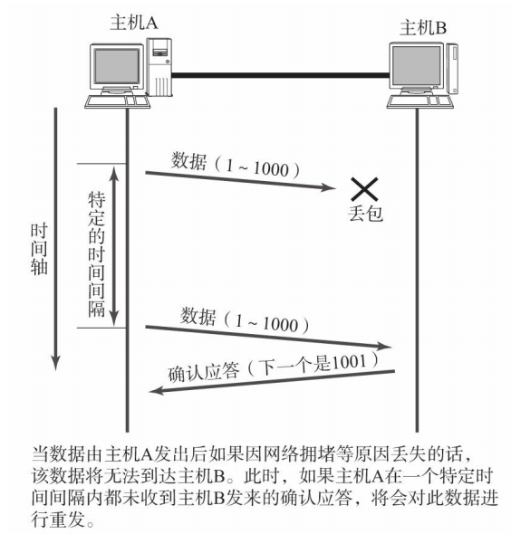

### 3.3.2 快速重传

如果出现报文段丢失，同一个确实号会被不断地返回，如果发送端连续3次收到同一个确认应答，那么会将其对应的**数据重发**

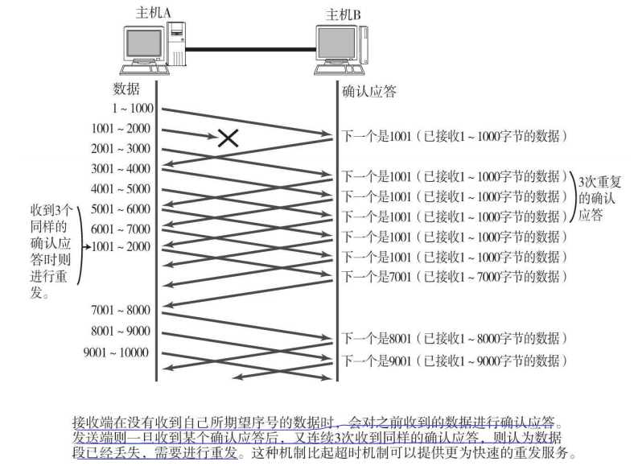

## 3.4 重复控制

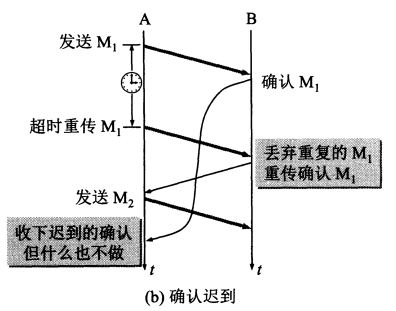

接收端接收到了TCP数据，但是确认应答因为网络问题未能及时到达发送端，那么发送端会进行超时重传

接收端就会收到2个重复的TCP数据段——通过**TCP首部的序列号**，丢弃重复的报文段，实现**重复控制**

## 3.5 滑动窗口

**滑动窗口**：没有收到对方确认的情况下，可以将窗口内的数据都发送出去——发送但未收到确认的数据必须保留，以便超时重传使用；收到确认的数据可以从缓冲区中删除

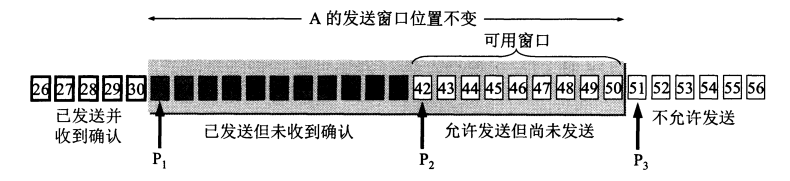

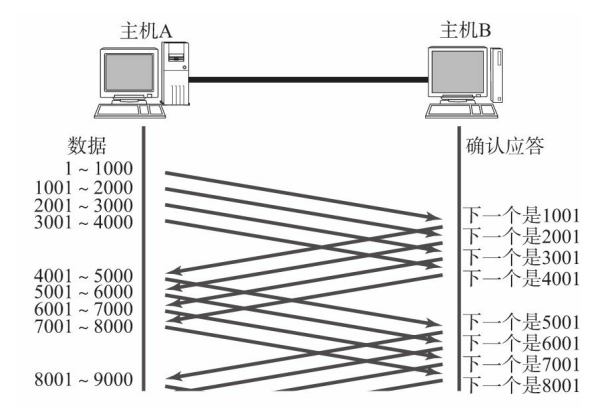

* 接收方只能对 **按序收到的数据中的最高序列号给出确认**
  
  > 如果接受方接受到了0-30,32,33，但是没有接收到31，那么接收方返回的确认应答中，确认号为31
  
  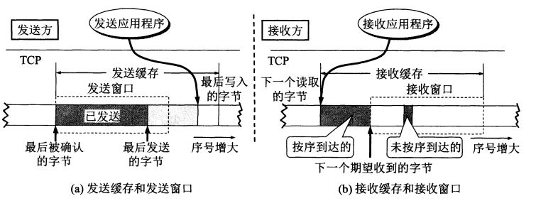

* 发送方收到确认号后，会将窗口滑动到确认号的位置
  
  > 如果A收到确认号34，那么A就知道31-33已经被对方接收到了，就会向右移动窗口到34
  
  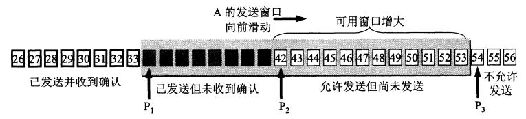
  
  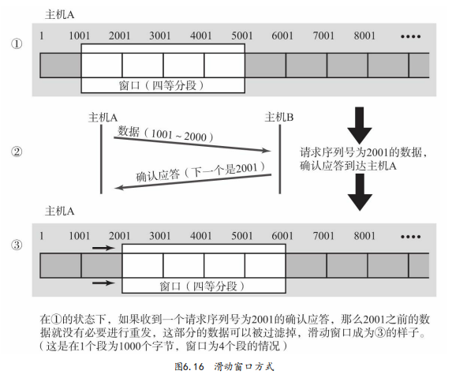

### 滑动窗口大小控制

TCP首部中有一个 **windows字段**——用于控制窗口的大小

接收主机将自己剩余可用的缓冲区的大小放入windows字段发送给发送主机，发送主机会根据窗口字段的大小来调整发送窗口的大小

## 3.6 流量控制

TCP提供一种机制——让发送方根据接收方的实际接受能力控制发送的数据量——这就是**流量控制**

接收方可以通过TCP首部的**Windows字段**——告诉发送方自己剩余可用的缓冲区的大小

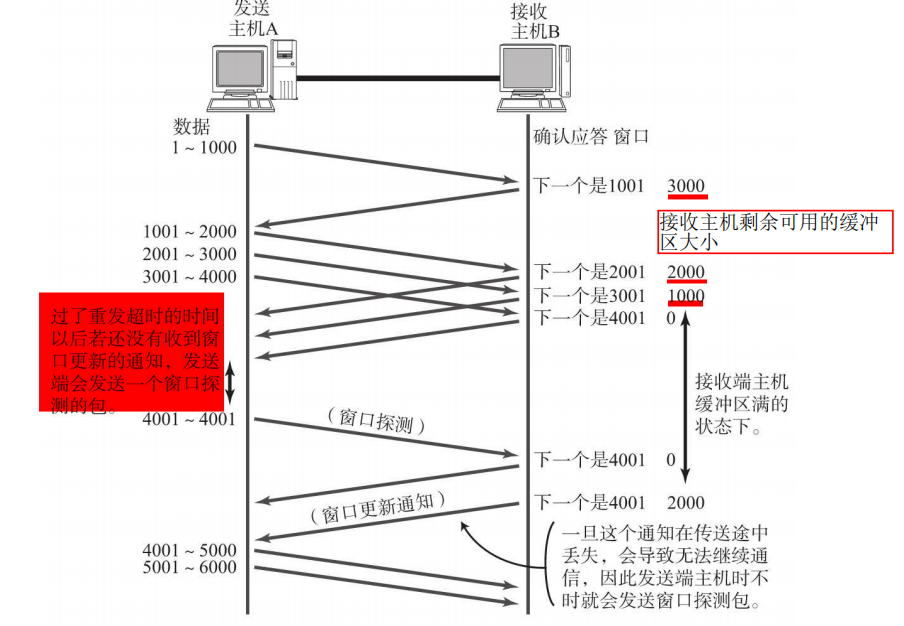

* 如果窗口大小设为0，那么发送端将不会再发送数据
* 窗口大小为0时，会启动一个计时器，如果过了重发超时的时间还没有收到窗口大小更新的通知，发送方会发送一个窗口探测的报文段

## 3.7 拥塞控制

拥塞控制——防止过多的数据注入到网络中，使得网络中的路由器or链路不致过载

TCP进行拥塞控制的算法有四种—— **慢开始**，**拥塞避免**，**拥塞发生**，**快速恢复**

### 3.7.0 拥塞控制全过程

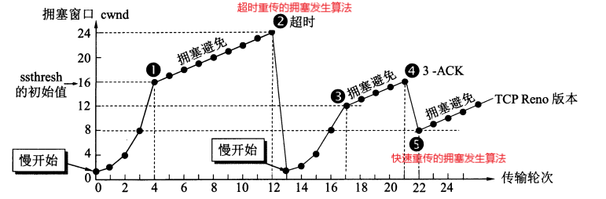

**cwnd：拥塞窗口值**

**ssthresh：慢开始门限**

1. 拥塞窗口值设置为默认值，执行**慢开始算法**
2. 当拥塞窗口值达到慢开始门限后，该为**拥塞避免算法**
3. 如果发生了数据重传，采用不同的策略
   * 如果发生的是**超时重传**——使用**拥塞发生算法**
   * 如果发生的是**快速重传**——启动**快速恢复算法**

### 3.7.1 慢开始

主机开始发送数据时，不清楚网络负载——由小到大逐渐增大拥塞窗口值

* **拥塞窗口默认值设置**
  
  * **旧规定**
    
    拥塞窗口值设置为1到2个发送方的最大报文段SMSS(Sender Maximum Segment Size)的数值
  
  * **新规定**
    
    * 若SMSS>2190字节
      
      设置拥塞窗口值为2 * SMSS字节，且不得超过2个报文段
    
    * 若 1095< SMSS<=2190
      
      设置拥塞窗口值为 3 * SMSS字节，且不得超过3个报文段
    
    * 若SMSS<=1095
      
      设置拥塞窗口值为4 * SMSS字节，且不得超过4个报文段

* 每收到一个对报文段的确认后，将拥塞窗口值增加**min(N,SMSS)（N为收到的确认报文段的字节数）**个字节
  
  > 如果一个报文段的字节数比较小，那么每收到一个确认，就将拥塞窗口值增加1个报文段的字节数
  > 
  > 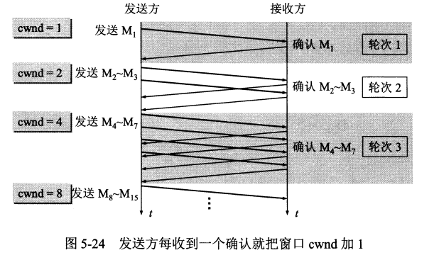
  
  * 当拥塞窗口值<慢开始门限——使用慢开始算法
  * 当拥塞窗口值>慢开始门限——使用拥塞避免算法
  * 当拥塞窗口值=慢开始门限——两个都可以

### 3.7.2 拥塞避免

让拥塞窗口值缓慢增大——每经过一个往返时间RTT，就将拥塞窗口值+1

### 3.7.3 拥塞发生

**如果发送了超时重传，那么使用拥塞发生算法**

* 将ssthresh设置为cwnd/2
* 将拥塞窗口值重置为1
* 重新启动**慢开始**

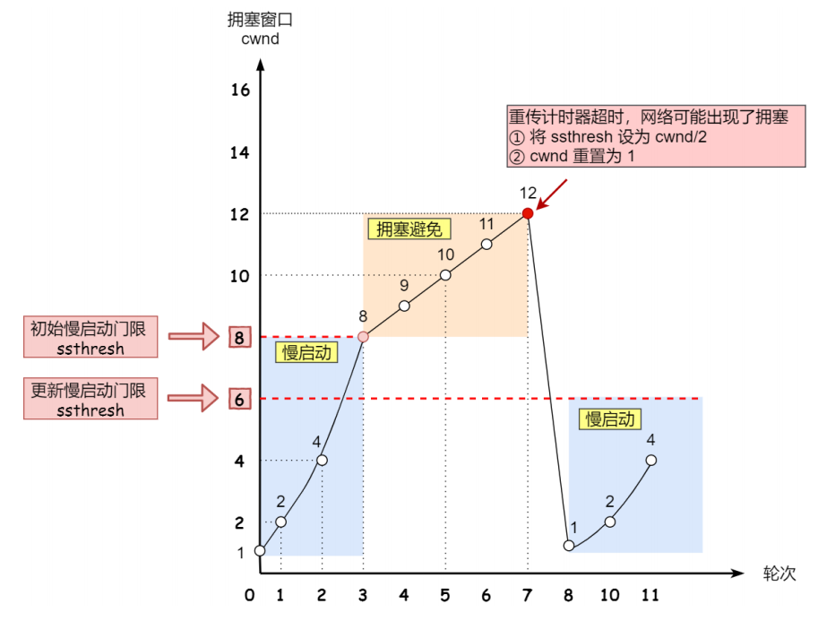

### 3.7.4 快速恢复

如果出现了快速重传，那么说明不是网络拥塞，而是数据丢失——启动**快速恢复算法**

1. 收到三个重复的ACK，触发快重传
   
   * cwnd=cwnd/2
   
   * ssthresh=cwnd

2. 启动快速恢复算法
   
   * cwnd=ssthresh+3（收到3个ACK，补发三次）
   
   * 进入拥塞避免状态

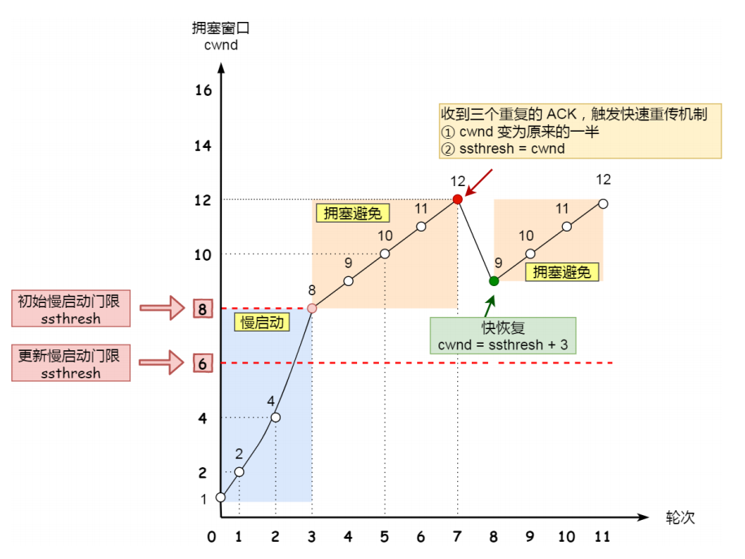

# 4. TCP延迟确认与Nagle算法

有两种策略用来避免大量TCP小数据报文的传输

* Nagle算法
* 延迟确认

## 4.1 Nagle算法

试想一个场景，发送方不停地给接收方发送很小的包，一次只发送1个字节，那么发送1千个字节需要发送1000次，这种方式会带来巨大的时延消耗

* 为了避免小包的频繁发送——使用Nagle算法
  
  * 当第一次发送数据时不管数据量多少都会立刻发送
  
  * 后面满足下面的条件之一即可发送
    
    * 待发送的数据长度达到MSS（Maximum Segment Size最大报文段长度）
    * 不存在已经发送但还未收到确认的报文段

* Nagle算法默认开启，可以在Socket中设置**TCP_NODELAY**来关闭

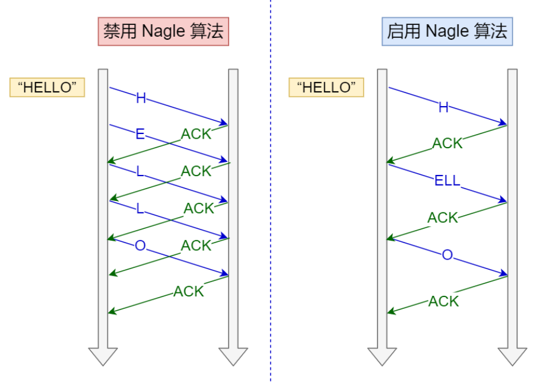

```
* H——第一次发送数据直接发送
* ELL——数据长度达到MSS
* O——不存在已经发送但未收到确认的报文
```

## 4.2 延迟确认

试想这样一个场景，接收方收到发送方的一个包，然后在极短时间内又收到了第二个包，接收方是一个个回复ACK包，还是稍等一下，将两个包的ACK合并后一起回复

* **延迟确认策略**
  
  * 接收方在接收到数据后，不会立刻回复ACK包，而是会等待一段时间
    * 超时——回复ACK包
    * 未超时，接收方需要向发送方发送数据，那么将数据和ACK一起发送
    * 未超时，接收方收到了第二个数据包，将两个ACK一起发送

* TCP延迟确认可以在Socket中设置**TCP_QUICKACK**来关闭

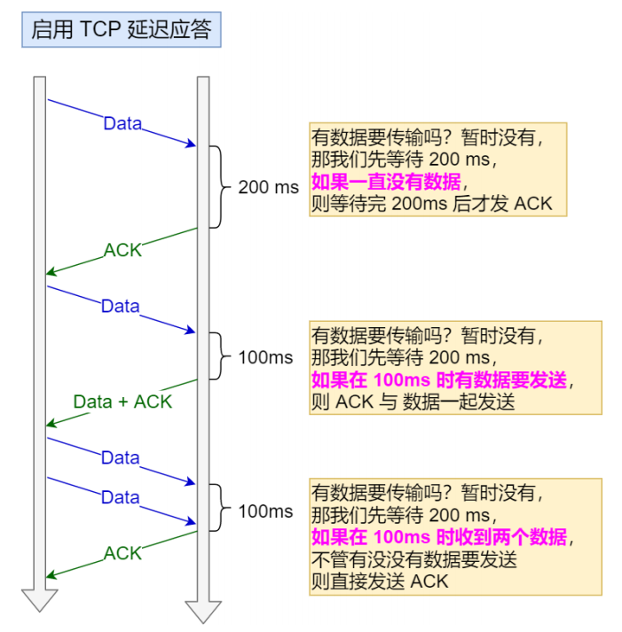

## 4.2 Nagle和延迟确认共同使用产生的问题

* Nagle算法是发送方启用
* 延迟确认是接受方启用

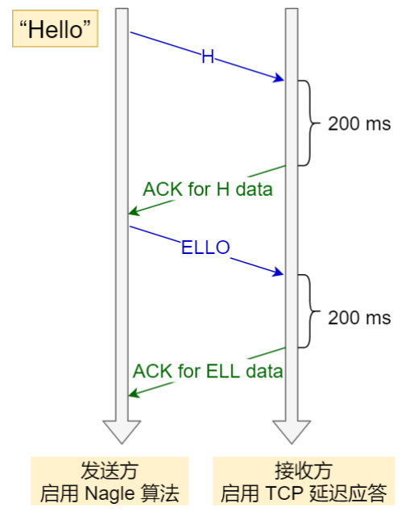

* 两者同时使用，会导致时耗增长，所以最好是关闭其中的一个

# 5. 粘包和拆包

* TCP是个面向字节流的协议
* TCP传输的数据，在网络上就是一连串的二进制数据，没有分界线，业务层面认为的一个完整的包，在TCP可能会被拆分成多个小包发送，也可能把多个小的包封装成一个大的数据包进行发送，这就是TCP粘包和拆包问题

## 5.1 发生情况

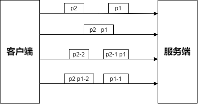

## 5.2 发生原因

OS在发送TCP数据时，底层有一个缓冲区

* **Socket缓冲区**——如果一次业务请求发送的数据量比较小，那么该业务请求会暂存在发送缓冲区中，CP会将多个业务请求合并到一个TCP数据包中进行发送

* **MSS和MTU的限制**——如果一次业务请求发送的数据量比较大，那么TCP会将其拆成多个TCP数据包进行发送（MSS是TCP分片，MTU是IP分片）

* **Nagle算法**

## 5.3 解决方案

* 客户端在每个包的末尾使用固定的分隔符，例如\r\n，如果一个包被拆分了，则等待下一个包发送过来之后找到其中的\r\n，然后对其拆分后的头部部分与前一个包的剩余部分进行合并，这样就得到了一个完整的包
* 将消息分为头部和消息体，在头部中保存有当前整个消息的长度，只有在读取到足够长度的消息之后才算是读到了一个完整的消息
* 通过**自定义协议**进行粘包和拆包的处理
