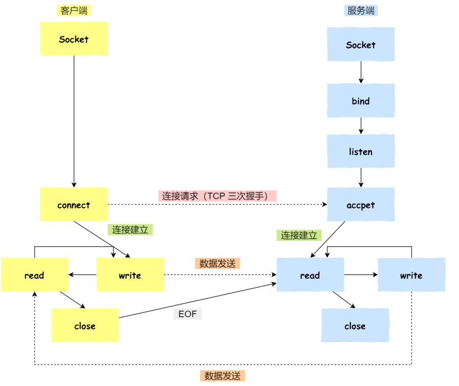
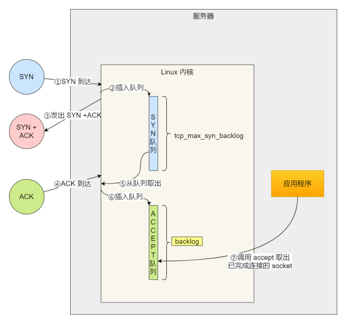
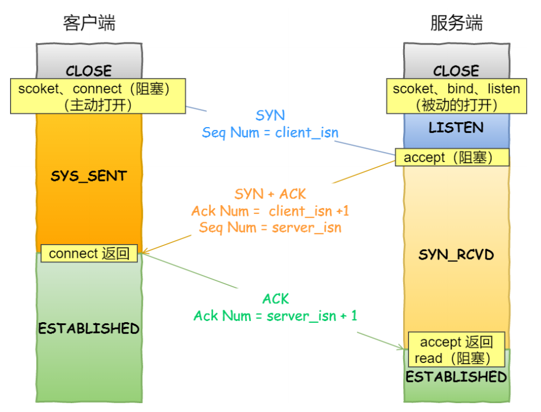
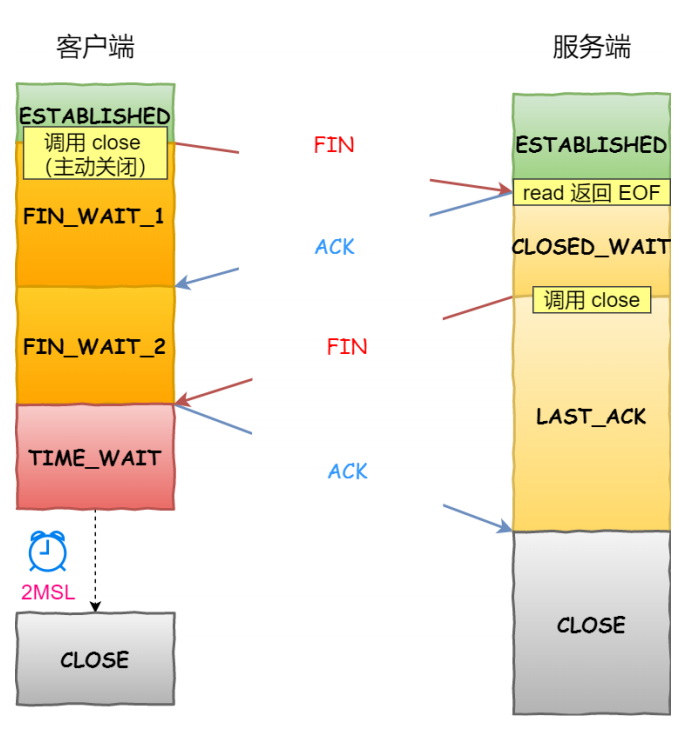

## 1. 总览

* Client与Server初始化Socket，得到文件描述符
* Server调用bind()，让Socket绑定IP与端口（监听的Socket）
* Server调用listen()，开始监听
* Server调用accept()，等待Client连接
* Client调用connect()，向Server发起连接请求（三次握手开始）
* Server的accpet()会返回一个已经完成连接的Socket的文件描述符（已完成连接的Socket）
* Client与Server通过Socket通信
* Client调用close()，请求与Server断开连接，此时Server通过read读数据就会读到**EOF**，然后服务端调用close()，表示连接关闭

## 2. Linux维护的Socket队列

* Linux内核维护两个Socket队列
  * 半连接队列（SYN队列）：接收到Client的SYN报文，内核会将该连接存储到半连接队列，并向Client响应SYN+ACK
  * 全连接队列（Accept队列）：已完成TCP三次握手，处于Established状态（如果连接数超过了TCP最大全连接数，那么会丢弃到后续的TCP连接，可以通过netstat -s查看被丢弃的TCP连接）
    * /proc/sys/net/ipv4/tcp_abort_on_overflow：指定策略
    * 数超过TCP最大全连接数时，采用什么策略
      * 0（默认值）：如果全连接队列满了，那么server会丢弃掉Client的第三次握手信息（不会通知Client，Client的TCP连接仍然是Established）
      * 1：如果全连接队列满了，那么server会发送一个reset报文段给Client，表示废掉这个连接（Client会出现connect reset by peer）

* TCP全连接队列的长度=min(somaxconn，backlog)
  * **somaxconn**——/proc/sys/net/core/somaxconn设置（默认128）
  * **backlog**——listen(int sockfd，int backlog)中的backlog参数（Nginx默认是511）

## 3. 三次握手与accept(),connect()

\

* connect()调用——Client开始第一次握手
* connect()返回——Client接收到第二次握手，发送第三次握手
* accept()返回——Server接收到第三次握手

## 4. 四次挥手与close()

* Client调用close()，开始进行四次挥手
* Server收到第一次挥手消息（FIN报文段）后，会在FIN报文段中插入一个**文件结束符EOF**——应用程序就可以通过read读到这个EOF来感知这个FIN报文段（EOF表示该连接上再无额外数据），Server进入Close_Wait状态
* Server调用close()，会向Client发出第三次握手信息